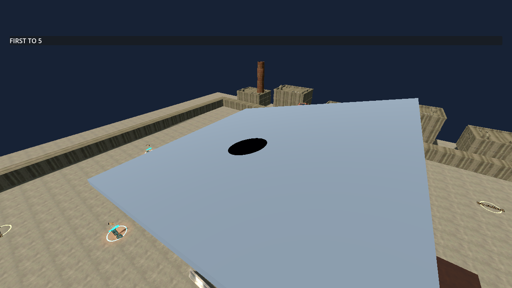

# TS-117 — Persistent Oil deployment and recovery

Date: 2026-09-22. Branch: ts-117-jg. Jira: https://jonathangenier.atlassian.net/browse/TS-117.

## Scope and implementation

Read the complete Story (no subtasks or comments), workflow, standards, critique policy, nested routing and applicable item, vehicle, simulation, networking, reconnect, migration, lifecycle and configuration documents. No approved requirement change was supplied or found. Main was fetched before implementation and final verification; the branch started at current main d815e767978ff0c903fb0a6e1b9cea59991b1268. Canonical Story version is 0.1.30, derived from main, with matching Windows preset versions.

Oil uses the TS-116 registry handler and ItemAuthority transaction. A host terrain adapter projects a bounded supported footprint behind the vehicle; failed placement and a full patch cap retain the exact held slot. Persistent patches use grant-token identities and survive owner departure/death independently of inventory. Finished clears hazards; fresh arenas start empty. The cap defaults to 16 and is configurable from 1 to 32 through existing host tuning.

Per-patch/vehicle/life contact latches permit one trigger per entry. Every living supported vehicle is eligible, including the owner. The existing movement model applies a bounded yaw impulse and temporary tire-capacity reduction while preserving controls. Movement snapshots retain the recovery timer and angular velocity; item snapshots retain complete patches and latches. Normal publication, fresh admission, resume and migration compose these existing codecs. Presentation is reconstructable and has no contact authority. Stats and Event Log expose patch/handling/entry state.

Protocol versions: item 4, movement 4 (109 bytes), vehicle networking 7, gameplay configuration 6. No dependency, asset download, Shared layer, alternate gameplay clock, inventory owner or replication stream was added. Client still references Core; Core has no project or engine references.

## Executed verification

All runtime checks used installed Godot .NET 4.7.2 (ed1daf0bf), Windows, local native worlds and the existing transport. Commands below used its console executable under C:/Godot/Godot_v4.7.2-stable_mono_win64/Godot_v4.7.2-stable_mono_win64/.

- Targeted Release tests for Items, movement codec, migration, resume and gameplay configuration: 59 passed during iteration. Subsequent focused Oil run: all 7 passed, including the full 32-patch/256-contact codec bound, invalid continuation, duplicate requests, rejected world transaction, owner/peer entry, sustained occupancy, re-entry, life reset, departed owner, exact checkpoint restoration, fresh admission and movement replay.
- ./check.ps1: version regressions (108), workflow-helper regressions, media regressions/materialization, restore, Debug production build and Release full solution build passed with zero warnings/errors. The Core stage initially exposed a stale expected configuration-catalog count (78 instead of 79); the assertion was corrected and explicitly checks the default Oil cap. Re-ran the failed Core stage and then the remaining transport stage: **528 Core tests passed; 345 non-native Client/transport tests passed**. The entire gate was not needlessly repeated.
- ./tools/sync-story-version.ps1 and ./tools/check-version.ps1 passed against fetched main.
- ./check-oil.ps1 -Visual: passed at baseline, then -Visual -Impaired passed (30 ms outbound delay, 5 ms jitter, 2% loss). A final baseline visual run after integrated checks passed for critique. Native terrain rays placed Oil on a 0.25-radian bank; a third real UDP peer joined after deployment and received the exact single patch. Owner and remote vehicle effects, strong yaw response, recovery, continued persistence, one-entry/re-entry and configured cap were exercised.
- ./check-items.ps1 -Impaired -NoBuild: eight native UDP peers passed Wrench, all four Missile collision scenarios, matching outcomes, prop impulse and repeat-request regressions. Artifacts: .godot/item-checks/672da3793c604a90804c2c9ca2128663.
- ./check-reconnect.ps1 -NoBuild: passed three native resyncs, first after 125 seconds offline. The added assertions compare exact Oil patch identity/geometry after each resume and verify Finished/new-match cleanup. Existing collision death, respawn, held-item identity, native node reuse and complete score recovery checks also passed. A committed Oil fixture isolates recovery from deployment, which is covered by check-oil.
- ./check-migration.ps1 -Players 2 -NoBuild and -Players 3 -NoBuild: both passed. A committed Oil fixture survived the arena authority replacement with exact identity/geometry in both restored authority and presentation state. Existing sequential epochs, former-host lifecycle, configuration, prediction and gameplay continuation checks passed.
- ./check-migration-processes.ps1 -Players 3 -NoBuild: passed actual host-process termination and independent survivors continuing epoch 2. This is surrounding migration regression evidence; this separate-process fixture does not seed Oil. Artifacts: .godot/migration-process-checks/6741be8ac48b4697a61d8962d1f1aba5.
- ./check-vehicle.ps1: 144 native assertions passed at both 30 and 144 render FPS; fixed-step and surface replay matched within 0.02. Artifacts: .godot/vehicle-checks/eb510d299c34453ea4ee88d6ea313c45.
- ./check-network-vehicles.ps1 -Players 3 -Latency 30 -Jitter 5 -Loss 2: passed three production native processes on the oval. Client error P99 values were approximately 0.0080 m and 0.0017 m, with zero large corrections. Artifacts: .godot/network-vehicle-checks/b364719b62024dc88d1d76d801730983.
- ./check-startup.ps1 -SkipBuild -SkipMediaCheck: canonical startup harness passed with no runtime diagnostics. An earlier ad-hoc --quit-after 5 smoke emitted one ObjectDB exit-leak warning; --quit-after 120 was clean. The canonical harness allows orderly native audio teardown and is the completion evidence.
- Reviewed the Story diff, recovery construction sites, protocol changes, dependency direction and affected feature documentation. git diff --check passed.

## Runtime evidence and limits

The image above was rendered and inspected. The first attempted capture was black because the fixture lacked a displayed viewport; the fixture was corrected and the retained image is from the successful final visual run.

VERIFIED: local native deployment, bank orientation/elevation, peer/late-admission equality, owner and peer physical response, sustained recovery, single-entry/re-entry, cap, reconnect, migration and cleanup checks described above.

INFERRED: the same provider-neutral state path should support authenticated EOS recovery. Local tests do not establish that service/network behavior.

UNVERIFIED: separate-PC authenticated EOS, changed public IP, exported-build recovery, Internet soak, human keyboard/controller handling satisfaction, low-end frame-time profiling, arbitrary highly curved terrain and Oil deployment during a separate-process kill. No audio listening claim is made. Recovery fixtures seed patches; their success is not represented as a native placement test.

Placement intentionally requires a supported local plane: ledges, excessive curvature/height deviation and movable ground fail safely rather than bridging them. Contact is based on the supported vehicle centre, not individual tire footprint overlap. Protocol changes require matching builds. Migration retains the pre-existing bounded checkpoint rollback policy rather than promising lossless recovery after every interruption.

## Astra Runtime Critique — Story Round 1

**Overall Score: 7.6 / 10**

**Quality Assessment: FAIL (<8.0)**

Category scores based on exercised behavior:

| Category | Score |
| --- | --- |
| Runtime functionality / integration | 8.4 |
| Physics response and recovery | 8.0 |
| Local multiplayer / recovery experience | 8.2 |
| Visual hazard presentation | 6.5 |

What was exercised: the native and rendered scenarios above, including a post-verification final Oil run. Functionality and recovery were directly exercised; subjective human driving feel and remote Internet behavior remain unverified. No engineering/source-quality score is substituted for runtime evidence.

Problem: the rendered Oil surface reads as a uniform black ellipse with little material detail, closer to a flat marker or hole than a convincing slick.

Evidence: the inspected banked-oil.png above; the footprint is clear and aligned, but its surface has almost no visible variation.

Severity: Medium.

Impact: players can see the hazardous footprint, but material identity and visual integration are below the repository's polished-runtime threshold.

Suggested improvement: add restrained oil sheen/surface variation within the same authoritative footprint, then inspect it from the normal chase camera on the actual oval asphalt as well as a banked fixture. Preserve Core contact and recovery semantics.

Scope: In Scope. Corrective Work Type: Existing Task (TS-117).

Recommended Next Round: if authorized, refine Oil surface readability and run a normal-chase-camera driving assessment. The current behavior is implemented and locally verified; human critique acceptance and independent engineering/PR review remain pending. No corrective round is authorized by this report.
