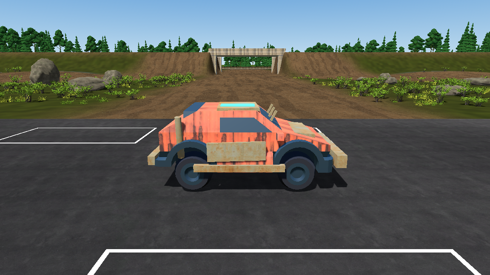
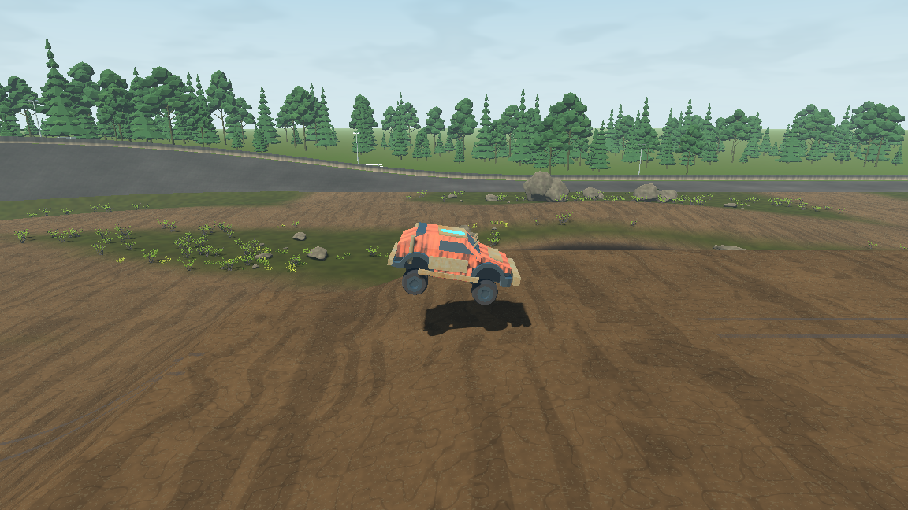
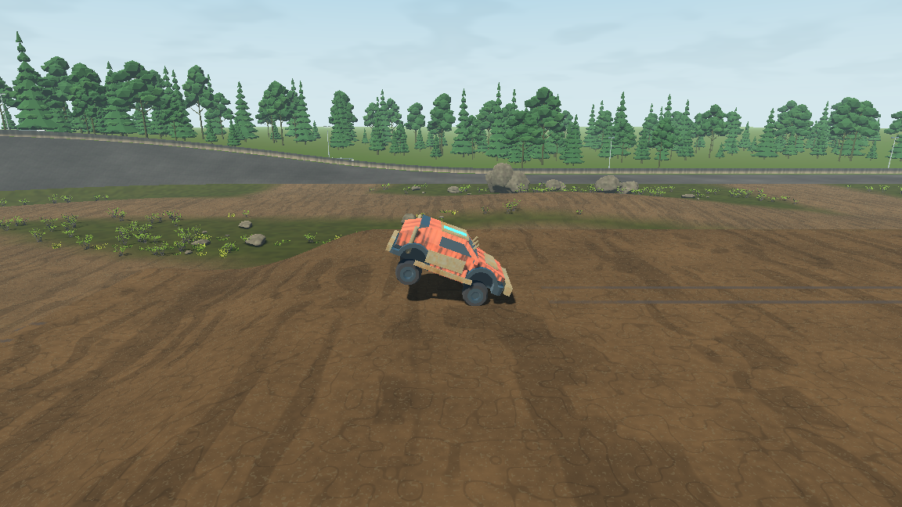

# TS-159 — Suspension and chassis verification

## Scope and implementation

Jira TS-159 (description, comments and child list) and TS-162 were inspected on 2026-09-24. TS-159 has no children or comments. The explicit user instruction permits representative obstacles while TS-162 is unavailable; TS-162 is To Do. No map geometry or vehicle asset was replaced or modified.

The existing `ts-159-pg` branch began at current `origin/main` (`3924fd5`). Its existing input-file formatting change and untracked rock texture files are excluded from this delivery. The required normal Story version is 0.1.51, preserving main's 0.1 release prefix; this is not a Release 0.2.0 version transition.

- Increased equilibrium origin height and spawn clearance while retaining the existing baked mesh origin and shared chassis collision hull.
- Reduced wheel spring stiffness and provided separate compression/rebound damping plus bounded progressive end resistance. Springs remain unilateral; unsupported wheels provide no force. Existing finite pitch/roll response remains active, without axis locks, snapping, new downforce or unlimited impact absorption.
- Existing four wheel meshes now translate independently from accepted suspension observations, including full airborne droop. A 30/s presentation response has no feedback into gameplay, collision or prediction.
- Added three Configs keys through the existing authority, validation, persistence, reliable revision and recovery architecture. Complete configuration wire version is 12, with 104 values/853 bytes; movement snapshots are unchanged.
- Extended deterministic force tests and native bump/obstacle/drop coverage. Updated obsolete static-wheel and fixed-height fixture assumptions. Added actual jump suspension traces.

## Production tuning

| Value | Default / interpretation |
| --- | --- |
| Origin ride height | 1.145 m nominal; native measured chassis clearance 0.477 m |
| Full ray extension | 1.472 m |
| Static compression / droop reserve | 0.327 m nominal |
| Wheel spring | 30 /s² |
| Compression damping (`vehicle.wheel_damping`) | 7 /s |
| Rebound damping (`vehicle.wheel_rebound_damping`) | 15 /s |
| Progressive engagement (`vehicle.wheel_bump_start`) | 0.55 m compression |
| Progressive coefficient (`vehicle.wheel_bump_spring`) | 140; additional acceleration = coefficient × squared excess compression |
| Support bound | 6 × gravity per wheel before quarter-mass weighting; no tensile force |
| Spawn offset above authored marker | 0.45 m |
| Retained mass / reference mass | 900 / 900 kg |
| Retained native COM | `(0, -0.25 × Scale + OriginShift, 0)` relative to the unchanged chassis origin |
| Retained load-transfer height | `0.45 × Scale`, approximately 0.618 m |
| Retained pitch/roll spring / damping | 32 /s² and 8 /s |
| Retained compliance / tilt bound | 0.004 rad per m/s² / 0.16 rad |
| Retained yaw damping | 0.65 /s |

These are the implemented production candidate values, subject to human acceptance of the runtime critique. Existing saved host overrides remain deliberate overrides; Reset to Defaults + Apply selects this complete setup.

## Commands and results

Windows PowerShell, .NET SDK 10.0.401, Godot 4.7.2 .NET. `dotnet` was supplied through `C:/Program Files/dotnet` on PATH. In commands below, `$g` denotes `C:/Users/orsin/OneDrive/Desktop/godot/Godot_v4.7.2-stable_mono_win64/Godot_v4.7.2-stable_mono_win64_console.exe`.

| Executed command | Result / retained evidence |
| --- | --- |
| `tools/check-fast.ps1 -Area Core` | PASS, 626 tests after tuning and added force tests; [log](ts-159/check-fast.log) |
| `check.ps1` | PASS: helper/media checks, restore, Debug production build, Release solution build, zero warnings/errors, 626 Core + 355 non-native transport tests; [log](ts-159/check.log) |
| `check-oval.ps1 -GodotPath $g -NoBuild` | PASS, 3,097 checks including expanded suspension cases; [evidence](ts-159/oval.txt) |
| `check-infield.ps1 -GodotPath $g -NoBuild` | PASS, complete route suite and 2,598 support probes; [evidence](ts-159/infield.txt) |
| `check-landing.ps1 -GodotPath $g -NoBuild` | PASS, 64 normal/crash/secondary-impact scenarios across both native adapters and landing zones; [evidence](ts-159/landing.txt) |
| `check-vehicle.ps1 -GodotPath $g` | PASS, 147 assertions at each render rate, vehicle and surface replay matched at 30/144 FPS within 0.02 tolerance; [log](ts-159/vehicle.log) |
| `check-developer-options.ps1 -GodotPath $g` | PASS, 674 write/UI/replication assertions and nine fresh-process persistence assertions; [log](ts-159/configs.log) |
| `check-terrain-handling.ps1 -GodotPath $g -NoBuild` | PASS, both adapters, six surfaces, slope starts, steering, handbrake recovery and transitions; [log](ts-159/terrain.log) |
| `check-water.ps1 -GodotPath $g -NoBuild` | PASS, both adapters, actual basin, repeated death/respawn and input-driven entry; [log](ts-159/water.log) |
| `$g --headless --path . --quit-after 120` | PASS, main scene startup without errors/warnings; [log](ts-159/startup.log) |
| `check-network-vehicles.ps1 -GodotPath $g -NoBuild -Players 8 -Latency 50 -Jitter 10 -Loss 0.02` | PASS harness; roster eight and all peers grounded at end; scheduling/correction limitations below; [summary](ts-159/network-eight-summary.json) |
| Same network command with `-Players 2` | PASS; client p99 correction 0.776 m, maximum 3.916 m, two large corrections; [raw result](ts-159/network-two.json) |
| `dotnet test code/TransportTests/Trackstorm.Transport.Tests.csproj -c Release --no-build --filter 'FullyQualifiedName~NativeVehicleReplicationTests'` | PASS, five real UDP scenarios; [log](ts-159/native-replication.log) |
| `git fetch origin main`; `tools/sync-story-version.ps1` | Main remained the same; required 0.1.51 / 0.1.51.0 version checks passed; [log](ts-159/version.log) |

After the final fixture corrections, `check.ps1` was rerun successfully. The subsequent mechanical Story-version change was verified with warning-free Debug production and Release solution builds ([log](ts-159/version-build.log)), `tools/check-version.ps1` through the sync helper, and `check-build-version.ps1 -GodotPath $g` ([native identity result](ts-159/build-version.log)). No handling changes followed those gates.

Native commands required execution outside the filesystem sandbox because Godot's ordinary user logs and Windows certificate store were inaccessible inside it. The initial sandboxed attempt was not a clean pass.

## Direct runtime findings

**VERIFIED through driven native fixtures and rendered captures**, not claimed as human keyboard/controller playtesting:

- Flat asphalt: 0.477 m settled chassis clearance. Three high-speed laps reached 43.03 m/s with 4,434/4,434 supported frames and 0.662 m/s maximum terrain-normal speed.
- Banking, diagonal asphalt/infield transitions, ordinary turns, handbrake recovery and rapid direction changes passed the existing bounds through practice and network collision adapters.
- Eleven consecutive 12 cm bumps: practice/network peak chassis rise 0.026/0.032 m, maximum heave approximately 0.45 m/s, no unsupported frames, final vertical speed below 0.001 m/s. Successive disturbances did not build into a large bounce.
- A 12 cm rounded one-wheel obstacle at 12 m/s produced 0.119/0.115 m independent wheel compression difference, 0.000/0.004 m chassis rise and continuous support. This is a controlled representative obstacle, not a TS-162 fragment.
- 0.5/1.5/4 m drops at 12 m/s: approximately 0.349/0.526/0.79–0.81 m peak compression. Later rebound remained at or below 0.55 m/s; final-second vertical speed below 0.001 m/s. The 4 m drop reaches chassis bottom-out rather than unlimited absorption.
- Both authored jumps at 14/16/18 target approach speeds showed preload, unsupported droop, landing compression and supported recovery without HP loss. Landing compression ranged 0.50–0.73 m; after the first second, upward speed stayed below 0.20 m/s. [Jump summary](ts-159/jump-summary.json) and per-frame `*-suspension.json` files retain measurements. Target speed is the controller setting, not a claim that actual takeoff speed equals it.
- Existing production rock landmark collisions were exercised in six approaches; meaningful impacts still produced damage and stopped outside the rock centers. The complete infield suite also covered rough dirt, repeated route use, structures, jumps, water boundaries and two-car tunnel traversal.
- Native vehicle fixtures exercised real input capture, camera behavior, car contacts, explosions, damage, reset and surface transitions. Configs controls affected accepted host/client state and survived process restart.

## Iteration findings and corrections

The first compression damping candidate was 11/s. It preserved support but used only 0.376 m compression on a 1.5 m drop. Reducing it to 7/s increased impact stroke to 0.526 m while retaining controlled rebound. No map geometry was changed to obtain this result.

Older tests assumed static wheel geometry, a body origin below 1.1 m, and a 0.9 m ray reaching the road. They now check observed wheel positions, the same ±0.2 m height tolerance relative to ride height, and a 1.8 m long versus 0.1 m short support query. Assertions were not removed.

The secondary-tumble fixture's original 22,000 N·s impulse could land upright under the changed suspension. It now starts after authoritative recovered support and uses a 12,000 N·s off-center impulse. The assertions still require both Crash classification and real HP loss. Production landing forgiveness/damage logic was unchanged.

## Assumptions, limitations and risks

- The existing compact sprung-body model and four point rays are retained. This is not a full unsprung-mass/tire-volume solver. Vertical tire presentation does not add spinning wheels, steerable wheel meshes, suspension links or the deferred production rig.
- Wheel visuals follow observations; remote wheels use the latest accepted compression while the remote chassis uses buffered pose interpolation. No independent visual state is serialized. Large corrections may be visible.
- Eight simultaneous local processes exhibited severe scheduling stalls (client frame-time p99 approximately 381–2,760 ms), p99 position corrections 2.04–2.79 m and 1–3 large corrections per client. The harness passed, but this is not evidence of polished eight-player latency on this machine. The two-peer impaired comparison also had two large corrections. No networking algorithms were changed to mask this.
- Current kicker entry geometry can use nearly the full stroke during preload (0.83–0.84 m). TS-162 explicitly owns the kicker-to-tabletop seam correction. The current jumps recover successfully, but future geometry must be retested rather than compensated with unrealistic tuning.
- Rendered evidence is bounded fixture observation. It does not establish long human driving sessions, every obstacle/speed/landing attitude, or cross-platform bit-identical native physics.

## Explicitly unverified

- **TS-162 final destructible/movable small rocks:** not implemented in this checkout; their specific acceptance test remains UNVERIFIED.
- Real remote-machine/EOS play, Internet latency, and human subjective controller feel remain UNVERIFIED. Local native UDP and deterministic replay evidence are identified separately above.
- A shipping/exported build and future production vehicle rig were not tested or introduced.

## Astra Runtime Critique — Story Round 1

**Overall Score: 8.1 / 10. Quality Assessment: PASS (>=8.0).** This assesses the scoped runtime suspension result; it is not an engineering score or human acceptance.

| Material category | Score |
| --- | ---: |
| Suspension / chassis physics | 8.3 |
| Visible motion / lifted stance | 8.0 |
| Runtime functionality and recovery | 8.3 |
| Runtime integration, including observed network limitations | 7.8 |

**What was exercised:** After final verification, `check-infield.ps1 -GodotPath $g -NoBuild -Case WestJump -Visual` passed; the completed `check-oval.ps1 -GodotPath $g -NoBuild -Visual` pass recorded 3,103 checks. [Jump log](ts-159/critique-jump.log), [oval log](ts-159/critique-oval.log), and [rendered-run measurements](ts-159/oval-rendered.txt) retain the outcomes. The rendered stance, airborne and landing captures were directly inspected. The vehicle reads visibly higher; front/rear extension differs at landing, consistent with the recorded compression/recovery sequence. Bump and drop measurements show controlled chassis motion with meaningful wheel stroke. Banking, repeated impacts and ordinary control maneuvers remain operational through native tests.

**VERIFIED:** rendered stance/droop/initial landing presentation; native support, heave, repeated bumps, normal/hard recovery, damage, and the integration scenarios above. **INFERRED:** the measured single-dominant-response traces should translate to a more planted human driving impression. **UNVERIFIED:** human subjective driving feel, TS-162 fragments and remote-machine/EOS experience.

The score is limited by simple wheel presentation, point-ray contacts, near-full-stroke preload at the current kicker, and local network scheduling/correction observations. It does not certify the deferred asset, future map changes or every extreme impact. No further implementation round is started; human review/acceptance remains outstanding. The explicitly requested commit/push are delivery actions, not acceptance or permission to merge.

