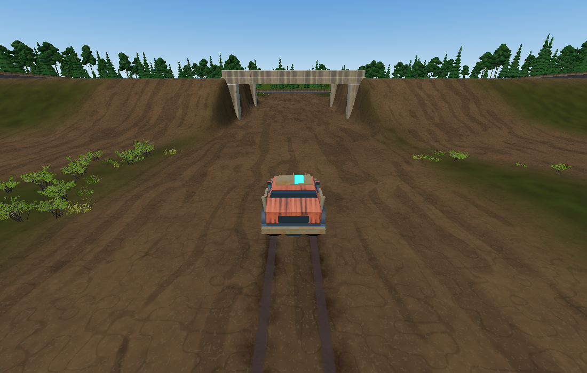

# TS-160 — Acceleration, surfaces and driving recovery

## Scope and implementation

Inspected Jira TS-160 description, comments, children and dependencies on 2026-09-24. There are no children or comments. The user requirements match Jira. TS-159 is Done; its merge commit 4fb3237 is the branch base/current main. TS-161 collision work is excluded.

Work remains on ts-160-pg, version 0.1.52 / Windows preset 0.1.52.0. Main was fetched before implementation and final verification. Pre-existing InputButtons.cs formatting and ten untracked rock textures are excluded.

- Forward engine demand increased 11 → 16 m/s², braking 14 → 17 m/s². Existing smooth fourth-power taper, 44.44 m/s powered cap, mass scaling and finite tire budget remain. No launch velocity injection.
- Coast drag 0.5 → 0.28/s retains rolling momentum.
- Steering retains 2.4 rad/s maximum rate and 0.6 rad low-speed angle; speed parameter is 12 m/s. A 0.1-second filter grows with planar speed. Sideways speed also limits wheel authority.
- Dirt rear grip loss approaches 0.22 × throttle² × rear dirt-contact fraction, with 2/s buildup and 2.5/s recovery. No heading lock, target yaw or automatic steering.
- Grass grip is 0.62 (dirt 0.85, asphalt 1). Individual wheel materials affect tire capacity; split longitudinal forces create torque through track width. Center material remains diagnostic.
- Four new Configs controls use existing authority, persistence and replication. Defaults are in production records; saved overrides remain overrides.
- Portable power-slip memory: movement version 6 / 123 bytes, vehicle protocol 9, configuration version 13 / 108 values / 885 bytes. Standard eight-car snapshot is 1,501 bytes. EOS already fragments at 1,141 payload bytes; this remains two fragments.
- TS-159 springs, damping, bump resistance, mass, hull, ride height, wheel presentation and landing policy are unchanged.

## Commands and results

Windows PowerShell, .NET SDK 10.0.401, Godot 4.7.2 .NET. Godot executable: C:/Users/orsin/OneDrive/Desktop/godot/Godot_v4.7.2-stable_mono_win64/Godot_v4.7.2-stable_mono_win64_console.exe.

The comprehensive gate is root check.ps1; tools/check.ps1 does not exist.

| Executed command | Actual result / evidence |
| --- | --- |
| Targeted Vehicles/Development Core tests | PASS, 257 tests after protocol/default fixes |
| Targeted HandlingRecovery tests | PASS, 3 tests covering progressive restoration, split torque and small corrections |
| tools/check-fast.ps1 -Area Core | PASS, 629 tests; [log](ts-160/check-fast.log) |
| check.ps1 after storage assertion correction | PASS, helper/media checks, restore, Debug production and Release solution builds, zero warnings/errors, 629 Core + 355 non-native transport tests; [log](ts-160/check.log) |
| check-terrain-handling.ps1 -GodotPath $g -NoBuild | PASS, six surfaces, grades, both adapters, transitions and split contacts; [log](ts-160/terrain-handling.log), [measurements](ts-160/terrain.txt) |
| check-oval.ps1 -GodotPath $g -NoBuild | PASS, 3,097 checks; [log](ts-160/oval.log) |
| check-infield.ps1 -GodotPath $g -NoBuild | PASS, complete routes and 2,598 support probes; [log](ts-160/infield.log), [measurements](ts-160/infield.txt) |
| check-landing.ps1 -GodotPath $g -NoBuild | PASS, 64 scenarios; [log](ts-160/landing.log), [measurements](ts-160/landing.txt) |
| check-water.ps1 -GodotPath $g -NoBuild | PASS; [log](ts-160/water.log) |
| check-surfaces.ps1 -GodotPath $g -NoBuild | PASS, eight identities, adapters, transitions and Stats; [log](ts-160/surfaces.log) |
| check-vehicle.ps1 -GodotPath $g | PASS on completed production behavior, 147 assertions at each rate, 30/144 FPS replay agreement within 0.02; [log](ts-160/vehicle.log) |
| check-developer-options.ps1 -GodotPath $g | PASS, 694 write/UI/UDP and 9 fresh-process read assertions; [log](ts-160/configs.log) |
| tools/check-version.ps1; git diff --check | PASS before final verification |

The first full gate passed Core but failed four storage assertions expecting acceleration 11. Those obsolete assertions were corrected; 13 focused storage tests and the full rerun passed. Earlier iteration failures caught an encoder/header mismatch, old snapshot/default expectations and a Nitro test assuming at least 10% extra launch acceleration despite unchanged tire capacity. Nitro still improves acceleration and powered speed; the corrected test verifies improvement within available traction.

The first windowed-executable attempt supplied no usable completion log. Sandboxed console execution finished scenarios but had log/certificate-access errors. Neither is counted as a clean pass. Retained native results were rerun outside the sandbox and pass error/warning checks.

## Active playtest evidence

**VERIFIED: bounded observe/drive/observe playtesting** with the production practice adapter, actual collision queries and explicit handling_playtest.tscn scene. Inputs were selected between observations. The scene pauses between segments and restores commanded velocities on resume. This differs from continuous physical keyboard/gamepad play.

The actual infield route was rendered and inspected. A powered turn near the tunnel hit a pillar (HP 908); it is excluded from slide-recovery conclusions. An early pause cleared native velocity and duplicate test instances briefly competed for output. The pause was corrected, obsolete instances closed, and the retained open-fixture sequence repeated with continuous segment-to-segment momentum. Atomic command replacement avoided an observed sharing error. Windows capture failed twice with SetIsBorderRequired; Godot viewport captures were inspected instead.

[Per-tick traces](ts-160/playtest-traces.json) retain the uncontested open-fixture dirt and grass sequences. The fixture removes obstacles while retaining native suspension/tire behavior; actual routes and landings are covered separately above.

| Sequence | Observed result |
| --- | --- |
| Dirt, 3 s, 60% throttle, neutral steering | 18.31 m/s, grounded, neutral yaw, 1000 HP |
| Then 1 s, 85% throttle, +65% steering | 22.93 m/s; yaw -0.662 rad/s; lateral -2.565 m/s; power slip 0.148 |
| Then 0.5 s, 25% throttle, -25% countersteer | 23.35 m/s; yaw -0.467; power slip progressively 0.052; no damage |
| Then 1.5 s, 35% throttle, centered | 27.39 m/s; yaw -0.00198; lateral -0.0075; no damage |
| Then +10% / -10% steering, 0.5 s each | Peak absolute yaw 0.093 / 0.091; no snap or growing oscillation |
| Then 1.5 s centered | Yaw 0.000148, lateral 0.000604, speed 33.51 m/s |
| Transition to Grass, 1.5 s, 85% throttle, +50% steering | 32.85 m/s; lateral -1.63; peak yaw 0.335; no arbitrary spin |
| Grass, 0.75 s, 15% throttle, -30% countersteer | Lateral 0.168; yaw progressively +0.221; 31.23 m/s |
| Grass, 2 s centered, 30% throttle | Yaw 0.0000493; lateral 0.000188; 30.25 m/s; 1000 HP |

Native eight-second speeds: Asphalt 44.396 m/s, Dirt 42.582, Grass about 30.10. Both adapters observed all four split Grass/Asphalt identities and produced about 0.065 rad/s physical yaw while accelerating to 1.674 m/s. These measurements are not guarantees for every input or speed.

## Human runtime acceptance

On 2026-09-24, Patrick reset Developer Settings to defaults and performed a human driving test covering an asphalt oval lap, dirt/infield driving, and the tabletop jump. He reported the oval handling was good, vehicle power felt good, the dirt/tabletop behavior felt good, and explicitly approved the human driving test and requested PR approval to proceed to CI. **Human handling acceptance: PASS.**

This human acceptance establishes the requested driving feel for the exercised single-player/default-settings scenarios. It does not replace or invalidate the formal Astra Round 1 score or its recorded eight-peer impaired-network limitation; those remain documented below as known runtime evidence.

## Assumptions, limitations and risks

- Compact axle model and point-ray support remain; no transmission, differential or independent wheel angular solver. Split contact uses compression-weighted shares of existing axle loads.
- Eight-car snapshots grow by 32 bytes. Local native transport evidence cannot establish Internet/EOS quality.
- Fixtures and segment-based playtests establish measured response and viewed states; enjoyment, physical-controller ergonomics, uninterrupted human driving and audio feel are not established.
- The observed tunnel impact belongs to deferred TS-161 collision work.
- The powered target remains 44.44 m/s. Stronger baseline drive makes Nitro launch more tire-limited; it does not gain extra grip or injected velocity.
- Saved host overrides require Reset + Apply to select new defaults.

## Explicitly unverified

Remote-machine/EOS driving, Internet latency, exported/shipping builds, physical-controller play, exhaustive slide/landing cases and human acceptance of subjective feel remain UNVERIFIED. Local UDP results and formal critique follow below.

## Final local network evidence

Both commands used check-network-vehicles.ps1 -GodotPath $g -NoBuild -Latency 50 -Jitter 10 -Loss 0.02. Delay is per outbound direction.

- Players 2: PASS, roster 2, grounded, client p99 correction 0.422 m, maximum 5.198 m, one correction at least 3 m; frame-time p99 75.249 ms and maximum 1,107.651 ms. [Log](ts-160/network-two.log), [client metrics](ts-160/network-two-client.json).
- Players 8: FAIL. All eight joined and were grounded; one client p99 correction was 3.030 m, exceeding the unchanged 3 m gate. Client p99 values ranged approximately 1.60–3.03 m; frame-time p99 ranged 257–2,222 ms (host 1,116 ms). This is a material local multiplayer limitation, not a passing result. Scheduling stalls are a plausible contributor, not proof of the sole cause. [Log](ts-160/network-eight-failed.log), [metrics](ts-160/network-eight-summary.json).

No networking algorithm or acceptance threshold was changed to mask this failure. A controlled existing -IsolateHost diagnostic follows.

The eight-peer -IsolateHost diagnostic also FAILED: host acknowledgements stalled and the existing reconnect-to-resynchronize guard fired. [Diagnostic log](ts-160/network-eight-isolated.log). No pass is claimed for eight concurrent impaired local instances. This limits network acceptance and the runtime critique even though deterministic/state tests and two-peer execution pass.

Production startup command: $g --headless --path . --quit-after 120 -- --local-practice. PASS, exit 0 and no errors/warnings; [log](ts-160/practice-startup.log).

## Astra Runtime Critique — Story Round 1

**Overall Score: 6.5 / 10. Quality Assessment: FAIL (<8.0).**

[Complete independent Astra critique, category scores, evidence and recommendations](ts-160/astra-critique.md). A fresh rendered WestJump14/16/18 check passed and approach, airborne and landing images were directly inspected. Local eight-peer correction/acknowledgement failures and large execution stalls prevent runtime acceptance. The retained dirt recovery proves a modest approximately 6.4-degree slide, not broad moderate/large drift recovery.

Implementation stopped after this formal critique. No recommendations or further polish were implemented. The user explicitly requested commit/push, which are delivery actions only; the Story is not accepted, not merge-ready, and no merge is authorized. Continuous human/controller driving, larger-slide repeatability and remote EOS remain unverified.

Delivery maintenance normalized trailing whitespace in retained log copies; original runtime outputs remain under .godot/ts-160. No result content or implementation changed.
