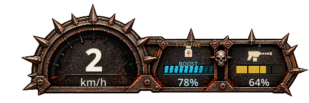
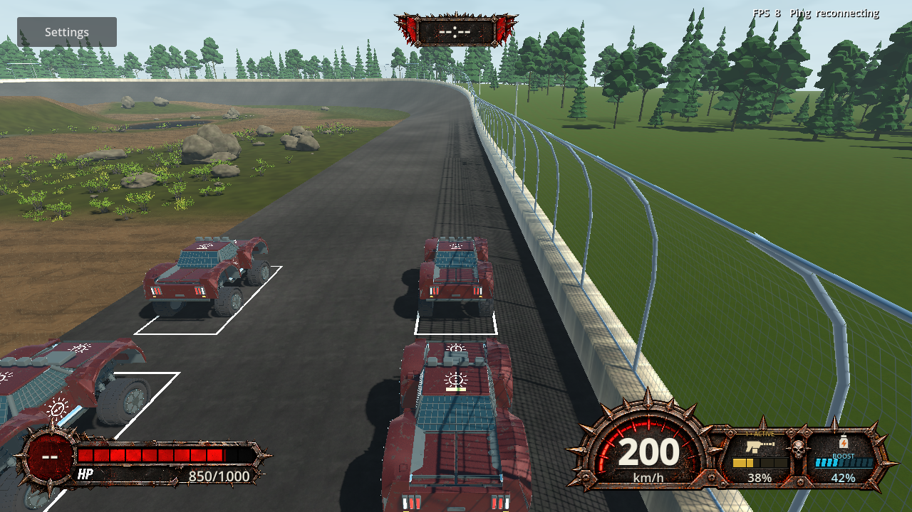
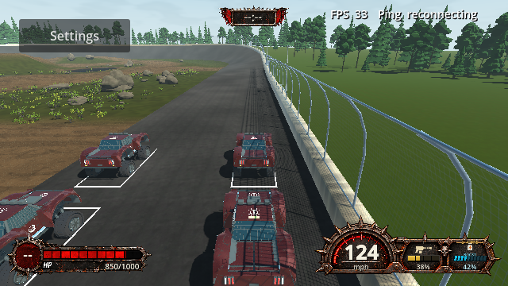
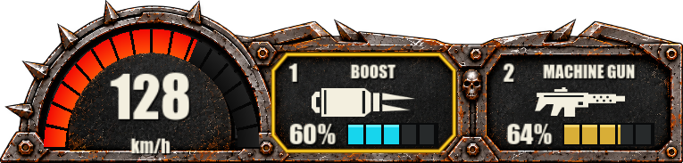
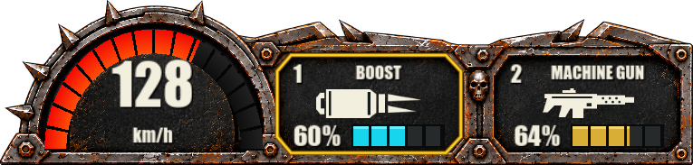
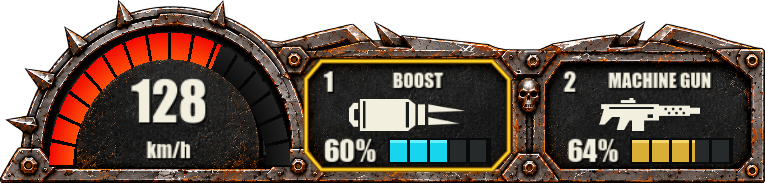

# TS-177 — Boost Item HUD Variant & Visual Design

The current approved result is the corner HUD with the smaller centered speed numeral shown in the speed-fit evidence below. Earlier sections are chronological verification history, not current appearance specifications. The user approved the final result on 2026-09-29 and requested removal of unused superseded HUD remnants only.

Recorded 2026-09-27 on `ts-177-jg`. [Jira TS-177](https://jonathangenier.atlassian.net/browse/TS-177) was read before work and re-read after final verification. It has no children or comments; TS-222 is its completed prerequisite. At that time no additional user-approved requirement change had been supplied; the later approved redesign and cleanup are recorded below.

## Initial implementation — superseded appearance

- The existing physical-slot projection continues to bind each authoritative Nitro charge independently. Within the shared TS-222 slot control, Nitro now renders a cyan ten-vane thrust meter, `BOOST` legend, and pale percentage readout. Partial vanes use charge-proportional opacity; the numeric percentage remains the exact upward-rounded authoritative presentation.
- The variant appears in either occupied physical slot, including beside Machine Gun's gold magazine meter. Replacement, wrong-life/vehicle inventory, removal and exhaustion clear the legend and meter with the existing shared slot lifecycle. The speedometer frame, separate HP artwork, 85% scale, layout and item authority were not changed.
- HUD feature documentation and the native verification fixture were updated. The Story version was synchronized from current main to `0.2.3` / Windows `0.2.3.0`. No third-party asset or dependency was added.

## Verification actually performed

| Check | Result |
| --- | --- |
| `tools/check-fast.ps1 -Area Client -GodotPath <Godot 4.7.2> -RequireRuntime` | PASS after final production change; Debug Client build, zero warnings/errors. The first sandboxed attempt could not read the local NuGet config; an authorized rerun passed. |
| Godot 4.7.2 headless editor import | PASS; refreshed missing local `TrackstormCar.glb` import after the first HUD run failed for that cache reason. |
| `check-hud.ps1 -GodotPath <Godot 4.7.2> -NoBuild` | PASS after final production/test change. Confirmed per-slot Boost percentage, full/partial/near-empty/exhausted states, unchanged second-slot meter while first drains, Boost in slot 2 beside Machine Gun, replacement and stale-data clearing, selection, wrong life/vehicle, nine viewport sizes and teardown. Final native artifacts: `.godot/hud-checks/8c0776f9c79b447da3980a52a526100b/`. |
| `check.ps1` | PASS; Debug and Release builds with zero warnings/errors, 912 Core tests and 407 transport/Client tests passed, none failed or skipped. |
| `check-nitro.ps1 -GodotPath <Godot 4.7.2> -NoBuild` | PASS; two native peers sustained use, release, reuse and exhaustion, with the other physical slot preserved. Both Nitro resources reached zero and cleared only their slots. |
| Godot `--headless --path . --quit-after 120` | PASS; exit 0, no emitted errors/warnings. |
| Latest main ancestry, `check-version.ps1`, `git diff --check` | PASS; canonical/preset versions match `0.2.3` / `0.2.3.0`; diff remains scoped to Client HUD, fixture, HUD documentation, evidence and version metadata. |

**VERIFIED rendered evidence:** Inspected the actual native composition with Boost 78% beside Machine Gun 64%, Boost 42% in the second slot beside Machine Gun 38%, and the 640×360 full HUD with the same mixed items. The blue vanes, BOOST legend and readout are visually contained in their respective slot; the other meter retains its gold treatment. The 640×360 image confirms the compact assembly remains within the viewport, although the BOOST legend is hard to read at that size. These are fixture-driven native renders, not a claim of human-driven combat playtesting.

## Astra Runtime Critique — Story Round 1

Performed after the comprehensive checks above and direct inspection of the native rendered states.

**Overall Score: 8.2 / 10**  
**Quality Assessment: PASS (>=8.0)**

| Category | Score | Observed basis |
| --- | --- | --- |
| Runtime Functionality | 8.8 | Native per-slot charge, consumption projection, slot isolation and clearing checks passed. |
| Visual Quality | 8.4 | Ten tapered cyan thrust vanes, bottle icon and BOOST legend distinguish Boost from the four-cell gold meter within the approved frame. |
| UI / UX | 7.6 | Percentage remains prominent at normal size; BOOST legend is hard to read at 640×360 under the approved common 85% scale, although cyan vanes still distinguish the item. |
| Runtime Integration | 8.5 | Mixed-item native render, two-peer Nitro lifecycle and shared HUD teardown passed. |
| Runtime Stability | 8.5 | Final native HUD, Nitro and startup runs completed without errors; no long-session claim. |

**What Was Exercised:** VERIFIED native fixture-driven full/partial/depleted Boost in both physical slots, coexistence with Machine Gun, nine layouts, and two-peer Nitro sustain/release/reuse/exhaustion. **Runtime / Operational Limitations:** Human-controlled combat, physical controller hardware, separate-PC/EOS, exported builds, and long-session soak are UNVERIFIED. The minimum-resolution BOOST legend is difficult to read; the numeric value and cyan meter remain visible in the inspected capture. The score judges this Story's Boost variant, not independent engineering quality or user acceptance.

## Assumptions and limitations

- The gameplay item is named `Nitro` in Core; TS-177's “Boost” means this item and its slot-local remaining Nitro charge. No vehicle exhaust/VFX or TS-224/TS-225 work was added, and the HUD does not require TS-164 production vehicle changes.
- Native inventory states are supplied by fixture and two-peer harnesses on one Windows machine. This evidence does not establish remote-device latency behavior or manual combat feel.
- No manual discard command exists; replacement/clear and authoritative exhaustion paths were exercised without adding one.

## Approved corner-HUD implementation — 2026-09-28

The user rejected the prior icon placement/font and approved a new reference through iterative visual sketches. Explicit scope now includes the shared chassis and speedometer: worn modern steel, shaped armor shoulders, a low wide silhouette with flat base/right edge, zero bottom/right window margin, centered icons, condensed instrument type, a yellow selection perimeter with no ACTIVE/SELECTED wording, and chunky live resource segments. Jira TS-177 was read in full (no subtasks/comments) and updated to preserve these approved changes and unaffected resource requirements. The retained approved reference is `assets/hud/reference/ApprovedCornerHud.png`.

### Approved corner implementation outcome

- A blank generated armor substrate preserves the accepted upper contour, bolts, skull divider and wear. Its alpha bounds are sampled into 600x144.24 design pixels, replacing the former 600x200 assembly and exterior margin. This is a roughly 28% reduction in bounding height, not a measured percentage reduction in opaque screen coverage.
- Sixteen live red/orange speed segments preserve the existing 200 km/h scale. Speed number/unit use separate native labels.
- Both item wells share centered visible SVG regions, headings and live resource rows. Nitro uses the approved jet silhouette and five cyan fuel cells with partial-width depletion; Machine Gun uses the revised ivory silhouette and gold rail. Selection is a yellow physical-slot perimeter, independent of fuel. All confirmed inventory/life gating remains unchanged.
- A cyan exhaust underline marks the actively boosting selected cell; release removes it while retaining charge. This replaces the old NITRO BOOST caption, which collided with the new arc in an intermediate render.
- Windows native rendering uses installed Impact via SystemFont. No font binary or third-party acquisition was added. Other systems may use the documented alternate/fallback fonts.
- Source/output hashes, exact built-in imagegen prompt, original reference and runtime geometry are retained under `assets/hud`. Health/timer layout and the user's pre-existing grass import change are preserved.

### Verification actually run

| Check | Result |
| --- | --- |
| Current `origin/main` ancestry and Story version | PASS after fetch; canonical 0.2.6 / Windows 0.2.6.0. |
| `tools/check-fast.ps1 -Area Client -GodotPath <4.7.2> -RequireRuntime` | PASS Debug build; zero warnings/errors. |
| Godot 4.7.2 editor import | PASS, including the generated chassis and revised SVGs. [Log](ts-177/corner-hud/import.log). |
| Final `check.ps1` | PASS after last production change: Debug/Release warnings-as-errors builds, 918 Core and 407 non-native Client/transport tests, zero failures/skips. [Log](ts-177/corner-hud/check.log). |
| Final `check-hud.ps1 -GodotPath <4.7.2> -NoBuild` | PASS: full/partial/near-empty/depleted Boost, independent second-slot fuel, replacements, empty/life/vehicle clearing, repeated selection pixel checks, exact corner anchoring and label/icon separation across nine sizes, active/released thrust underline and teardown. [Log](ts-177/corner-hud/hud.log). Full final run: `.godot/hud-checks/4e877dd2944e4d279b190f8436681977/`. |
| `check-nitro.ps1 -GodotPath <4.7.2> -NoBuild` | First run FAILED at existing release/depletion flame/smoke cutoff assertion, followed by cleanup warnings on early exit. Standalone retry PASSED both-peer sustain, release, recovery, reuse, depletion, slot isolation and VFX cutoff. The exhaust/harness source is unchanged from origin/main. A timing sensitivity is INFERRED, not proven fixed. [First failure](ts-177/corner-hud/nitro-first-attempt.log), [retry](ts-177/corner-hud/nitro-retry.log). |
| Godot headless production startup, `--quit-after 120` | PASS, exit 0 and no errors/warnings. [Log](ts-177/corner-hud/startup.log). |
| `git diff --check` | PASS. |
| Supplemental `tools/check-root-artifacts.ps1` | Reports existing ignored local roots: EOS local configuration, Releases and Godot template/profile/theme directories. Their creation/write dates predate this implementation. They were left intact; no deletion or claim of a clean root check. This is outside HUD acceptance. |

Intermediate native checks exposed speed/unit and heading/icon minimum-font-size collisions. Both were corrected before the final run. Native selection is checked through rendered yellow pixels, resource depletion/isolation through rendered cyan pixels, and geometry through actual native Control rectangles, not just detached view values.

### Native visual evidence

These are real Godot fixture renders using production HUD components, not the generated concept overlay. The scene fixture supplies confirmed inventory snapshots and uses the existing arena; this is not a claim of human combat playtesting.

- [640x360 gameplay fixture](ts-177/corner-hud/hud-640.png)
- [1920x1080 gameplay fixture](ts-177/corner-hud/hud-1920.png)
- [Selected first slot](ts-177/corner-hud/selected-first.png)
- [Selected second slot](ts-177/corner-hud/selected-second.png)

## Astra Runtime Critique — Story Round 2

Evaluated after the final comprehensive and native verification above. This is the user's authorized redesign following Round 1.

**Overall Score: 8.3 / 10**
**Quality Assessment: PASS (>=8.0)**

| Category | Score | Directly observed basis |
| --- | --- | --- |
| Runtime Functionality | 8.8 | Independent fuel, confirmed selection, active/release feedback, replacements and clearing pass native checks. |
| Visual Quality | 8.5 | Native armor shape, corner treatment, jet/gun silhouettes and instrument hierarchy closely follow the approved concept. |
| UI / UX | 8.1 | Yellow perimeter and chunky fuel cells remain identifiable at minimum size; headings are necessarily small at 640x360. Speed/unit and icon/heading regions do not overlap. |
| VFX / Feedback | 8.2 | Active cyan underline remains local to the selected Boost cell and disappears on release; remaining fuel stays visible. |
| Runtime Integration / Stability | 8.0 | HUD and startup runs are clean; two-peer resource lifecycle passed on retry, with the initial unchanged exhaust timing assertion explicitly retained as a limitation. |

**What Was Exercised:** VERIFIED native fixture-driven composition, all supported layouts, full/partial/near-empty/exhausted resources, duplicate and mixed inventory, both selections, active/released Boost, invalid-life/vehicle clearing, startup and two-peer Nitro lifecycle. INFERRED that the intermittent exhaust cutoff assertion is timing-sensitive; no fix is claimed.

**Runtime / Operational Limitations:** Manual combat, physical controller use, separate-PC/EOS latency, exported builds, non-Windows font appearance and long-session soak are UNVERIFIED. Fixture FPS is not a measured HUD performance benchmark. The unrelated root-artifact checker findings remain untouched. This historical revision awaited visual acceptance at the time; the user accepted the final HUD on 2026-09-29 and authorized cleanup and delivery.

**Historical human gate:** The user subsequently approved the implemented HUD on 2026-09-29, authorizing cleanup and delivery without further visual changes.

## Speed-unit fit correction — 2026-09-28

User-authorized correction: move the km/h readout off the bottom frame and fit it better inside the speedometer. Raised the speed number by 12 design pixels and the unit by 11, keeping the existing fonts, size and centered alignment. The native harness now also requires the unit Control to end no lower than y=130 in assembly coordinates, inside the dial above the metal base. The existing number/unit non-overlap check remains enforced.

Verification: Debug Client build with warnings as errors passed (zero warnings/errors); `check-hud.ps1 -GodotPath <4.7.2> -NoBuild` passed all nine resolutions, selection/resource/lifecycle checks, active/release rendering and the added dial-containment assertion. Final artifacts: `.godot/hud-checks/bb580a31dcac45b9b67b4df47ec7ee2e/`; [runtime log](ts-177/unit-fit/hud.log). The first spacing attempt exposed a one-pixel minimum-font-height collision and was corrected before this final run. The full solution and two-peer checks from the preceding revision were not repeated for this coordinate-only correction.

[640x360](ts-177/unit-fit/hud-640.png) | [1920x1080](ts-177/unit-fit/hud-1920.png)

## Astra Runtime Critique — Story Round 3

**Overall Score: 8.3 / 10**
**Quality Assessment: PASS (>=8.0)**

Category scores: Visual Quality 8.5; UI / UX 8.2; Runtime Functionality 8.8; Runtime Integration / Stability 8.0. The previously overlapping frame/unit treatment now has visible dark-dial padding. The overall assessment remains grounded in the same feature and limitations, not the number of improvement rounds.

**What Was Exercised:** VERIFIED native 1920-width component capture and 640x360 gameplay fixture visually inspected; all nine supported resolution/layout checks and inventory-state tests passed. Both mph and km/h fit inside the dial. The imagery is native fixture-driven rendering, not manual combat playtesting.

**Runtime / Operational Limitations:** Manual combat, exported builds, alternate platform fonts, remote-device networking and long sessions remain UNVERIFIED. The prior intermittent exhaust check and existing ignored root entries remain as documented in Round 2. This was the third formal Story round. The user subsequently accepted the HUD on 2026-09-29 and explicitly authorized cleanup, a regression-only critique and commit/push.

## User-directed speed numeral refinement — 2026-09-28

The user requested a slightly smaller, more centered speed value with more clearance from the progress arc. Reduced its font from 50 to 42 design pixels (16%) and moved its label down from y=42 to y=53 with a 51-pixel target height. Its horizontal center and the corrected unit placement are preserved.

Verification: Debug Client build passed with zero warnings/errors. Native HUD checks passed all nine resolutions, including speed/unit non-overlap and unit containment, plus the existing inventory/resource/selection/lifecycle checks. Native isolated composition and 640x360 fixture were visually inspected. Final run: `.godot/hud-checks/23393aaa9f6a473884458082a5ccf256/`; [log](ts-177/speed-fit/hud.log). No full-solution rerun or new formal critique round was performed for this focused font/coordinate correction; earlier limitations remain applicable.

[640x360 fixture](ts-177/speed-fit/hud-640.png)

## Approved-HUD cleanup — 2026-09-29

The user explicitly accepted the current HUD and authorized cleanup only, a regression-only Astra review, and commit/push on `ts-177-jg`. Jira TS-177 now records that approval. No redesign or further improvement round is authorized. Approved implementation checkpoint: `7f4b7f2`; cleanup baseline after merging current main `39b8be2`: `3e44a6e`. Story version is now 0.2.7, with Windows preset versions 0.2.7.0. Main was fetched again and version validation passed before delivery.

Removed only the superseded `Item.png`, `Speed.png`, `ItemAssembly.png` (5,971,619 bytes combined), `ItemAssembly.gdshader`, its legacy mapping document, two obsolete startup preload entries, unused component-1/2 shader paths, and their asset-manifest/current-documentation references. No exclusively obsolete tests were found: current selection, resource and containment regression checks remain useful and were retained.

Intentionally retained: `CornerAssembly.png` and shader, all seven item icons, approved reference/provenance, `Health.png`, `Timer.png`, and their still-active component-0/3 shader paths. The runtime node named `ItemAssembly`, TS-222 two-slot classes, compatibility projections used by callers/tests, and authoritative item/resource logic remain active dependencies. Historical verification evidence remains historical evidence. The pre-existing grass import edit remains outside this commit.

All `code/Client/Hud` file hashes match the pre-cleanup snapshot. No cleanup changes touch Core, HUD geometry, fonts, colors, artwork, speedometer, selection, Boost presentation, resource behavior, gameplay, or the HUD verification harness. The only production source edits are deletion of unreachable shader branches and unused startup preload paths.

### Cleanup verification actually performed

| Check | Actual result |
| --- | --- |
| Targeted `tools/check-fast.ps1 -Area Client -GodotPath <4.7.2> -RequireRuntime` | PASS, zero build warnings/errors. [Log](ts-177/cleanup/targeted.log). |
| Godot 4.7.2 headless editor import | PASS, no errors/warnings. [Log](ts-177/cleanup/import.log). |
| Final comprehensive `check.ps1` | PASS: Debug/Release builds, version/workflow/frontend checks, 918 Core + 411 Client/transport tests, no failures/skips. [Log](ts-177/cleanup/final-check.log). |
| Native HUD before and after cleanup | Both PASS across nine resolutions, full/partial/near-empty/exhausted resources, independent slot fuel, replacements, clearing, selection, active/released Boost, and layout containment. [Before log](ts-177/cleanup/hud-before.log), [after log](ts-177/cleanup/hud-after.log). |
| Before/after render comparison | Two complete isolated PNGs (normal and Boost-active composition) are byte-identical by SHA-256. Five opaque HUD regions across each of nine resolutions (health fill, health number, timer, first slot, second slot) have zero differing pixels: 45/45. [Comparison report](ts-177/cleanup/pixel-comparison.txt). Animated full-scene images were not claimed identical. |
| `check-startup.ps1 -GodotPath <4.7.2> -SkipBuild -SkipMediaCheck` | PASS through navigation, recovery, settings/browser return and persistent MenuShell. This exercises the edited preload path; media validation was explicitly skipped. [Log](ts-177/cleanup/startup.log). |
| Supplemental `check-nitro.ps1 -GodotPath <4.7.2> -NoBuild` | FAILED twice at the previously recorded `release/depletion finishes bounded flame and smoke emission on both peers` assertion. Both runs reached sustain, release/recovery and second activation with authoritative charge drain. [First run](ts-177/cleanup/nitro.log), [retry](ts-177/cleanup/nitro-retry.log). No passing current Nitro run or exhaust fix is claimed. |
| Final version and whitespace checks | `tools/check-version.ps1` and `git diff --check` PASS. |

Baseline capture directory: `.godot/hud-checks/37ff1107b6b34df4add793f8ad452812/`; after-cleanup: `.godot/hud-checks/12cdbfa6b19944ea92eb9ce046fa3c35/`. The two complete isolated PNG hashes are recorded in the comparison report. Health/timer comparisons specifically cover the surviving shared shader consumers. [Before composition](ts-177/cleanup/before.png) and [after composition](ts-177/cleanup/after.png) are preserved for direct review.

### Astra runtime regression critique — approved HUD cleanup

This is the explicitly requested preservation check, not a fourth visual-improvement round. The user's current instruction accepts the approved appearance and authorizes delivery after cleanup; no additional design or acceptance request is introduced.

**Overall Score: 8.3 / 10 — Quality Assessment: PASS (>=8.0), for HUD preservation.**

Category scores: Visual Quality 8.5; UI / UX 8.2; Runtime Functionality 8.8; Runtime Integration / Stability 8.0. These assess the unchanged approved HUD, not an improvement resulting from deletion or an all-runtime-checks-passed claim.

**What Was Exercised:** VERIFIED native post-cleanup normal/active composition and minimum-size fixture inspection, unchanged visual hierarchy, speed/unit fit, yellow selection perimeter, cyan resource cells and active underline. Exact isolated-image equality and sampled-region comparison corroborate preservation. Native checks exercise both slots, resource depletion/isolation, selection, invalid-life clearing and nine layouts. Startup navigation is verified. No HUD regression was observed.

**Runtime / Operational Limitations:** The supplemental two-peer Nitro exhaust assertion remains failing; its harness and exhaust implementation are unchanged from main, and this assertion had also failed before cleanup in earlier TS-177 verification. A timing cause remains INFERRED, not proven. Manual combat, physical controllers, separate-PC/EOS networking, exported builds, alternate-platform fonts and long sessions remain UNVERIFIED. This cleanup does not resolve those pre-existing verification gaps or claim complete two-peer exhaust acceptance.

### Cleanup delivery and independent engineering review

Cleanup committed as `cd3a6b5` and pushed on `ts-177-jg`. The remote branch had compatible main/version maintenance; merge `ce0dc6b` preserves it and has an identical Git tree to `cd3a6b5`. The verification-index conflict was resolved by retaining the TS-177 entry and linked historical captures. [PR #133](https://github.com/JonathanGenier/Trackstorm/pull/133) was updated; it remains unmerged.

An independent read-only engineering reviewer examined `3e44a6e..ce0dc6b`, current source/dependencies and committed verification evidence: **PASS**, no actionable cleanup defects. It confirmed unchanged HUD/Core/harness code, active Health/Timer consumers, missing obsolete runtime references, matching composition hashes, correct main ancestry/version, and the unstaged user grass edit. This verdict covers cleanup correctness and preservation, not full Story runtime acceptance or merge readiness. The current Nitro failure remains an explicit limitation; its retry also emitted early-exit object/resource cleanup diagnostics. GitHub CI run `36557763095` was still in progress when this delivery note was recorded; no CI success is claimed.
