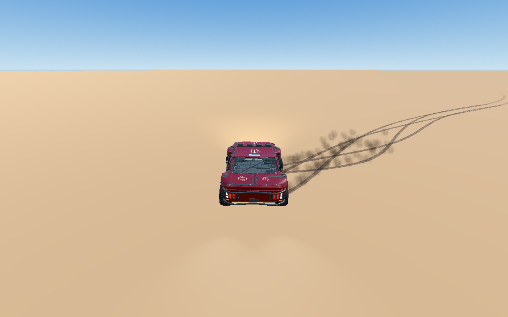
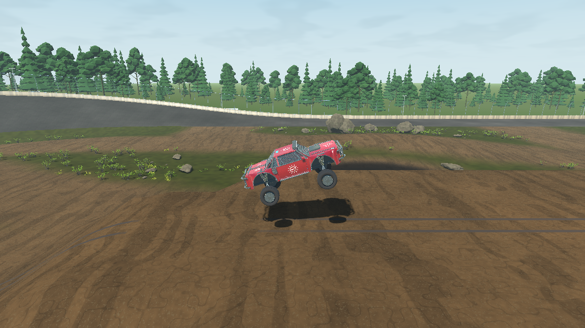
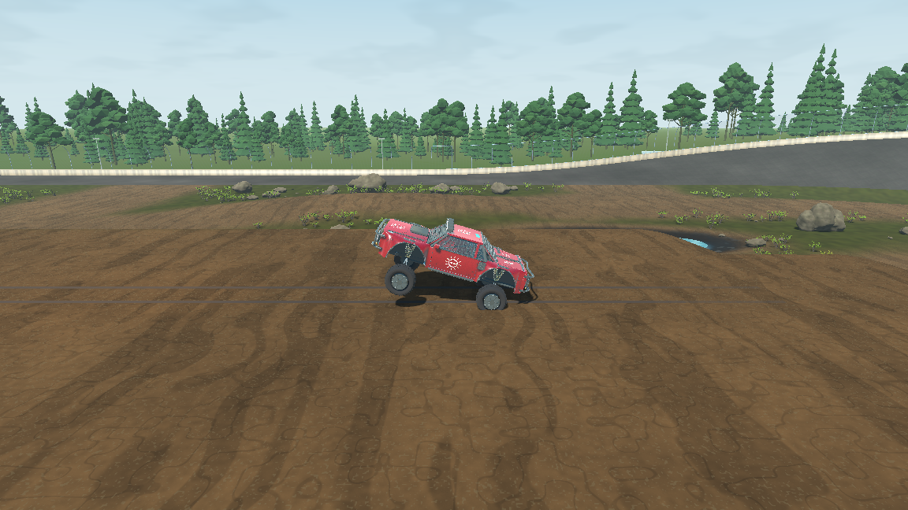
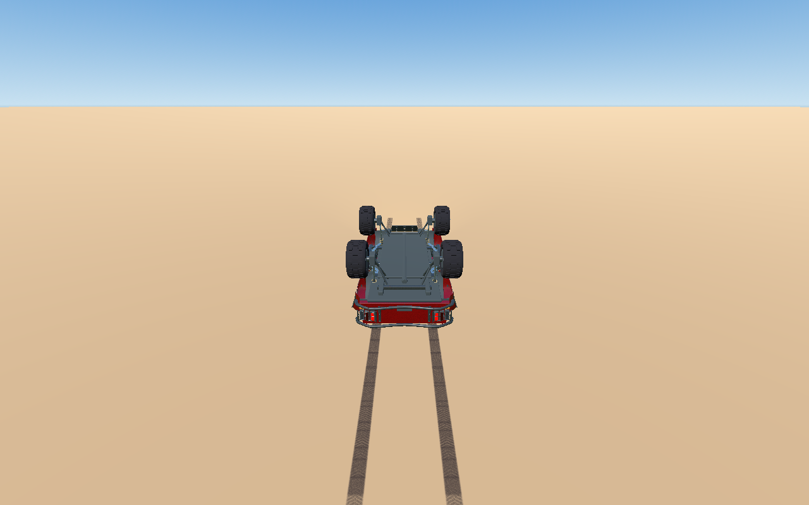

# TS-197 — Arcade trophy-truck driving, suspension and landings

Earlier rounds below are historical. The latest evidence is in **Human playtest polish — Astra 7.7 follow-up: grip, planted feel & digital steering precision** at the end of this report.

Evidence recorded 2026-09-28 on `ts-197-pg`, using Windows, Godot 4.7.2 .NET and the production Car from TS-228/TS-164/TS-259. Jira TS-197, parent TS-229, TS-228 and applicable repository routing were inspected. TS-197 had no required children or comments. No approved scope change was needed. The unavailable production Van remains TS-232, To Do; it was not invented for this Story.

## Implemented

- A 1400 kg chassis, 40 m/s² reference engine demand, 28 m/s² reference braking, stronger grip and faster steering. Reference mass remains 900 kg, and forward/reverse caps remain 44.44/11 m/s. These are arcade force parameters, not a claimed horsepower simulation.
- Rear-biased all-wheel drive, with a validated `vehicle.front_drive_share` of 0.35. The established Developer Config catalog, complete transaction validation, persistence, host publication, recovery and prediction carry this parameter. Configuration protocol 26 has 174 keys; movement-state serialization is unchanged.
- Strong rear lock: faster engagement, more braking, 0.25 rear lateral-grip fraction, interrupted engine drive and rear visual wheel lock. Dirt steering retains directional authority through a broadside handbrake slide. Countersteering arrests wrong-way yaw; release restores ordinary steering and traction progressively.
- Longer, softer initial suspension with progressive end resistance: 1.591 m extension, 22/s² spring, 10/s compression damping, 11/s rebound damping, and a quadratic bump term of 260 above 0.6 m compression. No aerodynamic force was introduced.
- Ground attitude assistance now requires landable wheel support and scales with supported wheel count. Roof, side and severe bumper contact receive no upright target. The airborne branch, control mappings, rates, delay and stabilization remain unchanged.
- Vehicle wheel rays no longer treat other vehicles as spring support. Native practice retains its existing zero-restitution rigid-body collision solver. Network host observations solve each vehicle pair once, applying equal/opposite mass-weighted inelastic impulses and bounded contact torque. Local prediction uses the same Core solver against the latest remote state.
- Raw relative contact velocity, impact direction, contact position, stable vehicle identity and configured mass remain available. Existing HP/damage behavior was preserved; no collision-damage system or formula was added. No production mesh, collider asset, dependency or license was changed.
- Added `check-trophy-truck.ps1`, its native fixture and fast-check routing; added Core coverage for impulse conservation, mass advantage, glancing contacts, unsupported axles, configuration and progressive suspension.

## Verification performed

`GodotPath` below was `C:/Users/orsin/OneDrive/Desktop/godot/Godot_v4.7.2-stable_mono_win64/Godot_v4.7.2-stable_mono_win64_console.exe`. Local detailed logs and per-tick traces are under `.godot/ts-197`; representative rendered evidence is retained beside this report.

| Command / check | Actual result |
| --- | --- |
| `git fetch origin main`, `tools/sync-story-version.ps1`, `tools/check-version.ps1` | Current main was already an ancestor, zero missing commits; canonical 0.2.5 and Windows 0.2.5.0 validated. |
| `tools/check-fast.ps1 -Area Core` | Final targeted iteration passed 928 tests. Earlier stale-default failures were corrected. |
| `tools/check-fast.ps1 -Area Transport` | Iterations exposed stale acceleration/friction expectations; corrected. Focused Developer Options retest passed 18 tests; comprehensive transport gate below passed. |
| Targeted vehicle/release-default NUnit run | 275 passed during the final handling iteration. |
| `check.ps1` | PASS: version/tool/media regressions, restore, Debug production graph, Release solution, warnings-as-errors, 928 Core tests and 407 non-native transport tests. |
| `check-vehicle.ps1` | PASS: 147 assertions at each of 30 and 144 render FPS; 3,840-component physics and 8,400-component surface traces agree within 0.02. Includes camera input/return and reset. |
| `check-trophy-truck.ps1 -NoBuild` | PASS: 50 assertions across both production adapters. Dirt acceleration, fast steering, opposite and sustained drift, release, four landing attitudes, rear impacts at 8/20/30 m/s, head-on, unequal mass and glancing impacts. |
| `check-landing.ps1 -NoBuild` | PASS: 64 scenarios. |
| `check-air-control.ps1 -NoBuild` | PASS: 20 production-adapter scenarios, including sustained rotations, release, correction and repeated landing transitions. |
| `check-terrain-handling.ps1 -NoBuild` | PASS: both adapters, all six normal surfaces, split contacts, slope starts, steering, handbrake recovery and transitions. |
| `check-environment-collisions.ps1 -NoBuild` | PASS: zero failures for walls, corners, rocks, pillars, glancing/repeated contacts and production-oval scraping. |
| `check-oval.ps1` | PASS: 3,095 checks, including sustained laps, banks, repeated bumps, one-wheel obstacles, coasting and flat drops. |
| `check-infield.ps1 -NoBuild -Visual -Case WestJump` and `-Case EastJump` | Both PASS: 2,598 support probes per invocation; each corridor driven at 14, 16 and 18 m/s. Rendered approach, airtime and landing captures inspected. This was not a run of every infield route. |
| `check-developer-options.ps1` | PASS: write phase 1,317 assertions; independent read phase 13. Includes catalog controls, apply/reset, authority, replication and persistence. |
| `check-pickup-drive.ps1 -NoBuild` | PASS after fixture correction: both application peers acquired all registered items, filled both slots, rejected full inventory and retried after use; all 180 valid motion crossings succeeded at 8/40/65 m/s and three offsets. |
| `check-reconnect.ps1 -NoBuild` | PASS: three arena resyncs including 125 seconds offline, body reuse, prediction/interpolation reset, held-item/spawn/match continuity and new-generation reset over native UDP. EOS identity and initial scores are fixture seams. |
| `check-car-articulation.ps1 -Visual` | PASS after fixture correction: 226 assertions; rendered tire, steering, suspension, braking/reverse lamps and repeated rack/trunk deployment inspected. |
| `check-nitro.ps1 -NoBuild` | PASS after fixture correction: six rocket/support/pedal scenarios, repeated use/release, charge exhaustion and authoritative scoring over two native peers. Normal drive reached 44.44 m/s, boost 62.22 m/s. |
| `check-startup.ps1 -SkipBuild -SkipMediaCheck` | PASS: native application startup, phase/input gating, repeated mixed navigation, Settings/browser return and persistent menu media. Media validation already passed in `check.ps1`. |
| `check-environment-collision-network.ps1 -NoBuild` | PASS: two native UDP peers, 30 ms outbound delay, 5 ms jitter, 2% loss. Scrape, crash and head-on outcomes agree; contact correction maximum 0.4777 m, excluding deliberate new-life placements. |
| `check-network-vehicles.ps1 -NoBuild -ApplicationEntry -Latency 50 -Jitter 10 -Loss 2` | FAIL: two peers connected and drove, but startup maximum 1.024 m and steady P99 0.412 m exceed the existing limits. Details below. |

The first comprehensive pass was followed by narrowly scoped verification-fixture corrections and their affected native retests; no production behavior changed after that pass. The complete gate was run again on the completed branch after those corrections, rather than treating the earlier compilation as evidence for later edits.

### Fixture corrections and diagnostic failures

The faster drivetrain outgrew several older scenario assumptions. Straight acceleration now stops before reaching the oval curve; drift recovery uses a long isolated runway rather than hitting the yard wall; the ramp fixture releases airborne pedals; clean drop fixtures use neutral pedals because throttle intentionally commands nose-down aerial control. The oval art check now uses TS-259's actual 3.351105 m visual wheelbase, independently of the unchanged physical axle spacing. Drift bounds were updated for deliberate strong rotation, and a held-spin check observes the turn rather than assuming a particular final heading.

Bank/infield transition separation is measured against the four-wheel support plane and bounded by available static droop energy. The old center-triangle/12 cm rebound assumption did not describe a long-travel chassis bridging concave terrain while descending. Continuous support and settling requirements remain; the independent 12 cm bump and flat-landing limits were retained. A stiffer rebound-damping experiment worsened that transition and was discarded.

The rendered drive exposed loss of requested rotation during a broadside held drift. That was corrected before final verification and added to the native regression. Initial network contact tests exposed an uninitialized stationary proxy orientation, fixed by initializing from the native transform.

The Car articulation approach was shortened from 90 to 60 powered ticks to keep its brake-lamp test off the legacy yard ramp. Nitro scenarios now compare their own score deltas instead of assuming earlier powered scenarios could never earn valid overspeed points during release. Lighting and scoring production code did not change. The pickup-motion fixture initially rejected its own outer path as outside the three-dimensional 3 m collection sphere; its grazing offset now accounts for production ride height, while preserving the valid-crossing requirement and all 180 trials.

Sandboxed NuGet metadata lookup initially produced NU1900, resolved with a network-authorized restore; the final gate was clean. A direct rewrite of the optional playtest command JSON briefly exposed an empty file to that verification hook and logged a parse exception; the next complete command ran successfully. This did not occur in game input or the final native suites. Atomic file publication is appropriate for this diagnostic hook.

## Direct driving and runtime observations

These are **VERIFIED** observations from bounded logical input segments and native integration runs, with rendered captures inspected. This was active observe/input/observe driving, not physical keyboard/gamepad play by a human.

- Dirt standing acceleration reached 100 km/h in 99 ticks (1.65 s), then about 43.3 m/s after four seconds. At high speed, a 0.7 steering command produced about 0.394 rad/s yaw and a controlled 3.30 m/s lateral component with continuous support.
- Reversing steering into rear lock produced decisive rotation. After the subsequent sustained segment, yaw remained in the requested direction at 3.47 rad/s, with body-up 0.9997. Three seconds after release with 75% throttle, speed was 40.4 m/s, yaw 0.00010 rad/s and lateral velocity 0.00055 m/s. Long held input can deliberately spin the truck; release does not select a heading or create a speed boost.
- A standing 30-degree Dirt climb reached about 32 m/s along the incline after three seconds and gained roughly 25 m altitude, with wheel support and full HP. Native surface checks also exercised their existing material-specific grades.
- A clean 4.355 m drop used 0.870 m maximum compression, generated zero chassis contacts and returned level, with full HP. Side/roof/bumper fixtures remained bounded. The rendered roof drop remained inverted and lost 28.23 HP through the pre-existing damage rule; it was not auto-righted.
- Eleven repeated 12 cm bumps produced 0.133 m peak body rise in practice and 0.150 m in the network adapter, no unsupported samples, and settled vertical motion below 0.02 m/s. Isolated 12 cm crests raised the body only 0.044–0.054 m. Four-metre flat drops had about 0.451 m/s later rebound and settled below 0.001 m/s.
- West-ramp 18 m/s approach compressed the suspension up to 0.944 m, then unloaded through approximately 0.06 m to full droop, taking off at about 6.36 m/s vertical speed. It produced 1.32 s airtime, 18.95 m horizontal travel and 3.98 m peak origin clearance; the complete route finished with 1000/1000 HP. Ramp shape and suspension both contribute; no claim is made that spring release alone supplies all launch energy.
- Native equal head-on impacts settled almost to rest. The network sweep adapter retained approximately 0.9–1.2 m/s residual longitudinal motion after the same opposed 20 m/s inputs, rather than returning the entry speeds as rebound. At the same 20 m/s entry, a 1400 kg source displaced a 700 kg target farther than a 1400 kg target on both adapters. Raw impact observations remain separate from the solved motion.
- Rendered roll input visibly rotated the airborne production Car. The native aerial suite retained the configured pitch/yaw/roll rates (2.8/2.4/3.6 rad/s), release damping and repeated landing behavior.

## Multiplayer findings and limitations

The separate-process production-map test is **not an unconditional pass**. An initial normal-entry run connected but exceeded correction limits: steady P99 0.560 m and maximum 1.708 m. Other attempts timed out before admission with no gameplay payloads sent, including an isolated-host diagnostic. These attempts do not establish successful physics synchronization.

The normal lobby-to-arena run (`check-network-vehicles.ps1 -NoBuild -ApplicationEntry`) connected and completed driving, but failed the existing 0.25 m steady P99 limit: startup maximum 0.059 m, steady P99 0.393 m, steady maximum 0.554 m, zero hard snaps and zero prediction-limited frames. Frame-time P99 was 502.7 ms; simulation-step P99 was 121.2 ms. The largest corrections occurred after a world/prop impact. This is observed association, not proof that the pair solver caused it. Acceptance thresholds were not weakened.

The final impaired run used 50 ms outbound delay, 10 ms jitter and 2% loss, with no other Godot sessions running. It received 464 snapshots and ended grounded. Startup maximum was 1.024 m (limit below 1 m); steady P99 was 0.412 m (limit below 0.25 m), with maximum 0.536 m. There were zero hard snaps and zero prediction-limited frames. Frame-time P99 was 384.1 ms and simulation-step P99 127.2 ms. Its largest corrections occurred without damage, so the complete tail cannot be attributed to collisions. This remains a failed runtime quality gate, despite successful focused contact, configuration and reconnect checks.

Local prediction uses the latest remote proxy, not a full rollback simulation of every vehicle. Practice uses Godot's rigid solver while multiplayer uses the existing sweep adapter, so detailed crash/tumble trajectories differ. Those differences and the measured correction tail limit confidence in multiplayer polish.

## Explicitly unverified

- Van-specific geometry, mass or stance: production Van integration is unavailable.
- Real EOS authentication/relay, separate devices, Internet/WAN conditions and cross-platform native parity. Local UDP impairment is not a substitute for these.
- Full eight-peer physics quality and prolonged multiplayer soak were not run for this Story.
- Human physical-controller ergonomics, subjective audio balance and long play sessions. Rendered logical driving and synthetic camera-controller checks do not establish these.
- Every possible terrain/impact angle, large pileups, arbitrary extreme Developer Config combinations and a future momentum-dependent damage design.

The pre-existing local change to `assets/maps/oval/grass_variation.png.import` was preserved and excluded from Story delivery.

## Astra Runtime Critique — Story Round 1

**Overall Score: 7.6 / 10**

**Quality Assessment: FAIL (<8.0)**

The observed truck has the intended power, responsive steering, forceful deliberate drift, useful suspension travel and forgiving clean landings. It retains momentum and permits consequential crashes. The offline/isolated driving result is strong. The complete experience does not pass because production-map multiplayer still has an excessive correction tail and substantial observed frame stalls. Passing unit tests and focused contacts do not outweigh that runtime evidence.

| Material runtime category | Score | Evidence and practical limit |
| --- | ---: | --- |
| Runtime functionality / integration | 8.2 | Repeated native driving, configuration, pickup, Nitro and reconnect flows pass; full vehicle roster and Van remain unverified. |
| Controls / responsiveness | 8.4 | Rapid steering reversal, sustained rear-lock rotation and smooth powered recovery directly exercised. Human controller ergonomics were not evaluated. |
| Vehicle / movement feel | 8.3 | Strong launch and incline drive, level chassis in aggressive slides, momentum loss on impacts and visible bad-landing consequences. |
| Suspension / physics | 8.2 | Repeated bumps remain supported, meaningful ramp compression/release and clean landings settle; detailed native/sweep crash trajectories differ. |
| Multiplayer / networking experience | 6.2 | Contact and reconnect flows work, but both ordinary and impaired production-map driving fail the correction-quality gate. |
| Observed performance | 6.0 | Final isolated impaired run has 384 ms frame P99 and 127 ms simulation-step P99 on this machine. No causal baseline comparison establishes which cost predates this Story. |

**What was exercised — VERIFIED:** the final commands and rendered logical-input drives above, both production physics adapters, differing masses/speeds/contact directions, all requested landing attitudes, native local UDP contacts and impaired production-map driving. **INFERRED:** occasional correction and frame-time peaks can disrupt aiming and the sense of direct control; this was not measured through a human WAN session. **UNVERIFIED:** Van, full eight-peer quality, real EOS/WAN, physical-controller ergonomics and prolonged play. No audio or static engineering score is substituted for missing experiential evidence.

### Material recommendation

- **Problem:** multiplayer correction/frame-time tails prevent consistent direct control at the intended quality level.
- **Evidence:** final impaired startup correction 1.024 m, steady P99 0.412 m versus limits below 1 m and 0.25 m; ordinary entry also failed steady P99. Hard snaps and prediction-limit saturation remained zero. Frame and step timing show substantial stalls, and some large corrections occur without contacts.
- **Severity:** High.
- **Impact:** inconsistent predicted motion and intermittent stalls risk disrupting precise approach steering, ramming and combat positioning even though the isolated vehicle is controllable.
- **Suggested improvement:** profile and compare current/main authority, input consumption and prediction replay on the production map under controlled load; identify the source of the correction tail, correct it within the existing network model, and rerun ordinary/impaired driving plus the successful contact scenarios. Do not lower acceptance thresholds or alter aerial controls to hide the issue.
- **Scope:** In Scope for the required multiplayer driving quality; a broader network redesign would require a separate scope decision.
- **Corrective Work Type:** New Corrective Task, if authorized. No Jira issue was created.

**Recommended Next Round:** if authorized, concentrate on the multiplayer correction/performance finding and repeat the affected runtime evidence. Preserve the verified handling and aerial mechanics. No further polish round or implementation followed this formal critique. The branch is delivered for review with this FAIL, not represented as accepted or merge-ready.

## Round 2 implementation and verification

Recorded 2026-09-28 on the existing `ts-197-pg` / PR 137. Re-read updated TS-197 (no children/comments), TS-229, TS-228, repository routing, current PR, vehicle/prediction/configuration implementation and tests. The updated Story explicitly authorizes modest aerial sensitivity reduction and delayed inverted recovery, superseding Round 1's unchanged-rate/no-righting behavior. Main remained `141b74d`; sync/version checks retained 0.2.5 / 0.2.5.0. The pre-existing grass texture import change is excluded from delivery.

### Changes

- Dirt corner assist adds up to 45% wheel authority at low/medium speed, without exceeding the low-speed steering limit; it fades from 16 to 28 m/s. Directed front grip starts with throttle/steering commitment instead of waiting for a broad slide. Rear power slip builds progressively with that commitment and recovers when steering/throttle relax. Tire budgets, bounded yaw recovery and stronger dedicated rear lock remain.
- Gravity 9.81 -> 11 m/s²; rebound damping 11 -> 14/s; extension increased by the corresponding static sag to retain ride height. Power, mass and speed caps are unchanged.
- Badly tilted wheel support scales down with chassis/support alignment. Chassis-first terrain contacts dissipate separating velocity above 0.5 m/s and damp rotation while preserving raw relative contact velocity, normal and impulse. No collision-damage rule, aerodynamic system or production mesh was added.
- Settled bad attitudes wait 1.25 seconds before a half-second ramp toward a 1.2 rad/s recovery roll. No pose teleport or immediate perfect landing correction. Ground loss resets the timer; aerial control remains independent. Pitch/yaw/roll target rates are 10% lower (2.52/2.16/3.24 rad/s); mappings, delay, acceleration, smoothing and release stabilization are unchanged.
- Three ordinary Developer Config keys: dirt corner strength, crash recovery delay and crash recovery rate. Movement v10 is 159 bytes and serializes the recovery timer; vehicle network v12 and configuration v27 reject old layouts. The configuration catalog has 177 entries / 1437 bytes. Retuning preserves recovery memory; new lives clear it.

### Actual iteration evidence

- `tools/check-fast.ps1 -Area Core`: initial runs exposed stale default/packet expectations and a countersteer comparison that rewarded overshoot. Updated explicit defaults/schema expectations; low/medium countersteering must arrest wrong-way yaw rather than exceed an unassisted overshoot. The 30 m/s comparison remains. A subsequent targeted run passed 930 tests before three new default cases were added.
- Initial slow recovery torque was canceled by resting native contacts. Changed to a delayed ramp toward a bounded angular rate; both adapters then recovered. Added deterministic delay, snapshot continuation and raw-contact preservation tests.
- Initial oval 0.5 m drop touched full extension immediately after the static-sag change. Raised only the smallest fixture to 0.6 m; retained genuine-airborne, rebound and settling assertions.
- Terrain recovery initially failed at position X=130.934 m beyond the fixture's 125 m half-width, with up=1.000. Enlarged the isolated platform from 250 to 1000 m wide; retained recovery, HP, speed and transition assertions.

### Runtime/playtest observations

VERIFIED using real Godot production adapters and bounded logical driving inputs; rendered samples were inspected. This is not a claim of human physical-controller ergonomics or audio evaluation.

- Paired native/network full-throttle corners starting at 40/50/60 km/h: first 0.75-second heading changes with assist disabled were 0.565/0.518/0.473 rad; enabled were 0.795/0.688/0.581 rad (41%/33%/23% greater). Both adapters behaved almost identically. These are accelerating corner entries, not constant-speed circles. All three exits recovered yaw below 0.1 rad/s and lateral speed below 0.5 m/s after three seconds.
- Rendered 40 km/h entry, full throttle/right steer for one second: rear lateral speed -4.50 m/s, yaw -0.804 rad/s, chassis up 0.998, 1000 HP. Releasing steering at 70% throttle for three seconds yielded yaw -0.000011 rad/s and lateral speed -0.000068 m/s at 42.50 m/s forward, without snap or repeated fishtailing. [Power-slide frame](ts-197-evidence/round2-power-slide.png).
- A lower-throttle 50 km/h entry during iteration turned tightly and remained planted: after 1.5 seconds at 15% throttle/full steering, speed 17.64 m/s, yaw -1.295 rad/s, lateral -0.506 m/s, up 0.997. The subsequent power-slip tuning retained this wheel-authority curve.
- Rendered standing start on 30° Dirt: after three seconds, 32.71 m/s along the truck's forward axis, 27.26 m origin altitude, continuous support and full HP.
- 4.355 m roof/side/trunk/bumper drops: largest observed upward velocity after chassis contact was 0.722 m/s; roof recovery stayed below 1.64 m origin altitude after contact. Roof recovered in roughly six seconds, side sooner, on both adapters. Rendered roof crash retained the existing HP consequence (968.67/1000) and recovered level. [Rest](ts-197-evidence/round2-roof-rest.png), [gradual roll](ts-197-evidence/round2-roof-roll.png), [recovered](ts-197-evidence/round2-roof-recovered.png).
- Repeated eleven 12 cm bumps: practice/network peak body rise 0.101/0.091 m, heave 0.511/0.476 m/s, zero unsupported samples. Four-metre wheel landing: 0.808 m compression, later rebound 0.336 m/s, final heave within 0.0018 m/s. This preserves progressive compression while reducing bounce.
- Real Proxy Mine contact through item authority and UDP peers committed 18000 N·s (the fixture configures 60 damage). Peak origin altitude 22.772 m over a platform surface at 20.5 m; six seconds later grounded with vertical speed effectively zero. Moving/stationary targets, bank/uneven contact and late admission also ran.
- Both production adapters exercised 8/20/30 m/s rear impacts, opposed 20 m/s head-on impacts, 1400-to-700 kg impacts and glancing contacts; retained displacement/momentum and no-added-rebound assertions passed.

### Final machine verification

`./check.ps1` passed: Debug production and Release full solution with warnings as errors; 933 Core tests and 407 non-native transport/client tests. Log: `.godot/ts-197/round2-check-final.log`.

Additional completed checks (Godot executable under `C:/Users/orsin/OneDrive/Desktop/godot/Godot_v4.7.2-stable_mono_win64/`):

- `check-vehicle.ps1 -GodotPath <console>`: 147 assertions at each of 30/144 FPS; vehicle and surface replay matched within 0.02.
- `check-trophy-truck.ps1 -GodotPath <console> -NoBuild`: 94 assertions, both adapters, powered corner comparisons, handbrake continuation/release, wheel/roof/side/bumper/trunk landings and six pair-impact cases per adapter.
- `check-landing.ps1 -GodotPath <console> -NoBuild`: 64 scenarios passed.
- `check-air-control.ps1 -GodotPath <console> -NoBuild`: 20 production-adapter scenarios passed, including repeat takeoffs, correction, heading and release.
- `check-oval.ps1 -GodotPath <console> -NoBuild`: 3095 checks passed; artifact `.godot/oval-checks/969e149734ae4a39b6addf936b2efa38`.
- `check-terrain-handling.ps1 -GodotPath <console> -NoBuild`: both adapters, six surfaces, slope starts, steering, drift release and transitions passed after the platform correction.
- `check-environment-collisions.ps1 -GodotPath <console> -NoBuild`: passed.
- `check-mine.ps1 -GodotPath <console> -NoBuild`: actual contact, settling and peer replication passed.

### Multiplayer observations so far

Separate-process production-map `check-network-vehicles.ps1 -NoBuild -ApplicationEntry -Latency 50 -Jitter 10 -Loss 2` passed during iteration. Artifact `.godot/network-vehicle-checks/942b3dbe2484457d95f301f51dfa83c6`: startup maximum 0.0252 m, steady maximum 0.2562 m, overall correction P99 0.00413 m, zero hard snaps and prediction-limited frames. This does not erase Round 1 failures or establish a causal networking-performance fix. The same run still recorded frame-time P99 507.7 ms and simulation-step P99 103.8 ms on this workstation; performance variability remains material.

Additional completed final checks:

- `check-infield.ps1 -GodotPath <console> -NoBuild -Visual -Case WestJump` and `-Case EastJump`: each passed 2598 support probes and 14/16/18 m/s approach trials. Only these two corridor cases were selected, not the entire infield route catalog. At 18 m/s, West/East airtime was 1.00/1.03 seconds, travel 15.12/15.78 m, pre-takeoff maximum compression 1.00/0.990 m and takeoff vertical speed 5.28/5.57 m/s. Rendered flight/landing frames were inspected. Airtime is shorter than Round 1's approximately 1.32 seconds. [West flight](ts-197-evidence/round2-west-air.png), [East landing](ts-197-evidence/round2-east-landing.png).
- `check-developer-options.ps1 -GodotPath <console>`: write 1332 assertions, read 13; persistence, accepted tuning and replication passed.
- `check-environment-collision-network.ps1 -GodotPath <console> -NoBuild`: two native UDP peers, 30 ms delay / 5 ms jitter / 2% loss; scrape, crash and head-on contact outcomes agreed, maximum contact correction 0.4198 m excluding deliberate placement.
- `check-nitro.ps1 -GodotPath <console> -NoBuild`: six scenarios and repeated use/release/resource exhaustion passed; boosted cap 62.22 m/s retained.

Final multiplayer and startup completion:

- `check-reconnect.ps1 -GodotPath <console> -NoBuild`: passed three arena resyncs, including 125 seconds offline, native body reuse, prediction reset, items/world/match continuity and new-generation reset over real UDP. EOS identity and initial scoring are fixture seams.
- `check-network-vehicles.ps1 -GodotPath <console> -NoBuild -ApplicationEntry -Latency 50 -Jitter 10 -Loss 2 -Visual`: PASS, artifact `.godot/network-vehicle-checks/8ea52e03f31d48eb8f81d7d625fb6f9c`. Rendered output inspected. Startup max 0.23296 m; steady P99 0.0007845 m, max 0.0012617 m; 493 snapshots, zero hard snaps and zero prediction-limited frames. Acceptance thresholds were not relaxed.
- Despite passing corrections, that rendered run recorded frame P99 **403.063 ms**, maximum **509.827 ms**, and simulation-step P99 **81.754 ms**. Twenty frame stalls of 269-510 ms occurred between simulation seconds 13.43 and 15.97. This is measured runtime evidence, not an attribution to a particular subsystem. No controlled main-branch performance comparison was performed.
- `check-mine.ps1 -GodotPath <console> -NoBuild -Impaired`: passed the expanded actual-mine contact/settling and peer-delivery scenarios with 30 ms delay / 5 ms jitter / 2% loss.
- `check-startup.ps1 -GodotPath <console> -SkipBuild -SkipMediaCheck`: passed; build/media were already checked by the comprehensive gate.

### Limitations and explicitly unverified areas

Multiplayer vehicle/collision verification was performed in this round; it is no longer merely pending. Passing those correction/contact checks does **not** resolve the measured late-run frame stalls or authorize final Story approval. Eight-peer load, sustained multi-device/WAN/EOS sessions and a controlled causal performance comparison remain UNVERIFIED. Roof recovery was exercised through both native adapters and its timer through serialization/replay, but a dedicated remote-peer inverted-recovery scenario was not separately run. Van behavior remains UNVERIFIED because no production Van was available for these trials. Physical-controller ergonomics, audio quality, cross-platform behavior, every possible bad-angle/terrain combination and the complete infield route catalog were not evaluated. Saved custom Developer Config overrides can retain earlier settings until reset/applied. Independent engineering review and human acceptance remain separate from this evidence.

`check-car-articulation.ps1 -GodotPath <console> -Visual` also passed **226 assertions** on the final build, covering production Car wheel/suspension presentation and deployment integration. Final diff checks found no whitespace errors. No production changes followed the comprehensive verification.

## Astra Runtime Critique — Story Round 2

**Overall Score: 7.8 / 10**

**Quality Assessment: FAIL (<8.0)**

| Runtime category | Score | Observed basis |
| --- | ---: | --- |
| Runtime Functionality | 8.5 | Powered corners, delayed recovery, landings, mine disturbance and repeated use passed through production adapters. |
| Controls / Responsiveness | 8.6 | Substantially tighter dirt entries, controlled rear rotation, clean release and retained less-sensitive aerial authority. |
| Vehicle / Movement Feel | 8.5 | Strong power retained, reduced heave/rebound, deliberate drift and consequential crashes followed by gradual recovery. Intentional jump airtime remains, but is shorter. |
| Physics | 8.4 | Stable rough-terrain trials, low chassis-impact rebound and meaningful unequal-mass/pair contact response. |
| Multiplayer / Networking Experience | 7.5 | Correction/contact and reconnect checks passed; late-run hitches remain significant to the integrated experience. |
| Observed Performance | 5.5 | Repeated 269-510 ms frame stalls in the rendered two-process run; headless run also showed large late stalls. |

**What Was Exercised:** VERIFIED native and network-adapter driving, 40/50/60 km/h powered entries, aggressive handbrake rotation/recovery, high-speed oval driving, 30-degree incline, repeated bumps, ramp preload/takeoff, clean and bad-angle drops, inverted recovery, mine effects, object/pair collisions, rendered impaired multiplayer and reconnect. The implementation is a clear handling/crash improvement. The integrated result cannot receive a polished-runtime PASS while the repeated measured multiplayer frame stalls remain unexplained.

**Runtime / Operational Limitations:** The limitations above apply. Rendered images and telemetry were inspected, but synthetic logical input is not a human controller session. No causal attribution of stalls to this physics change, the map, transport, host lifecycle or workstation scheduling is established. No Van, eight-peer/WAN, or cross-platform quality claim is made.

**Problem:** The multiplayer run synchronizes accurately but repeatedly stalls late in its driving window.

**Evidence:** Final rendered frame P99 403.063 ms, maximum 509.827 ms; twenty stalls between simulation seconds 13.43 and 15.97. A separate headless run recorded P99 507.734 ms. Neither run had hard snaps or prediction holds; passing correction limits therefore does not resolve frame pacing.

**Severity:** High.

**Impact:** Quarter- to half-second frame interruptions undermine steering feedback, impact readability and reliable real-time driving.

**Suggested Improvement:** Profile the late-window simulation/native/reconciliation work and compare main/current under identical long-lived two-peer conditions; distinguish a harness/lifecycle interaction from sustained gameplay before selecting a focused correction. Retain existing correction thresholds and the new driving behavior.

**Scope:** In Scope for multiplayer runtime verification and physics integration. Broad networking redesign or unrelated optimization is not authorized by this polish pass.

**Corrective Work Type:** New Corrective Task, only after human authorization and causal isolation; no issue was created.

**Recommended Next Round:** Resolve or conclusively explain the repeatable multiplayer frame stalls, then repeat sustained rendered multiplayer driving/collision checks and the relevant physics checks. Preserve this round's tuned handling unless new runtime evidence demonstrates a defect. No further implementation or polish began after this formal critique.

## Round 3 implementation and verification

Human-authorized continuation after Round 2's 7.8/10 critique. The attached prompt and screenshot were confirmed by the user; the updated TS-197 description was read on 2026-09-28, including the low-speed near-180 turn, stronger deep suspension and awkward inverted recovery requirements. TS-229 and TS-228 were rechecked. Current main `82cdff1` (TS-225 booster presentation) was merged without conflicts; the canonical Story version is 0.2.6, with export metadata 0.2.6.0. The pre-existing `grass_variation.png.import` user edit remains excluded.

### Changes

- Increased maximum wheel angle to 0.9 radians and changed steering-speed scale to 13 m/s. Dirt corner assistance now fades progressively between 8 and 28 m/s, increasing both wheel range and the supported tire budget with steering commitment. This lets travel direction follow the nose during tight turns while preserving approximately the previous high-speed range. Acceleration demand, speed caps and handbrake mechanics are unchanged.
- Kept the compliant 22/s² initial suspension spring and 10/14 compression/rebound damping. Increased the quadratic deep-travel spring from 260 to 900 and made both damping directions progressively stronger beyond 0.6 m compression. Raised the per-support safety limit from 6g to 18g before its quarter-mass share, allowing hard landings to use spring travel instead of hitting the chassis. No uniform suspension stiffening or aerodynamic model.
- Bad-attitude chassis contact now dissipates tangential scraping as well as solver separation. Recovery eligibility allows slow residual motion below 6 m/s and 3 rad/s; the existing 1.25-second delay and gradual rotation remain. Crash memory decays across brief unsupported gaps instead of resetting instantly. Assistance still applies only with support; genuine airborne input produces identical physics with or without remembered crash state. Raw contact momentum/velocity/normal/impulse data remain untouched. No collision damage or mesh changes.
- Existing Developer Config keys expose the changed defaults and corner strength. No new configuration keys or wire layout. Expanded native fixtures for speed progression, hard landings and moving diagonal crashes; added a two-peer inverted recovery case. The long-running trophy fixture retains resources via the production match loader. Its earlier attempt passed physics assertions but failed the runtime gate on a Godot `SwapGCHandleForType` resource-handle error while recreating the newly merged booster; this was not counted as a clean pass.
- The obstacle landing regression now uses an explicit side-first impact. Its old level platform case stopped damaging the vehicle because the strengthened suspension safely absorbed it; requiring damage there would require bottom-out. Existing damage rules remain unchanged.

### Direct driving and physics evidence

Actual Godot runtime with both the practice rigid body and network sweep adapter; bounded logical-input driving is distinguished from physical-controller play. The screenshot's exact pose, input and history are unknown. The diagonal fixtures approximate its bumper-balanced attitude with pitch +/-2.1 and +/-1.57 radians, roll 0.3, horizontal velocity (6, 0, -8), both neutral and held throttle.

The baseline reproduced persistent inverted sliding in the network adapter: after ten seconds, the -2.1-radian neutral case remained at up.Y=-0.482, height 2.889 m, sideways velocity 6 m/s and zero recovery time. The new run recovers all eight such cases per adapter. Neutral network cases return wheel-down in approximately 3.0-4.15 seconds; powered cases needing assistance take up to 5.1 seconds. No case rises above its 3 m initial drop height; peak post-contact upward velocity across the diagonal trials remains below 1.22 m/s. The cases preserve an initial crash before recovery.

Two-second full-steering dirt entries with 27.5% throttle, no brake or handbrake (entry speed rises during the turn):

| Entry km/h | Previous heading change | Revised heading change |
| --- | --- | --- |
| 30 | 156.2 degrees | 260.1 degrees |
| 40 | 139.0 degrees | 227.8 degrees |
| 60 | 111.2 degrees | 159.3 degrees |
| 90 | 84.8 degrees | 88.3 degrees |
| 100 | 78.9 degrees | 79.7 degrees |
| 120 | 71.3 degrees | 71.9 degrees |
| 150 | 64.8 degrees | 65.2 degrees |

The 30/40 km/h native fixture crosses 180 degrees after 1.30/1.52 seconds, with displacement from entry about 10.95/14.78 m. Both adapters agree at the reported precision. Dedicated full-power 40/50/60 entry, handbrake initiation/sustained rotation/opposite steering, and neutral exit checks also pass. Rendered observe/drive/observe at 40 km/h measured 230.7 degrees in two seconds (previous rendered run 140.9); three seconds of steering release plus 70% throttle ended at 42.23 m/s forward, yaw -0.000015 rad/s and lateral speed -0.000095 m/s. These are sampled inputs, not a guarantee for every corner radius or player technique.

Wheel-first drops from 4/8/12 m above ride height, with 15 m/s horizontal travel, now reach maximum compression 0.727/0.836/0.931 m on both adapters. Minimum chassis-origin heights are 0.918/0.809/0.714 m, with zero chassis contacts. The earlier 8/12 m baseline reached full compression and chassis contact. After the lowest point, revised trajectories rise only to normal 1.145 m ride height and settle; there is no second airborne hop. Initial compliance and ramp behavior are checked separately below.

Rendered evidence: [tight turn](ts-197-evidence/round3-tight-turn.png), [diagonal impact](ts-197-evidence/round3-diagonal-impact.png), [recovered](ts-197-evidence/round3-recovered.png). The flat fixture has intentionally simple rendering. Local per-tick evidence is in `.godot/ts-197/round3-baseline/`, `.godot/ts-197/trophy/` and `round3-*.json`; these local files are not all committed.

### Commands and verification

- `git fetch origin main`, `git merge origin/main --no-edit`, `tools/sync-story-version.ps1`: current-main integration and 0.2.6 version validation passed.
- Targeted `tools/check-fast.ps1 -Area Core`: first iteration exposed five outdated assertions for the intentionally changed steering bound, deep damping, scraping and timer behavior; corrected those expectations and added meaningful scraping/airborne-continuation coverage. Subsequent run passed 935 tests.
- Initial `dotnet build ... -warnaserror` attempts failed NU1900 because NuGet audit data was unavailable. `dotnet restore Trackstorm.sln --force` later succeeded without disabling audit. Subsequent builds were clean.
- `check.ps1`: passed clean Debug/Release builds, version/workflow/media checks, 935 Core and 407 transport/client tests. Native checks below use the built Debug game.
- `check-trophy-truck.ps1 -GodotPath <Godot 4.7.2 console> -NoBuild`: clean rerun passed 166 assertions, both production adapters.
- `check-landing.ps1 ... -NoBuild`: passed all 64 production-map cases after making the obstacle fixture explicitly side-first.
- `check-air-control.ps1 ... -NoBuild`: passed 20 scenarios; aerial rates and controls were not changed in Round 3.

- `check-oval.ps1 ... -NoBuild`: passed 3,095 checks. `check-terrain-handling.ps1 ... -NoBuild`: passed both adapters across six surfaces, incline starts, steering, handbrake recovery and transitions. `check-environment-collisions.ps1 ... -NoBuild`: passed.
- `check-infield.ps1 ... -NoBuild -Visual -Case WestJump` and `-Case EastJump`: each passed 2,598 support probes plus the selected corridor's 14/16/18 m/s approaches. The west 18 m/s approach has 1.017 seconds airborne, 15.55 m travel, 5.45 m/s takeoff vertical velocity and 0.882 m maximum compression. These runs do not cover the entire infield catalog. [West airtime](ts-197-evidence/round3-west-air.png), [east landing](ts-197-evidence/round3-east-landing.png).
- The first native driving check stopped on an idle-model bounds assertion because it included hidden flame/booster geometry merged from TS-225. The fixture now measures visible idle geometry; no asset or production presentation was changed.

- `check-vehicle.ps1 ...`: passed 147 assertions at both 30 and 144 render FPS; fixed-step and surface replays matched within 0.02. `check-developer-options.ps1 ...`: passed 1,332 write and 13 fresh-process read assertions.
- Repeated eleven-bump terrain trial: practice/network chassis rise 0.092/0.091 m, maximum heave 0.511/0.476 m/s, zero unsupported ticks and zero residual heave at the final sample. East 18 m/s ramp: 0.983 seconds airborne, 14.95 m travel, takeoff vertical velocity 5.32 m/s and maximum compression 0.880 m.
- The first articulation run failed because the newly merged inventory presenter kept commanding an empty rack closed during manual mechanism cycles. The fixture suspends that presenter only during its direct deployment/reversal tests, then restores it. Production item/rack behavior is unchanged.

- `check-car-articulation.ps1 ... -Visual`: rerun passed 226 assertions. `check-environment-collision-network.ps1 ... -NoBuild`: passed two native UDP peers at 30 ms delay / 5 ms jitter / 2% loss; scrape/direct/head-on behavior converged, maximum contact correction 0.0349 m. The additional diagonal-crash stage recovered both vehicles wheel-down and converged remote positions within 0.2 m.
- `check-mine.ps1 ... -NoBuild -Impaired`: passed ordinary host/remote use, late join, repeated stationary/moving targets, bank and uneven-terrain seating/contact. Peak disturbed origin Y=22.798 over a 20.5 m floor; after six seconds the vehicle is grounded with vertical velocity 0.000 m/s.
- First impaired Nitro attempt passed propulsion, 62.22 m/s sustained speed, release recovery and repeat resource use, then failed its presentation cutoff assertion. The merged 0.45-second release tail plus remote delivery can exceed the old 30-tick wait. The fixture now waits 60 ticks for that presentation assertion; the separate 30-tick mechanical release/overspeed checks are unchanged. The failed early exit also reported ObjectDB/resource cleanup warnings; it is not counted as a passing run.

- `check-nitro.ps1 ... -NoBuild -Impaired`: clean rerun passed six rocket attitudes/conditions, two-peer sustained 62.22 m/s boost, release/normal-speed recovery, repeated retained-charge use, exhaustion and presentation cutoff on both views.

- `check-car-rack.ps1 ... -NoBuild`: passed 131 checks across seven items, switching/use, duplicates, lifecycle and two UDP peers, confirming the production inventory presenter separately from direct mechanism tests.

- `check-reconnect.ps1 ... -NoBuild`: passed three arena resynchronizations including 125 seconds offline, native-body reuse and prediction/interpolation reset over real UDP; EOS identity is a test seam. `check-startup.ps1 ... -SkipBuild -SkipMediaCheck`: passed (build/media were separately checked).
- Final `check.ps1` rerun after all fixture corrections: PASS, clean Debug/Release builds, 935 Core tests and 407 transport/client tests. Full captured log: [final repository gate](ts-197-evidence/round3-check.log). `git diff --check` passed; Git's CRLF-to-LF notices are not test failures.

### Final multiplayer gate and bounded diagnosis — FAIL

`check-network-vehicles.ps1 -GodotPath <console> -NoBuild -ApplicationEntry -Latency 50 -Jitter 10 -Loss 2 -Visual` ran separate host/client processes on the production map after all other verification workloads completed. The pre-existing user Godot editor remained open. No stalls were deliberately injected. The normal gate failed; two bounded diagnostic variants (headless, then rendered `-IsolateHost`) also failed. No thresholds, production scheduling or networking code were changed to pass the tests.

| Run | Steady correction P99 | Steady maximum | Steady prediction-limited frames | Client frame P99 / max |
| --- | --- | --- | --- | --- |
| Rendered, normal scheduling | 0.280032 m | 0.379108 m | 5 | 80.923 / 119.784 ms |
| Headless diagnostic | 0.714837 m | 1.812394 m | 4 | 134.848 / 224.307 ms |
| Rendered, host CPU isolation diagnostic | 0.643114 m | 0.936686 m | 184 | 49.678 / 141.214 ms |

The two-player acceptance limits remain steady P99 <0.25 m, maximum <1 m and zero steady prediction-limited frames; all three runs had zero hard snaps. Normal rendered startup maximum was 0.826519 m (<1 m). Its host frame P99/max were 96.294/327.297 ms and client simulation-step P99/max were 22.103/65.483 ms. The isolated-host variant is deliberately diagnostic, not a proposed production affinity setting.

Retained reports: [normal rendered client](ts-197-evidence/round3-network-rendered.json), [normal host](ts-197-evidence/round3-network-host.json), [headless client](ts-197-evidence/round3-network-headless.json), [isolated client](ts-197-evidence/round3-network-isolated.json). Original run directories under `.godot/network-vehicle-checks/` are `943b2ab13df24d05b589baa123623977`, `f257fca94ac547a9b5c3e4a6e0e18902`, and `6245bad1a501443786cb64e06cf70f68` respectively.

**Multiplayer was performed, but final Story approval is blocked by its failed production-map gate.** The focused impaired collision/diagonal-recovery test passed; that cannot substitute for this broader failure. These runs do not establish whether the remaining failure is caused by native contact replay, input timing, scheduling, merged presentation work or their interaction. No causal before/after-main performance comparison was performed. Timing includes operating-system descheduling.

### Assumptions, risks and unverified areas

- Runtime evidence uses real Godot adapters and bounded logical input/automated native driving, including rendered observations. Physical keyboard/controller ergonomics, continuous human fun assessment and audio quality were not established by these tests.
- Van, eight-peer scaling, WAN, authenticated EOS, independent physical devices, exported builds and other operating systems remain UNVERIFIED. The infield runs cover the two named jump corridors, not every authored obstacle or jump.
- The photo's exact original pose, inputs and collision history are unknown; the moving diagonal fixtures reproduce its class of stranded state, not its precise incident.
- Defaults were tested. Saved Developer Config overrides remain authoritative; use Reset to Defaults + Apply to evaluate the revised defaults in an existing locally tuned session. Extreme tuning combinations and every mixed-surface crash are not exhaustively covered.
- The new low-speed dirt tire budget is intentionally arcade and can change driven corner exit speed. High-speed limits and the sampled neutral exits remain stable. This is not a realistic tire or horsepower simulation.
- Current-main integration brought booster presentation. Required fixture compatibility corrections are documented above; no production booster or mesh changes were made in this round.
- Independent engineering review remains a separate post-push step. PR 137 is not merged; Jira remains In Progress.

## Astra Runtime Critique — Story Round 3

**Overall Score: 7.7 / 10**

**Quality Assessment: FAIL (<8.0)**

| Relevant category | Score |
| --- | --- |
| Runtime functionality | 8.3 |
| Controls / responsiveness | 8.7 |
| Vehicle / movement feel | 8.6 |
| Physics | 8.5 |
| Multiplayer / networking experience | 6.0 |
| Observed performance | 6.0 |

**What was exercised — VERIFIED:** actual low/medium dirt turning through high-speed entries, powered cornering and exit, deliberate drift/reversal/recovery, six-surface/incline driving, repeated bumps, progressive 4/8/12 m drops, production ramp preload/takeoff/landing, aerial correction, roof/side/nose/tail/diagonal crashes, delayed recovery, mass-weighted vehicle contacts, object impacts, real mine disturbances, impaired UDP collision and inverted recovery, Nitro, reconnect and separate-process production-map driving. Rendered turn/exit/crash and jump observations support the handling assessment. Automated runtime evidence does not establish physical-controller comfort or audio quality.

The truck now answers low-speed direction changes decisively, settles deep landings without routine chassis impact, and escapes the demonstrated diagonal sliding trap after a visible crash interval. Those are meaningful experiential improvements. The overall experience still cannot pass while the normal production-map multiplayer run exceeds correction and prediction-continuation limits. Passing solo and focused collision trials does not erase that result.

**Material problem:** multiplayer driving still has correction outliers, prediction-limited frames and uneven pacing.

- **Evidence:** the normal rendered run failed at 0.280032 m steady correction P99 with five limited frames; the headless diagnostic reached 1.812394 m maximum correction. Normal host maximum frame time was 327.297 ms. CPU isolation did not produce a passing result.
- **Severity:** High.
- **Impact:** responsive solo handling does not reliably translate into smooth competitive driving/contact on peers; corrections and interrupted prediction reduce confidence in placing the truck.
- **Suggested improvement:** trace host step scheduling, consumed input sequence, native contact observations and prediction replay around the recorded correction outliers. Compare current-main and Story behavior under the same long-lived two-peer workload to establish cause before changing physics or networking. Preserve the existing correction limits and verify the resulting fix with ordinary scheduling.
- **Scope:** In Scope for TS-197's multiplayer acceptance; requires a separately authorized investigation beyond this completed focused tuning pass.
- **Corrective Work Type:** New Corrective Task recommended for traceability; none created automatically.

**Runtime limitations:** only the stated native/loopback environment and bounded input scenarios were exercised. Van, WAN/EOS, eight-peer scaling, exported/cross-platform builds, physical-controller ergonomics and causal performance attribution remain UNVERIFIED.

**Recommended next step:** human direction on the multiplayer investigation and Story acceptance. This is the third Story critique; repository policy provides no fourth Story critique round. Implementation stopped after this formal critique. Only the explicitly requested documentation/commit/push handoff follows; no further polish, corrective issue creation or merge.

## Authorized continuation after Round 3

The human explicitly requested another implementation pass and formal critique after the 7.7/10 result, limited to stronger suspension support, substantially stronger braking and grounded crash rolling. This explicit continuation is the authorization to proceed beyond the repository's previously recorded three-round limit; the policy file itself was not changed. Latest TS-197 already includes these requirements. TS-197/TS-229/TS-228, PR 137, applicable routing, implementation and historical evidence were inspected again. Main remained `82cdff1` at implementation start; Story version remained 0.2.6. The pre-existing grass import edit was preserved and excluded from delivery.

### Implementation

- Progressive bump engagement moves from 0.6 to 0.55 m, with coefficient 3500 instead of 900. Compression/rebound damping becomes 12/16 instead of 10/14, growing by `1 + 8 * deepTravel²` instead of `1 + 3 * deepTravel²`. Peak per-wheel support is bounded at one quarter of 30g instead of 18g. Static ride height and the base 22/s² spring remain unchanged.
- Clean landings with at least three supported wheels additionally dissipate positive normal rebound through the existing serialized landing-intensity envelope (decay 3/s). `WheelReboundDamping` controls that dissipation. Ordinary ramp loading has no landing envelope; genuine flight retains the existing air branch. No new state field or wire layout was needed.
- Reference braking demand increases from 28 to 65 m/s². Mass scaling, axle distribution, surface traction limits and the existing brake/reverse interaction remain in use. Steering, power, dirt cornering and aerial rates were not retuned.
- Body-supported crashes dissipate separating velocity and tangential scraping while retaining substantially more angular momentum. After the existing delay, a bounded rolling-rate floor ramps in over 0.75 seconds, continuing an existing roll/flip rather than reversing it toward the shortest upright direction. A stranded body receives a consistent tip direction. Two supported wheels with useful chassis/support alignment bypass crash assistance. There is no pose teleport or upward recovery impulse.
- Existing Developer Config controls expose braking, bump engagement/stiffness, compression/rebound damping and recovery delay/rate. Saved overrides remain effective until reset. Raw contact velocity, direction, impulse and mass are preserved. No new collision damage, aerodynamics, mesh changes or dependencies were introduced.
- The trophy fixture now drives actual tabletop end/side/oblique/downhill transitions, forward at 18/30 m/s and reverse at 11 m/s; brakes at 30/60/100/150 km/h straight and turning; and induces four alternating rollovers in the same life on both adapters. The aerial fixture retains per-frame evidence and rejects a second hop after its corrected high landing.

### Iteration evidence and corrections

`tools/check-fast.ps1 -Area Core` exposed default-sensitive damping/bump and low-speed braking fixtures. The comparisons now vary settings relative to their defaults, and the braking fixture samples the new engagement boundary. The original small-bump rise/settling limits were retained in the final test. The final focused command, `dotnet test code/Tests/Trackstorm.Core.Tests.csproj --no-restore --filter 'FullyQualifiedName~VehicleMovementTests|FullyQualifiedName~TrophyTruckTests|FullyQualifiedName~EachVehicleOptionChangesActualSimulationCommands'`, passed 76 tests, including delayed rolling, two-wheel exclusion, clean-landing damping, ramp release and restoration.

Initial terrain starts incorrectly intersected a ramp; those runs were rejected as tuning evidence. Starts now sample actual terrain height. The fastest downhill case runs through touchdown and ends before the unrelated perimeter barrier at approximately z=62.6 m. A first repeated-crash impulse only tilted the vehicle, so the fixture was corrected to induce a witnessed rollover rather than claiming that tilt as a crash.

A first suspension candidate with strong uniform damping passed the terrain tests but failed repeated bumps and the corrected high-jump landing. Traces showed a real chassis impact and second hop. An implicit-damping experiment reduced that rebound but consumed excessive travel on fast ramp approaches; it was not retained. The final implementation concentrates support/damping deeper in travel and uses the existing clean-landing envelope for the first compression/release cycle. These failures were addressed before the formal critique; they are not hidden by the earlier passing repository gate.

Final regression checks exposed two precompressed fixture starts. The gentle vehicle-brushing target started at y=0.5 m rather than its 1.145 m ride height; diagnostics measured a 5.707 m/s upward release and 2.411 HP loss. Starting at ride height preserves the original zero-damage assertion and passes. The banked mine drive-over likewise bounced over the mine from its low start; its start now accounts for the mine's seated centre and normal ride clearance. No damage or mine production code was changed. The mine's old late single-frame speed check sampled the ballistic ascent after gravity had reduced speed below 5 m/s. It now checks peak native response above 5 m/s plus displacement above 0.5 m over that interval, retaining exact committed impulse/damage, replication, repeated use and settling checks. A temporary diagnostic initially failed to compile due to incorrect state-property access; it was corrected and removed before final verification.

The initial impaired Nitro run timed out during its third activation. An isolated diagnostic rerun and a subsequent uninstrumented rerun both passed depletion and presentation checks. No Nitro production or fixture behavior changed in this continuation. The original failure remains recorded; its timing/transport cause was not established.

### Final measured behavior

[Measurements](ts-197-evidence/round4-measurements.json) derive from actual 60 Hz native traces, comparing the previous suspension/braking settings with the final candidate. The baseline is a settings comparison, not a full prior-commit multiplayer comparison. Compression is metres of wheel travel, not a percentage.

| Native scenario | Previous peak compression | Final peak compression | Final chassis-contact frames |
| --- | ---: | ---: | ---: |
| West/east intended entry, 30 m/s | 0.940 | 0.747 | 0 |
| Side entry, 30 m/s | 0.989 | 0.792 | 0 |
| Oblique entry, 30 m/s | 0.965 | 0.821 | 0 |
| Downhill, 18 m/s | 0.918 | 0.736 | 0 |
| Downhill, 30 m/s | 0.812 | 0.695 | 0 |
| Reverse downhill, 11 m/s | 0.799 | 0.673 | 0 |

All 30 terrain routes across both adapters passed the <0.85 m compression/no-chassis-contact assertions. The side/oblique baselines each recorded two contact frames. Native four-wheel drops from 4/8/12 m reached 0.626/0.703/0.767 m peak compression, with no chassis contact and stable wheel support afterward. The much higher aerial-correction scenario still uses 0.919 m native / 0.881 m network-adapter travel, but records exactly one landing and no chassis contact on both adapters; this is a remaining extreme-load limit, not a claim that bottom-out is impossible.

| Native straight braking | Previous time / planar displacement | Final time / planar displacement |
| --- | ---: | ---: |
| 30 km/h | 0.517 s / 2.13 m | 0.383 s / 1.40 m |
| 60 km/h | 1.033 s / 8.52 m | 0.683 s / 5.55 m |
| 100 km/h | 1.717 s / 23.36 m | 1.167 s / 15.35 m |
| 150 km/h | 2.533 s / 51.51 m | 1.700 s / 34.14 m |

Times include sampled fixture ticks until speed is below 0.5 m/s. Distances are planar displacement from the known start, not the harness log's three-dimensional origin length or curved path length. Straight and half-steering braking passed on both adapters without overturning.

Roof/side/nose/rear drops, eight moving diagonal attitudes per adapter, two-wheel roll/pitch cases and four alternating induced rollovers in one life all returned to wheel support. Native roof contact peaked at origin y=1.638 m after impact, side at 1.480 m; bumper/rear origin heights reflect a long chassis tipping on its end. The repeated-roll fixture uses a deliberately strong external horizontal impulse at a lever arm, not a mine. It can reach full wheel compression during a crash, and briefly reaches 2.38 m/s vertical motion while rolling; its origin stays below 1.54 m after first contact. Consequences are retained rather than asserting zero motion or zero crash compression.

Eleven repeated 12 cm bumps produced 0.146/0.160 m body rise and 0.560/0.517 m/s peak heave on practice/network adapters, zero unsupported samples and zero residual heave. Real mine contact committed 18,000 N.s and 60 configured HP, produced 7.036 m/s peak native speed and 1.933 m displacement before replicated removal, peaked at origin y=23.388 m above the platform at y=20.5 m, then settled grounded with effectively zero vertical velocity after six seconds.

### Rendered driving observations

The final rendered input segments are retained in [the command/measurement record](ts-197-evidence/round4-rendered-inputs.jsonl). Each capture now acknowledges its exact completed command after rendering; an earlier capture attempt with stale startup output was discarded and all retained captures were refreshed.

- **VERIFIED:** roof drop, visible resting crash, gradual continuing roll and wheel-down recovery. The crash remains visible for several seconds rather than snapping upright. [Contact](ts-197-evidence/round4-roof-contact.png), [roll](ts-197-evidence/round4-roof-roll.png), [recovered](ts-197-evidence/round4-roof-recovered.png).
- **VERIFIED:** full-throttle dirt turn from 50 km/h, neutral-steering exit, then half-steering braking from high speed. The exit ends with effectively zero lateral velocity/yaw; no chassis contact or rollover occurred. [Powered turn](ts-197-evidence/round4-dirt-power-turn.png). Automated trophy and terrain fixtures additionally exercise 40–60 km/h turning, stronger dedicated drift, release, aggressive reversals, high-speed limitations and incline climbing.
- **VERIFIED:** actively driven west approach/compression/crest and side approach/jump/landing on the actual map. The side sequence peaks at y=9.795 m, lands without chassis contact and continues wheel-down. [West approach](ts-197-evidence/round4-west-compression.png), [side compression](ts-197-evidence/round4-side-compression.png), [side landing](ts-197-evidence/round4-side-landing.png). Both rendered infield jump corridors passed separately.

These were bounded logical-input playtests with rendered images and tick traces inspected during tuning. They are not a claim of human keyboard/controller testing, continuous video viewing or audio assessment.

### Final commands and results

All commands ran on Windows with Godot `Godot_v4.7.2-stable_mono_win64_console.exe`. In this table `$godot` denotes that executable at `C:/Users/orsin/OneDrive/Desktop/godot/Godot_v4.7.2-stable_mono_win64/`. `-NoBuild` runs used the current Debug build. Fixture-only corrections were followed by their affected checks and the final repository gate; production physics did not change during those corrections.

| Command | Actual final result |
| --- | --- |
| `git fetch origin main`; `git merge-base --is-ancestor origin/main HEAD`; `tools/sync-story-version.ps1`; `tools/check-version.ps1` | PASS; main `82cdff1`, version 0.2.6 / preset 0.2.6.0 |
| `check.ps1` | PASS: clean Debug/Release with warnings as errors; 938 Core, 407 non-native transport/client tests; version/workflow/media checks. [Log](ts-197-evidence/round4-check.log) |
| `check-trophy-truck.ps1 -GodotPath $godot -NoBuild` | PASS: 262 assertions across both production adapters. [Log](ts-197-evidence/round4-trophy.log) |
| `check-landing.ps1 -GodotPath $godot -NoBuild` | PASS: 64 scenarios |
| `check-air-control.ps1 -GodotPath $godot -NoBuild` | PASS: 20 scenarios; unchanged aerial authority, repeat landings and corrected high landing. [Log](ts-197-evidence/round4-air.log) |
| `check-oval.ps1 -GodotPath $godot -NoBuild` | PASS: 3,095 assertions, including repeated rough terrain |
| `check-terrain-handling.ps1 -GodotPath $godot -NoBuild` | PASS: six surfaces, incline starts, steering, handbrake recovery and transitions on both adapters |
| `check-environment-collisions.ps1 -GodotPath $godot -NoBuild` | PASS: zero failures, static/curved/off-centre impacts |
| `check-infield.ps1 -GodotPath $godot -NoBuild -Visual -Case WestJump` and `-Case EastJump` | PASS: each named corridor; 2,598 support probes per run |
| `check-environment-collision-network.ps1 -GodotPath $godot -NoBuild` | PASS: two real UDP peers, 30 ms delay / 5 ms jitter / 2% loss, scraping/head-on contact and diagonal rolling recovery; contact correction maximum 0.1728 m, excluding deliberate placements. [Log](ts-197-evidence/round4-collision-network.log) |
| `check-mine.ps1 -GodotPath $godot -Impaired` | PASS after the documented fixture corrections: impulse, HP, removal, late join, settling, repeated use, banked/uneven drive-over and scoring. [Log](ts-197-evidence/round4-mine.log) |
| `check-nitro.ps1 -GodotPath $godot -NoBuild -Impaired` | PASS on isolated diagnostic and final uninstrumented reruns; initial timeout remains a risk. [Final log](ts-197-evidence/round4-nitro.log), [initial failure](ts-197-evidence/round4-nitro-initial-failure.log) |
| `check-vehicle.ps1 -GodotPath $godot` | PASS after ride-height fixture correction: 147 assertions at each of 30/144 render FPS; ordinary/surface replay agree within the existing 0.02 tolerance. [Log](ts-197-evidence/round4-vehicle.log) |
| `check-developer-options.ps1 -GodotPath $godot` | PASS: 1,332 write / 13 read assertions, persistence and live configuration |
| `check-car-articulation.ps1 -GodotPath $godot -Visual` | PASS: 226 assertions |
| `check-reconnect.ps1 -GodotPath $godot -NoBuild` | PASS: lobby removal/admission, three arena resyncs including 125 seconds offline, state/presentation continuation |
| `check-startup.ps1 -GodotPath $godot -SkipBuild -SkipMediaCheck` | PASS: headless application startup/navigation/recovery smoke |
| `check-network-vehicles.ps1 -GodotPath $godot -NoBuild -ApplicationEntry -Latency 50 -Jitter 10 -Loss 2 -Visual` | **FAIL:** production-map separate-process multiplayer acceptance; details below |
| `git diff --check` | PASS |

The corresponding `round4-*.log` files are committed beside the report. [Initial native batch results](ts-197-evidence/round4-initial-native-results.json) retain the mine/Nitro/vehicle failures before the documented reruns; they are not the final verdict for those three checks. Targeted 76-test evidence is [retained here](ts-197-evidence/round4-targeted.log). The complete Story diff and current continuation diff were inspected for scope, generated artifacts, protocol/state preservation and feature-document consistency. Independent engineering review is still a separate post-push step.

### Multiplayer result and remaining limitations

The final production-map test used two separate processes, normal scheduling, the application loading/countdown entry and a rendered client, after other task-owned native/build/playtest processes finished. The pre-existing user editor remained open. No CPU isolation, artificial stall, in-drive capture or relaxed acceptance limit was used. [Client metrics](ts-197-evidence/round4-network-rendered.json), [host metrics](ts-197-evidence/round4-network-host.json) and [failure log](ts-197-evidence/round4-network.log) retain the actual result.

- Steady correction P99 **0.602113 m**, versus the required <0.25 m; maximum **0.738206 m**.
- **Two steady prediction-limited frames**, versus zero allowed for two peers; maximum pending inputs 26.
- No hard snaps. 389 exact prediction confirmations; 415 received snapshots; mean measured RTT 108.1 ms.
- Rendered client frame P99 **30.755 ms**, maximum **112.104 ms**; host frame P99 **63.772 ms**, maximum **190.633 ms**. These include operating-system scheduling.
- Most correction outliers cluster around 3.3–4.4 seconds, near a host frame stall, but that correlation does not establish cause. No causal current-main comparison was performed in this pass.

**Multiplayer was exercised; it did not pass. Final Story approval remains blocked.** Focused vehicle/object, vehicle/vehicle and impaired collision/recovery results cannot substitute for the failed production-map gate. No networking implementation or thresholds were changed to conceal it.

Additional limitations: physical keyboard/controller ergonomics, continuous human fun assessment, audio quality, Van, eight-peer scaling, WAN, authenticated EOS, independent devices, exports and non-Windows platforms remain **UNVERIFIED**. Testing sampled the specified transitions/attitudes rather than every obstacle or tuning combination. Extreme crashes may still use full travel; crash compression is not treated as a clean-landing guarantee. Saved Developer Config overrides must be reset/applied to evaluate these defaults. The photo's exact original collision history is unknown. The isolated Nitro passes do not explain its initial timeout. No collision-damage expansion, mesh replacement or aerodynamic simulation was introduced.

## Astra Runtime Critique — Story Round 4 (explicitly authorized continuation)

**Overall Score: 7.8 / 10**

**Quality Assessment: FAIL (<8.0)**

| Relevant category | Score |
| --- | ---: |
| Runtime functionality | 8.4 |
| Controls / responsiveness | 8.6 |
| Vehicle / movement feel | 8.7 |
| Physics | 8.6 |
| Multiplayer / networking experience | 6.0 |
| Observed performance | 6.8 |

**What was exercised — VERIFIED:** powered dirt cornering/exit and high-speed braking; intended, side, oblique and downhill ramp transitions forward/reverse; clean and corrected aerial landings; roof/side/nose/rear/diagonal/two-wheel recovery; repeated rollovers and rough terrain; real mines; vehicle/object and mass/speed/direction-dependent vehicle contacts; impaired UDP collisions; Nitro; reconnect; separate-process production-map multiplayer. Rendered command sequences and both jump corridors supplement native tick evidence. Physical-controller comfort, audio quality and broader multiplayer environments are **UNVERIFIED**.

The truck now has substantially more suspension reserve on fast ramp transitions, decisive braking and a crash recovery that visibly continues rolling while staying near the surface. It preserves the improved powered dirt exit and useful aerial corrections. The roof case still spends time crashed before assistance finishes; this reads as recovery assistance rather than an instant reset. These are meaningful improvements to the requested experience. However, the overall result cannot meet the polished driving gate while ordinary multiplayer exceeds correction and prediction-continuation limits. The score is an overall experiential judgment, not an arithmetic average or a reward for test count.

**Material problem: interrupted multiplayer prediction and correction outliers.**

- **Evidence:** the final ordinary-scheduling production-map run failed at 0.602113 m steady correction P99 and two prediction-limited frames, with the frame stalls and correction cluster described above.
- **Severity:** High.
- **Impact:** precise solo placement and braking do not yet translate reliably into smooth peer driving; correction bursts undermine confidence in cornering and contact placement.
- **Suggested improvement:** under a separately authorized investigation, trace host step scheduling, consumed input sequence and restore/replay boundaries around the recorded outliers; compare current main and this branch under the same sustained two-peer workload before assigning cause. Keep the existing correction limits and rerun normal-scheduling multiplayer acceptance after a demonstrated fix.
- **Scope:** In Scope for TS-197's multiplayer acceptance, beyond the three focused handling corrections authorized for this continuation.
- **Corrective Work Type:** New Corrective Task recommended for traceability; none created automatically.

**Recommended next round:** human direction on that multiplayer investigation and acceptance, plus direct human driving confirmation of the new suspension/braking/crash balance. No automatic further polish is authorized by this critique. Implementation stops here; only the explicitly requested evidence/commit/push/PR handoff follows. No merge or Jira closure is performed.

## Latest human correction — 2026-09-29

This is the user's explicitly authorized continuation after Round 4, on `ts-197-pg` / PR 137. The latest TS-197 Jira description, including **Human playtest correction — latest build**, overrides the older speed-limited-steering paragraphs. TS-229 and TS-228, the Story's comments/children, repository routing, current PR and existing branch implementation were inspected before changes. No required children were found. Main `5d513d6` was merged as `ed3941b`; Story version is 0.2.8 / export 0.2.8.0. The pre-existing grass texture import edit is excluded from this delivery.

### Causes and bounded correction

- **VERIFIED:** steering angle was explicitly divided by `1 + (planarSpeed / 13)^2`, with additional speed-dependent filtering. This removed substantial wheel authority at racing speed and restricted dirt rotation. Wheel range is now the full configured ±0.9 radians at every speed, with the existing progressive 3.8 rad/s rate and 0.06-second filter. Grip/slip and momentum still determine the turn; high-speed full lock does not guarantee following the nose.
- **VERIFIED:** the former 0.15-second aerial delay turned held throttle into pitch during a short support gap. In the native 160 km/h isolated gap comparison, the old delay produced 10 commanded-air frames and 2.363 rad/s peak pitch; the one-second delay produced zero commanded-air frames, zero pitch rate, no crash timer, and regained support. Both adapters agree. The rounded 12 cm bump remained supported with either delay. [Diagnostic log](ts-197-evidence/round5-contact-baseline.log).
- **INFERRED:** premature throttle-to-pitch is a contributor to the human-reported oval regression. The precise original bump/contact sequence was not captured, so this does not establish it as the sole cause of every reported flip. No arbitrary downforce, orientation lock or extra stabilization was added.
- The existing continuous unsupported timer now defaults to 1.0 second. Valid support resets it; discontinuous short gaps cannot accumulate. Pitch/yaw/roll rates, acceleration, filtering and release authority after activation are unchanged. Because the existing aerial block also owns residual rotation damping, its later activation may affect uncommanded rotation on short flights; the integration limitation below is retained rather than silently retuned.
- Crash assistance already requires supported bad attitude and excludes aligned multi-wheel recovery. The short-gap and sustained oval checks recorded no crash-assistance activation. Its delay/rate and physical concept are preserved.

Suspension travel, spring/bump rates, compression/rebound damping defaults, gravity, jump loading/release forces, drivetrain power, tire profiles, collision energy handling, crash recovery and production meshes are deliberately preserved. No collision-damage expansion or aerodynamic simulation was added. Raw impact momentum, relative velocity, normal and impulse observations remain intact.

The existing Developer Config catalog now includes ten previously fixed handling values: dirt-assistance speed bounds and grip/power-slip gains, front brake share, deep-travel damping gain, landing envelope decay, crash scraping/rotation damping and recovery ramp. Defaults equal the prior constants. The obsolete steering-speed limiter control is removed. The shared catalog is 186 keys, wire version 28 / 1509 bytes; persisted explicit overrides remain authoritative. **Reset to Defaults + Apply is necessary if a saved air-delay override is still 0.15.** Fixed geometry, contact classification, force ceilings and safety limits remain invariants, not a parallel tuning system.

### Verification and fixture changes

[Focused Core run](ts-197-evidence/round5-core-targeted.log): 174 tests passed. [Final targeted Core check](ts-197-evidence/round5-core-final-targeted.log): `tools/check-fast.ps1 -Area Core`, 947 passed. [Comprehensive check](ts-197-evidence/round5-check-final.log): `check.ps1`, Debug/Release builds/analyzers, workflow/media/version checks, 947 Core and 411 transport tests passed. Further verification-fixture edits and their final checks are recorded below.

Existing automated pilots had gains calibrated to a reduced wheel range. The oval and barrier-following pilots now derive physical wheel angle from path curvature and normalize by the full configured range. Ordinary correction/lane-change inputs request small physical angles; separate full-lock cases retain full-range coverage. No production limiter or relaxed multiplayer thresholds were introduced. The braking fixture now releases the shared brake/reverse pedal when forward motion stops, allowing lateral motion to settle rather than commanding reverse. Uprightness is reset between independent trophy scenarios. Corrected high-angle landing fixtures give the explicit eight-tick correction pulse genuine airtime after the new delay; other drops retain their old initial conditions.

Initial failures are retained as iteration history: two old Core assertions assumed the limiter; the original oval and barrier pilots oversteered; the lane-change fixture requested a much larger angle; the old high-angle landing correction occurred before activation; the braking fixture continued reversing; an uprightness accumulator leaked between trophy scenarios. One rendered command omitted required yaw and produced a misleading 300-frame trace; it is excluded from evidence and was rerun with a valid 60-frame command. Newly merged HUD assets initially lacked local imports; Godot `--headless --editor --path . --import` completed before affected reruns.

### Active rendered driving observations

The production practice adapter was driven through bounded logical input segments, then poses/traces and selected rendered images were inspected. This is active observe/drive/observe testing, not a continuous human keyboard/controller session. [Valid commands and measurements](ts-197-evidence/round5-rendered-commands.json) retain the actual sequence.

- Flat dirt: 40 km/h tight turn at partial throttle, 50 km/h full-throttle turn and progressive exit; a 60 km/h full-handbrake reversal and release. The 50 km/h powered run remained upright and reached full 0.9-radian wheel angle; the exit ended at effectively zero lateral velocity/yaw. Full handbrake plus full lock reached 6.807 rad/s yaw before release; it recovered, but this remains an aggressive sensitivity concern, not proof of ideal drift feel.
- Brief asphalt support gap at 160 km/h: no commanded aerial input or crash timer; upright support returned. Sustained 20 m drop: no control at 0.917 seconds, active pitch/yaw after one second, then release and wheel-down landing. [Before activation](ts-197-evidence/round5-air-before-delay.png), [active correction](ts-197-evidence/round5-air-active.png).
- Roof impact at 4 m / 8 m/s: the truck remained inverted on contact initially, then delayed recovery returned it to wheels; recovery peak origin height 1.638 m, final up 1.0. [Crash](ts-197-evidence/round5-roof-impact.png), [recovery](ts-197-evidence/round5-roof-recovery.png).
- Production oval: 160 km/h straight, banking with small corrections, and full-lock input after crossing toward grass. No unsupported or crash-assist frames occurred in these segments. The manually selected path left the asphalt lane; do not count it as a completed manual racing lap. The separate native oval check completed three sustained laps and passed 3097 checks, including full-lock banking and the 12 cm bump at 44.44 m/s. [Native oval log](ts-197-evidence/round5-oval-third.log).
- Production west ramp: compression reached 0.819 m during approach; neutral airborne input preserved the launch, apex origin 22.086 m, more than three seconds continuous airtime. Landing compression reached 0.937 m with no chassis contact; final up 1.0, supported on the tabletop. [Launch](ts-197-evidence/round5-ramp-approach.png), [landing](ts-197-evidence/round5-ramp-landing.png).
- A production-infield 60 km/h attempt crossed a concrete object and grass, losing HP before its dirt exit. It supplies contact/transition evidence, not a clean isolated dirt-corner measurement. Countersteering and neutral release remained supported.

The native trophy suite passed 276 assertions across both production adapters: powered dirt corners and release, full-range turns, braking, authored terrain transitions, hard wheel-down landings, side/roof/bumper/trunk/diagonal landings, repeated roll recovery and vehicle impacts with varied speed, direction and mass. [Trophy log](ts-197-evidence/round5-trophy-fourth.log).

### Separate-process multiplayer

`check-network-vehicles.ps1 -GodotPath <Godot 4.7.2 console> -NoBuild -ApplicationEntry -Latency 50 -Jitter 10 -Loss 2 -Visual` ran alone after task-owned driving/build processes finished, with normal scheduling and no artificial stall or in-drive screenshot. The user's editor was left running. **FAIL:** steady correction P99 1.267802 m (limit <0.25 m), maximum 1.531614 m, 35 steady prediction-limited frames (two-peer limit zero). No hard snaps; 267 exact confirmations, 343 snapshots; mean RTT 108.644 ms; rendered frame P99 35.538 ms. [Run log](ts-197-evidence/round5-network-production.log), [client metrics](ts-197-evidence/round5-network-player-1.json), [host metrics](ts-197-evidence/round5-network-player-0.json). This remains a material Story approval blocker; no scheduling/root-cause claim or threshold relaxation is made.

### Final native results and limits

All commands used the local Godot 4.7.2 Mono console executable, with `-NoBuild` where the script supports it, otherwise its normal build; startup used `-SkipBuild`. The final post-fixture-edit `check.ps1` again passed **947 Core / 411 transport**, both builds and analyzers: [final log](ts-197-evidence/round5-check-last.log). `git diff --check` passed; current main remains an ancestor and Story version validation passes. [Initial native results](ts-197-evidence/round5-native-results.json) and [focused rerun results](ts-197-evidence/round5-rerun-results.json) distinguish actual failures from reruns.

| Command | Actual final result |
| --- | --- |
| `check-oval.ps1` | PASS, 3097 checks, three sustained laps, both adapters' banking/bump checks |
| `check-trophy-truck.ps1` | PASS, 276 assertions, both adapters |
| Direct `trophy_truck_checks.tscn -- --trophy-contact` diagnostic | PASS, 16 assertions, old/new delay comparison |
| `check-air-control.ps1` | PASS, 20 production-adapter scenarios |
| `check-terrain-handling.ps1` | PASS, six surfaces, incline starts, steering, handbrake and transitions, both adapters |
| `check-environment-collisions.ps1` | PASS after physical-angle pilot correction; zero failures; 226 network barrier-contact ticks, peak angular speed 0.55 rad/s |
| `check-environment-collision-network.ps1` | PASS, two native UDP peers, 30 ms delay / 5 ms jitter / 2% loss, scrape/crash/head-on agreement; maximum contact correction 0.5030 m under this fixture's own gate |
| `check-mine.ps1` | PASS, host/remote deployment, bank and uneven-terrain drive-over, repeated remote use, two-peer scoring agreement |
| `check-nitro.ps1` | PASS after importing new main HUD resources; initial import errors retained as an excerpt |
| `check-reconnect.ps1` | PASS, three arena resyncs including 125 seconds offline, native body reuse and continuation |
| `check-developer-options.ps1` | PASS, write 1377 assertions / fresh-process read 13 assertions; 186-key catalog |
| `check-startup.ps1` | PASS |
| `check-car-articulation.ps1` | **FAIL overall:** 203 assertions pass, then shutdown reports 24 leaked ObjectDB instances / 3 resources in use |
| `check-infield.ps1` | **FAIL:** hosted skill-14 pickup awarded while Grounded; later scenarios not reached |
| `check-landing.ps1` | **FAIL after correction timing fix:** west-native secondary tumble recovers at full HP without entering Crash; remaining cases not reached |
| `check-vehicle.ps1` | **FAIL at 30 FPS:** sustained handbrake case at 16 m/s reaches 2.99 rad/s yaw versus <2 bound; final lateral speed is zero and handbrake releases. 144 FPS run not reached |
| `check-network-vehicles.ps1` production-map impaired rendered run | **FAIL**, metrics above |

Logs for each command are committed alongside this report with the `round5-` prefix. [Landing details](ts-197-evidence/round5-landing-details.txt), [infield details](ts-197-evidence/round5-infield-details.txt), [vehicle failure](ts-197-evidence/round5-rerun-vehicle.log) and [articulation shutdown](ts-197-evidence/round5-final-car-articulation.log) are retained. The remaining landing/pickup failures are not waived as obsolete tests: their interaction with the later aerial damping/control activation needs further investigation. The handbrake limit is not relaxed to hide the stronger rotation. The articulation shutdown warning is not treated as a clean native pass.

Physical keyboard/controller ergonomics, continuous human fun assessment, audio, exact replay of the reported oval incident, exhaustive tuning combinations, Van, eight-peer scaling, WAN/authenticated EOS/independent machines, exports and non-Windows platforms remain **UNVERIFIED**. The failed integration paths leave their later scenarios unverified. Native two-peer fixture success does not replace the failed production-map multiplayer acceptance. No claim of final Story approval is made.

## Astra Runtime Critique — Story Round 5 (explicitly authorized human continuation)

**Overall Score: 7.2 / 10**

**Quality Assessment: FAIL (<8.0)**

| Relevant experiential category | Score |
| --- | ---: |
| Runtime functionality / integration | 7.0 |
| Controls / responsiveness | 7.7 |
| Vehicle / movement feel | 7.8 |
| Physics | 7.4 |
| Multiplayer / networking experience | 5.0 |
| Observed performance | 6.5 |

**VERIFIED:** active rendered dirt turns/exits, handbrake rotation/recovery, 160 km/h straight/banked transitions, brief unsupported gap, delayed sustained-flight control, ramp launch/landing and roof recovery; native repeated bumps, incline starts, bad-angle landings, mines, object/vehicle impacts, both adapters, impaired collision peers, reconnect and production-map multiplayer. **INFERRED:** the earlier throttle-to-pitch activation contributes to the human oval regression. **UNVERIFIED:** the exact original incident, physical-controller comfort, continuous human enjoyment and the broader environments listed above. No audio score is assigned.

The full steering range restores decisive dirt placement, and neutral release straightens the tested powered slide cleanly. The truck stays wheel-down during the tested brief contact interruption without losing its later aerial authority. The ramp still has substantial preload, airtime and a forgiving wheel-down landing; roof recovery visibly waits for the crash to happen before assisting. However, full-lock handbrake rotation is abrupt, native landing/pickup integration remains unresolved, and production multiplayer has substantial correction/prediction interruptions. These prevent a polished runtime PASS. The score judges the observed outcome, not test count, code quality or effort.

**Problem 1 — multiplayer correction bursts / interrupted prediction.** Evidence: steady correction P99 1.267802 m and 35 prediction-limited frames in the isolated two-peer production-map run. **Severity: High.** Impact: precise cornering/contact placement cannot be trusted to feel as smooth as solo driving. Suggested improvement: trace host scheduling, acknowledged input and restore/replay boundaries against a current-main baseline, then demonstrate the existing gate passing without threshold changes. **Scope: In Scope for Story multiplayer acceptance; outside this pass's narrow handling implementation. Corrective Work Type: New Corrective Task recommended for traceability, not created automatically.**

**Problem 2 — strong steering interacts with deliberate rear lock.** Evidence: native 16 m/s sustained drift reaches 2.99 rad/s against the existing <2 bound; rendered full lock/full handbrake reaches 6.807 rad/s before recovering. **Severity: Medium.** Impact: a sustained command can rotate much faster than a player expects despite successful eventual recovery. Suggested improvement: human-test the full-range steering with the dedicated drift, then refine rear-lock force/recovery dynamics if approved, preserving full wheel authority. **Scope: In Scope. Corrective Work Type: Existing Task.**

**Problem 3 — jump/landing integration is not completely preserved.** Evidence: grounded hosted skill pickup and secondary tumble returning at full HP without Crash, despite the separate clean-jump/roof-recovery passes. **Severity: Medium.** Impact: skill pickup and crash consequence expectations are not established across the integrated map. Suggested improvement: compare the same initial conditions with old/new air delay, separating intentional input timing from residual airborne rotation damping; correct the demonstrated cause without changing approved suspension values or moving pickups to conceal it. **Scope: In Scope integration verification. Corrective Work Type: Existing Task.**

**Operational limitation:** the articulation fixture's 203 assertions pass but shutdown leaks remain unresolved. Investigate fixture/resource lifetime before calling that native gate clean; no production mesh defect is established by this result.

**Recommended next round:** human direction on the multiplayer investigation and the two handling/integration findings above, plus direct human driving confirmation. This formal critique ends the implementation round. No additional polish, Jira closure, merge or threshold adjustment follows; only the explicitly requested report/commit/push/PR handoff remains.

## Human playtest polish — Astra 7.2 follow-up (2026-09-29)

This explicitly authorized continuation stays on `ts-197-pg` / PR 137. The complete updated Jira TS-197 description, especially its latest human-playtest section, repository routing, affected feature documentation, current implementation and prior branch changes were inspected before edits. Earlier evidence above remains historical; the results below describe this pass. Current main remained `5d513d6`; version synchronization/check passed at 0.2.8 / 0.2.8.0. No merge is authorized or performed. The unrelated grass-import setting is excluded.

### Root causes and implementation

- Front lateral demand used `tan(wheel)` in chassis axes, and accepted tire forces were not transformed from the steered tire axes. Front point velocity and resulting longitudinal/lateral forces now use the actual wheel basis. This gives steering physical heading response and scrub instead of excessive sideways translation. Lateral response rises from 18 to 26/s.
- The prior climb workaround actually distributed 35% of drive to the front. Production `FrontDriveShare` is now zero, restoring the expressly required RWD behavior. Rear longitudinal purchase is separate from lateral grip within the existing smooth tire saturation model. Engine demand rises from 40 to 55 at the retained 900 kg reference mass; chassis mass remains 1400 kg. This is an arcade force model, **not a measured 600–800 HP simulation**.
- Engine increase alone failed the first native donut trial: the car accelerated out of the turn. Excess rear torque under steering commitment now progressively consumes rear lateral and longitudinal grip through the existing serialized `PowerSlip` memory. Stationary and moving entries use the same continuous forces; there is no donut mode, yaw impulse or velocity reset. Configured rise/recovery rates apply to the combined dirt/torque slip target. A targeted test also exposed and fixed throttle changing rear traction while the handbrake had interrupted engine torque.
- Wheel rate changes from 3.8 to 1.8 rad/s, smoothing from 0.06 to 0.12 seconds. The full configured ±0.9 radians remains available at every speed. No speed-based maximum-angle limiter or new stabilization is introduced.
- Brake demand rises from 65 to 95, with greater longitudinal tire capacity under service braking. Opposing input still transitions into reverse after stopping; holding the brake indefinitely is not a parking-brake action.
- Tire marks used the shorter physical wheelbase/track and unrelated surface strip widths. Sampling now follows each authored wheel carrier, including articulation, and uses that tire rubber mesh's scaled width. Successive contact samples define the track direction during steering and sliding. Water depth uses tire radius below the same hub. Production meshes are unchanged.

**Deliberately preserved:** suspension spring/travel/compression/rebound/bottom-out values, gravity, jump preload/release, one-second continuous-loss aerial delay and subsequent authority, crash/wheel-down recovery, dedicated handbrake and collision momentum model. No collision-damage implementation, aerodynamic model or parallel configuration system was added.

### Developer tuning

The existing shared catalog grows from 186 to 190 fields; reliable configuration version is 29, payload 1541 bytes. The new fields use existing validation, host Apply/Reset, persistence, prediction and checkpoint paths:

| Key | Default | Valid range |
| --- | ---: | --- |
| `vehicle.rear_drive_grip` | 1.6 | 0.1–4 |
| `vehicle.brake_grip` | 1.5 | 0.1–4 |
| `vehicle.power_oversteer` | 0.8 | 0–0.9 |
| `vehicle.spin_drive_loss` | 0.7 | 0–0.9 |

Existing steering, grip, acceleration and brake controls own the changed defaults. Explicit saved overrides remain authoritative; Reset/Apply selects new defaults. Mixed configuration-codec versions are rejected rather than interpreted as another layout.

### Commands and actual verification results

Godot executable: `C:/Users/orsin/OneDrive/Desktop/godot/Godot_v4.7.2-stable_mono_win64/Godot_v4.7.2-stable_mono_win64_console.exe` (4.7.2 .NET); rendered checks used OpenGL compatibility on GTX 1070. Logs use the `round6-` prefix in [the evidence directory](ts-197-evidence/).

| Command | Result |
| --- | --- |
| `tools/check-fast.ps1 -Area Core` | Final targeted pass: 951 tests. First run: 12 failures; second: one StopSpeed fixture failure. Logs retained. |
| `check.ps1` | Final third run PASS: Debug/Release warnings-as-errors, 951 Core and 411 non-native transport tests, workflow/version/media gates. Earlier final attempts exposed stale numeric/string production-default assertions in transport fixtures; both failures are retained. |
| `dotnet build Trackstorm.sln -c Release --no-restore -warnaserror` | Supplemental compilation after verification-fixture updates; see final fixture build log. |
| `check-trophy-truck.ps1 -GodotPath $g -NoBuild` | PASS: 312 assertions, both real production adapters; RWD donuts/grades, braking, drift, landings/recovery, varied car impacts and repeated pushing. |
| `trophy_truck_checks.tscn -- --trophy-contact` (headless, fixed-fps 60) | PASS: 16 assertions; 160 km/h bump/gap, short-delay comparison, preserved one-second delay and no crash assistance on brief loss. |
| `check-vehicle.ps1 -GodotPath $g` | Final PASS: 147 assertions at each 30/144 render FPS; fixed-step and surface replays match within 0.02. |
| `check-air-control.ps1 -GodotPath $g -NoBuild` | PASS: 20 production-adapter scenarios. |
| `check-startup.ps1 -GodotPath $g -SkipBuild -SkipMediaCheck` | PASS, native startup/navigation smoke. Media checks already passed in `check.ps1`. |
| `check-terrain-handling.ps1 -GodotPath $g -NoBuild` | PASS, both adapters, six surfaces, slope starts, steering, handbrake recovery and transitions. |
| `check-terrain-effects.ps1 -GodotPath $g -NoBuild -Visual` | PASS: 84 observations, including 12000 eight-car stress frames, expiry, surfaces/water and rendered width/configuration checks. Rubber and strip width both 0.526 m; width control doubles strip to 1.051 m. |
| `check-developer-options.ps1 -GodotPath $g` | Final PASS: 1397 write assertions, 13 fresh-process read assertions, all 190 fields through production UI and UDP. Initial fixture multiplied zero FrontDriveShare by 1.05, producing no edit; it now supplies a real nonzero edit. |
| `check-environment-collisions.ps1 -GodotPath $g -NoBuild` | PASS: zero failures, including both adapters and 231 network oval barrier-contact ticks. |
| `check-environment-collision-network.ps1 -GodotPath $g -NoBuild` | PASS: actual native UDP peers, 30 ms delay / 5 ms jitter / 2% loss; scrape, direct impact, head-on vehicle convergence and moving inverted recovery. Max contact correction 0.2262 m under this fixture's gate. |
| `check-infield.ps1 -GodotPath $g -NoBuild -Case Tabletop` | PASS: 2598 support probes and filtered slow tabletop/deck/side-climb routes. This is not the full infield suite. |
| `check-mine.ps1 -GodotPath $g -NoBuild` | PASS: native knockback, bank/uneven-terrain drive-over, repeated remote use and two-peer/late-join scoring. |
| `check-oval.ps1 -GodotPath $g -NoBuild` | **FAIL:** practice eleven-bump run rises 0.165 m versus <0.16; peak heave 0.672 m/s, final heave 0.0000, zero unsupported ticks. Later checks were not reached. Threshold and approved suspension were not changed. |
| `check-landing.ps1 -GodotPath $g -NoBuild` | **FAIL:** `west-native-tumble meaningful crash did not damage`, recurring from the earlier pass. Later cases were not reached. No new collision-damage work was introduced to mask it. |
| `check-network-vehicles.ps1 -GodotPath $g -NoBuild -ApplicationEntry -Latency 50 -Jitter 10 -Loss 2 -Visual` | **FAIL twice**, final isolated run detailed below. |

The legacy vehicle fixture initially failed its <2 rad/s handbrake peak-yaw limit. Its actual 16 m/s sustained-handbrake trace peaked at 2.55 rad/s, rotated only 0.627 rad after release and reached near-zero yaw by one second after release. In accordance with the approved unrestricted steering/strong rear-lock behavior, the fixture now checks post-release rotation <π/2, final yaw <0.1 rad/s, lateral speed <1 m/s, released brake and wheel-down attitude throughout. It does not merely raise the old peak ceiling. The final power-out tests also retain their separate bounded-motion and release checks. The original failed log is retained.

### Active rendered driving and native findings

Active observe/drive/observe sessions used `handling_playtest.tscn`, first `--handling-flat`, then the actual production map, at 1100×720. Each bounded logical-input command ran the live production adapter; subsequent inputs were selected from the trace and rendered result. These are not physical keyboard/controller ergonomics tests. [Commands and end-state measurements](ts-197-evidence/round6-rendered-commands.jsonl) retain actual inputs; full local frame traces remain under `.godot/ts-197/round6/rendered/`.

- **Wheel transition:** 0.45 rad after 15 ticks; full ±0.9 remains reachable. Flat asphalt 44.4 m/s entry with full lock stayed wheel-down (minimum up 0.9986). Production oval straight at 160 km/h and a banked approach/turn stayed supported. One manually sequenced line cut into grass/dirt; this does not establish a perfect lap or replace the failed complete oval gate.
- **Donuts and drift:** rendered full-throttle donuts sustain both directions, ~6.52 m/s with ~3.67 rad/s yaw, up ≥0.995. Final native runs accumulate ~27.28 rad of turn in eight seconds. Incoming 14–16 m/s momentum produces a wider slide; metered throttle and countersteer arrest it, and neutral steering restores alignment. Rendered exit lateral speed reaches ~0.0003 m/s. Sustained full throttle/full lock can deliberately turn the moving slide into a tight spin; it is not an automatic fixed-angle drift.
- **Hill start:** at production tabletop side `(30,3.3,21)`, zero entry speed and 65% throttle gained ~3.51 m height in 1.25 s, reaching ~10.44 m/s along the chassis, without chassis contact. Native 30°/40° starts also accelerate uphill with rear-only drive.
- **Braking:** rendered 8/20/44.4 m/s entries first reach non-forward motion after about 0.32/0.68/1.63 s and 0.93/5.52/32.64 m. They remain wheel-down; continued brake then reverses normally. Native 150 km/h straight stop is 1.20 s over 23.21 m on its dirt fixture; steering increases the stop distance, as tire forces share capacity.
- **Tire paths:** inspected straight/climb, turn, donut and broadside-slide screenshots. Tracks originate behind the corresponding visible tires and follow their actual trajectories. [Donut](ts-197-evidence/round6-donut-right.png), [slide](ts-197-evidence/round6-power-slide.png), [climb](ts-197-evidence/round6-uphill-rest-on-slope.png), [bank](ts-197-evidence/round6-bank-turn.png). Native rendered geometry independently measured rubber width.
- **Jump/air/landing:** production ramp approach retains strong compression/release and substantial airtime; neutral release returns wheel-down. The higher powered approach reaches ~23.34 m apex, with three chassis-contact frames during that landing before settling upright; this is recorded, not described as a contact-free landing. Sustained-flight steering remains inactive at 0.917 s, active at 1.417 s. Native delay scenarios cover brief contact interruption. Roof impact waits, then rolls back to wheel support; rendered final up is 0.9985. Native side/roof/trunk/bumper and repeated-roll fixtures pass. Suspension/gravity values were not retuned.
- **Multi-car physical impacts:** both production adapters exercise 8/20/30 m/s rear impacts, opposing head-on momentum, glancing hits and unequal mass. Head-on speed decays below 3 m/s; a 700 kg target travels farther than the equal-mass target. Sustained full-throttle pushing records 328 contact ticks per case: practice separation ~5.06 m, vertical peak ≤0.107 m/s, angular peak ≤0.292 rad/s; network adapter separation 5.66–5.75 m, vertical peak 0.494 m/s, angular peak ≤0.217 rad/s. These native multi-car tests and the actual UDP head-on fixture support the physical momentum result, not blanket multiplayer approval.

### Production multiplayer and remaining limitations

The first rendered two-process run recorded max correction 1.5143 m, steady P99 0.4811 m, no hard snaps/prediction-limited frames. The final run was started only after other owned Godot fixtures ended; the user's editor was left untouched. It recorded **steady P99 0.9253 m**, **maximum 2.1290 m**, **one hard snap**, zero prediction-limited frames, frame P99 35.79 ms and maximum 410.757 ms. Existing gates require steady P99 <0.25 m, maximum <1 m and no snaps. Frame stalls and corrections coincide, but this pass does not establish their underlying scheduling/replay cause. No threshold, CPU-affinity workaround or network implementation was changed. [Final client metrics](ts-197-evidence/round6-network-final-1.json), [host metrics](ts-197-evidence/round6-network-final-0.json), [first client metrics](ts-197-evidence/round6-network-first-client.json).

**Story approval remains blocked by production multiplayer acceptance and the unresolved native gates.** Successful isolated collision fixtures are not a substitute. Full infield pickup integration, later scenarios after failed oval/landing gates, exact replay of the human incident, physical controller/keyboard comfort, human enjoyment, audio, Van, eight-peer multiplayer scaling, authenticated EOS/WAN/independent machines, exported builds and non-Windows platforms remain unverified here. The prior articulation-fixture shutdown warning was not rerun or claimed resolved. Exhaustive tuning combinations are unverified. Existing collision/landing health rules remain in place; no damage-system expansion occurred.

## Astra Runtime Critique — Story Round 6 (explicitly authorized follow-up)

**Overall Score: 7.7 / 10**

**Quality Assessment: FAIL (<8.0)**

| Relevant experiential category | Score |
| --- | ---: |
| Controls / responsiveness | 8.5 |
| Vehicle / driving feel | 8.3 |
| Physics / crash behavior | 8.0 |
| Tire feedback / visual motion | 8.2 |
| Runtime integration | 7.0 |
| Multiplayer experience | 5.5 |
| Observed performance | 6.5 |

**What was exercised — VERIFIED:** the live rendered steering transition, high-speed full wheel range, both-direction RWD donuts, metered moving oversteer/countersteer/recovery, tabletop uphill start, braking, tire paths, production jump/landing, delayed aerial correction and roof recovery listed above. Native physical tests additionally exercised repeated bumps, varied bad landings, mines, six surfaces, multi-car impacts/repeated pushing, real impaired-UDP contacts and a two-process production-map match. **INFERRED:** corrections are associated with the recorded frame stalls; the root scheduling/replay cause is not established. **UNVERIFIED:** physical controller comfort, continuous human enjoyment, audio and the operational environments explicitly listed above. No engineering/code-quality score is included.

The car now has a convincing rear-driven arcade muscle-car character: full lock produces tight, sustained donuts from rest, incoming momentum makes power slides broader, and metering/countersteering provide a readable exit. Wheel motion progresses visibly, and the chassis follows the requested line more directly. Hill starts are forceful and braking commits quickly. Tire tracks now explain the car's actual path. The preserved suspension and delayed aerial mechanic remain satisfying in the exercised solo scenarios. However, production multiplayer still produces visible correction discontinuities, and the repeated-bump and secondary-tumble acceptance gaps prevent a Story runtime PASS. The score is not rounded up or inferred from the number of passing tests.

**Problem 1 — multiplayer correction bursts.** Evidence: final steady correction P99 0.9253 m, maximum 2.1290 m, one hard snap and a 410.757 ms maximum frame; repeat failures with no other owned runtime fixture running. **Severity: High.** Impact: precise corner and impact placement can visibly shift despite acceptable solo forces. **Suggested improvement:** trace host scheduling, input acknowledgments and restore/replay across the stall/correction cluster against current main, then pass the existing production-map gate without changing its limits. **Scope: In Scope for Story multiplayer acceptance; separate from this pass's narrow force tuning. Corrective Work Type: New Corrective Task recommended for traceability, not created automatically.**

**Problem 2 — repeated-bump acceptance gap.** Evidence: eleven 12 cm bumps produce 0.165 m rise against the unchanged <0.16 m gate, while remaining grounded and settling fully. **Severity: Low.** Impact: the run is stable, but approved suspension preservation is not fully demonstrated under the stronger powered trajectory. **Suggested improvement:** compare identical entry-speed/drive histories and per-wheel support forces to separate increased drive loading from spring response before choosing any narrow correction; preserve the human-approved suspension behavior. **Scope: In Scope. Corrective Work Type: Existing Task.**

**Problem 3 — secondary-tumble integration.** Evidence: the native west tumble again returns without expected crash damage. **Severity: Medium.** Impact: bad-landing consequences are not established in that integrated scenario, despite physical rolling/recovery working. **Suggested improvement:** trace existing landing classification, airborne state and recovery transitions; distinguish a fixture expectation from a gameplay defect without adding collision damage or broadly retuning suspension. **Scope: In Scope integration investigation. Corrective Work Type: Existing Task.**

**Recommended Next Round:** human direction on the multiplayer investigation and the two unresolved native gates, followed by direct human driving confirmation of the new RWD control balance. No further polish cycle, Jira closure or merge follows this critique. Only the expressly requested commit/push/PR handoff remains.

## Human playtest polish — steering, throttle delivery & grass-edge stability

Evidence recorded 2026-09-29 on `ts-197-pg` / PR 137. This is the explicitly requested continuation after the previous critique; it does not imply Story acceptance. The updated full TS-197 description (latest Jira update 2026-09-29 15:05 EDT), applicable routing and affected implementations were inspected before edits. Main `5d513d6` remains an ancestor; Story version remains 0.2.8 / 0.2.8.0. The unrelated `grass_variation.png.import` change is excluded.

### Root causes and narrow changes

- Steering rate was still 1.8 rad/s with a 0.12 s filter. It is now 0.95 rad/s with a 0.22 s filter for both buildup and return. Maximum angle remains ±0.9 rad at every speed; front-wheel tire forces, chassis response and grip defaults are unchanged.
- Forward power previously followed the pedal immediately. One authoritative exponential throttle state now builds with a 0.45 s time constant and releases with 0.12 s. Full pedal still reaches the same engine demand and RWD traction limits. Service braking/drive disable cuts power immediately; the forward pedal still brakes reverse motion immediately. Aerial input uses raw pedals. No RPM/gearing simulation was added.
- **Reproduced grass-launch cause:** the banked infield had a 28 m cubic swale, descending about 2.9 m and returning uphill at up to one third of the bank grade. A 160 km/h bank-to-grass crossing compressed the suspension and launched up the far side: approximately 9 m/s upward speed, 4.202 m world-Y apex and 0.983 s continuous airtime in the recorded segment. Level asphalt/grass crossings stayed grounded. Neither aerial input nor crash recovery was active in the reproduced launch.
- The banked grass now flattens its initial descent with a 3 m exponential depth scale and spreads the shallow return over 50 m. The underlying hills retain their 28 m blend. This corrects the authored ramp-like transition rather than adding vehicle stabilization/downforce. Production asphalt, all X/Z coordinates and triangle indices, and the entire jump/tabletop reservation (|X| <=125, |Z| <=28.25) are identical. 57,446 of 201,521 vertex elevations change within 49.989 m of the rim. Terrain GLB, editable Blender source and manifests were regenerated; surface field and material geometry remain unchanged.
- Existing fixed-seed scenery was re-baked onto the revised ground: 157 rocks, 68 exterior fixtures, 2,288 cover instances in 211 spatial batches. This prevents stale floating/buried placements; no new asset library or vehicle mesh was introduced.

**Preserved:** engine strength, mass, RWD, power-slip/donut model, braking strength, steering authority, chassis-follow tire axes, suspension/gravity/damping/bottom-out values, jump geometry/preload, one-second aerial delay and subsequent authority, crash recovery and collision momentum model. No collision-damage implementation was added.

### Developer Config and state continuation

`vehicle.throttle_rise_time` and `vehicle.throttle_fall_time` use the existing catalog, validation, persistence, host publication, Apply/Reset and retuning paths; valid range 0.01–3 s. Steering uses its existing rate/filter controls. There are now 192 catalog fields; configuration version 30 is 1,557 bytes. Movement version 11 adds the throttle float (163 bytes); eight-car snapshot size is 1,829 bytes. Retune, restore and prediction preserve engine demand. Explicit saved overrides remain authoritative; Reset/Apply selects these defaults.

### Iteration evidence and actual runtime coverage

Artifacts are local ignored files under `.godot/ts-197/round7`; logs and traces are evidence, not committed distributable assets. Rendered tests used bounded logical-input commands in the real Godot production adapter, with trace/screenshot observation, not a physical controller.

- Steering both directions: 0.237 rad at 0.25 s, 0.475 at 0.5 s, 0.839 at 1 s and 0.894 at 1.5 s. Return from lock: 0.662, 0.425, 0.061 and 0.006 rad at those times. Full throttle from rest builds demand 0.426/0.671/0.892/0.964; speed reaches 1.72/5.69/15.61/25.70 m/s.
- Clear dirt stationary donuts in both directions remain sustained: approximately 6.53 m/s, ±3.669 rad/s, minimum up 0.9956, no chassis contacts or HP loss. Reduced throttle/neutral steering recovers to 33.47 m/s with near-zero side speed and yaw. Low/medium-speed turns, countersteer and powered recovery were exercised; the exit reached 38.73 m/s without repeated fishtailing. Initial production-origin trials hit props; they are not evidence of damage-free donuts.
- Flat asphalt at 160 km/h permits full wheel angle (0.899934 rad), remains supported and exits at 41.216 m/s without chassis impact. This does not establish the same result on a bank.
- Production tabletop-side climb at 65% throttle gained 3.57 m elevation and reached 9.49 m/s. Production ramp approach/takeoff reached a 21.31 m world-Y apex, landed wheel-down on the tabletop at full HP, and later drove off the other end into legitimate airtime.
- Geometry iterations at depth scales 1.5 and 2 m removed the launch but respectively failed rim-normal continuity / sharper crossing coverage and retained deep compression. The final 3 m / 50 m version passes 144 grass assertions: 12 routes, twice each, through both production adapters, both bank ends, shallow/sharp asphalt-to-grass and grass-to-asphalt. Recorded maximum air time is zero throughout; no aerial/crash assistance activates. Typical oval entries have no chassis contact. Extreme near-perpendicular crossings still use deep travel and may contact the chassis; do not infer that all crash consequences are eliminated.
- `BuildTerrain.py`, Blender material export and Godot import were executed. OneDrive direct export/write attempts failed with OS error 22; a temporary-file/replace wrapper executed the canonical surface exporter successfully. Generated backups remain ignored. `BuildDressing.gd` was executed with the rendering backend. Final terrain GLB SHA256: `d6152a4f1b9c174080cbe19645883ec5b9897ade2f91f0ef9e9bedb8d3d3a197`.

### Final native and runtime results

All commands used Godot 4.7.2 .NET on Windows. `-NoBuild` reused the immediately preceding Debug build where supported.

| Command / evidence | Actual result |
| --- | --- |
| `tools/check-fast.ps1` during iteration (`fast6.log`) | PASS, 964 Core tests. Earlier runs exposed outdated instantaneous-input expectations, corrected to test the requested response timing. |
| `check.ps1` (`final-check2.log`) | PASS, warning-free Debug/Release builds, 964 Core and 411 transport tests. |
| `check-vehicle.ps1` (`vehicle-final2.log`) | PASS, 159 assertions at each of 30/144 render FPS; fixed-step and surface replay match within the existing 0.02 tolerance. |
| `check-trophy-truck.ps1 -NoBuild` (`complete-trophy-truck.log`) | PASS, 456 assertions through both production adapters, including 144 repeated grass-transition assertions, RWD donuts, incline driving, progressive suspension, varied bad landings/recovery, mines and car impacts. |
| `check-terrain-handling.ps1 -NoBuild` | PASS, both adapters, six surfaces, starts/slopes, steering, handbrake recovery and split materials. Partial Grass/Asphalt produced traction yaw -0.0202 rad/s and continuing drive 5.545 m/s. |
| `check-air-control.ps1 -NoBuild` | PASS, 20 production-adapter scenarios. Intentional authority and activation delay preserved. |
| `check-developer-options.ps1` | PASS, 1,407 write / 13 read assertions for the expanded existing catalog. |
| `check-dressing.ps1` | PASS, 5,663 assertions, 873 vehicle-envelope probes, 225 props and 2,288 foliage instances. |
| `check-mine.ps1 -NoBuild` | PASS, terrain seating, drive-over detonation, repeated remote use and host/remote/late-join item scoring. |
| `check-environment-collision-network.ps1 -NoBuild` | PASS, two native UDP peers with 30 ms delay / 5 ms jitter / 2% loss: scrape, crash and head-on outcomes agree; max contact correction 0.2569 m, excluding deliberate new-life placement. Both partially inverted moving vehicles recover wheel-down; remote poses converge within 0.2 m. |
| `check-startup.ps1` | PASS, application startup smoke. |
| `check-oval.ps1 -NoBuild` | FAIL: full lock at 42 m/s on the bank, direction +1, reached 5.023 rad/s angular speed and 1.493 rad slip angle, ending at 14.093 m/s. Ground support remained continuous. No angle restriction or acceptance-limit relaxation was added. The full-lock observation window is 90 ticks to allow the new rate to reach >0.89 rad; earlier 60 ticks could not reach that angle, and 120 ticks also exposed excessive rotation. Later oval checks, including its repeated-bump gate, were not reached in this final run. |
| `check-infield.ps1 -NoBuild` | FAIL at the existing ordinary-tabletop skill-pickup expectation (10 m/s, nearest 2.999 m). No pickup logic was changed. |
| `check-infield.ps1 -NoBuild -Case Tabletop` / `-Case TerrainToBank` | PASS on final terrain. Tabletop: 2,598 support probes. |
| `check-infield.ps1 -NoBuild -Case ConnectedLoopTour` | FAIL: progress 195/401, lateral error 4.64 m, unsupported ticks 0, position (-9.433, 7.537, 4.689). Route-following completion is not established; no broad steering retune or route-threshold change was made. |
| `check-landing.ps1 -NoBuild` | FAIL at existing `west-native-tumble` expected crash damage. No collision-damage work was added to satisfy this fixture. |
| `check-network-vehicles.ps1 -NoBuild -Latency 30 -Jitter 5 -Loss 0.02` | FAIL in an actual two-process production-map match: steady correction P99 0.420121 m (gate <0.25 m), maximum 0.525948 m; zero hard snaps and zero prediction-limited frames. Max frame 927.192 ms, P99 83.123 ms. No other owned runtime fixture ran during this test. Lower correction than earlier rounds does not make it a pass. |

**Multi-car evidence:** the final 456-assertion fixture passes rear impacts at low/medium/high speed, head-on momentum consumption, heavier-vehicle displacement, glancing contact and sustained/repeated pushing on both adapters. The impaired native UDP collision fixture also passes. These results verify physical contact outcomes but do not override the separate production multiplayer correction failure.

**Final rendered confirmation:** `current-oval-entry` stays supported at 160 km/h entry, no chassis contact, max compression 0.754, minimum up 0.937, HP 1000. `current-bank-exit` stays supported during the steep climb, max compression 0.976 and three contact frames, HP 1000. `current-bank-descend` remains supported with three chassis-contact frames/full compression and ends at HP 993.706; the sharp bank descent can still bottom out. World-Y rise on the return is travel up the bank, not an airborne launch. `current-jump` / `current-landing` reproduce the 21.310 m apex and clean wheel-down tabletop landing, no chassis contacts, HP 1000. Screenshots of the final oval exit and landing were inspected. The rendered process was closed after these checks.

**Native expectation changes:** the generic vehicle fixture previously demanded >2 m/s² net propulsion on the very first pedal tick. With progressive engine demand, residual handbrake/tire scrub can initially exceed propulsion. It now requires immediate nonzero demand, >2 m/s² within a quarter second, and the existing sustained-speed/recovery bounds. Split-surface drive and full-angle observations similarly allow the new input buildup; dynamics acceptance thresholds remain intact. Initial failed runs and corrected checks are retained in local logs.

The final `check.ps1` rerun after the native expectation edits (`check-final3.log`) also **PASSed**: warning-free builds, 964 Core / 411 transport tests. `git diff --check` passed. No production behavior changed after the recorded final rendered/native tests.

### Assumptions, limitations and unresolved risks

This remains an arcade force model, not a measured horsepower simulation. Direct input segments and screenshots establish the exercised behavior, not physical-controller comfort or continuous human enjoyment. Steep bank crossings still use deep suspension travel; ordinary oval entries and the sharper bank descent must not be conflated. Full-lock bank rotation remains above its existing bound. Connected-loop completion, full infield pickup behavior and secondary-tumble consequences are not established. The prior repeated-bump 0.165 m result is historical; the final oval run exits earlier and does not reverify that gate. WAN/authenticated EOS, independent devices, exported builds, other platforms and audio were not exercised in this round. Saved user configuration can override new defaults. Mixed old/new movement/configuration wire formats are not compatible; participants must use the same Story build.

### Astra Runtime Critique — Story Round 7 (explicitly authorized continuation)

**Overall Score: 7.7 / 10**

**Quality Assessment: FAIL (<8.0)**

| Material runtime category | Score |
| --- | ---: |
| Controls / responsiveness | 8.2 |
| Vehicle / movement feel | 8.0 |
| Physics / runtime integration | 7.4 |
| Multiplayer experience | 6.5 |
| Observed performance | 6.5 |

**What Was Exercised — VERIFIED:** rendered steering buildup/return, low/medium/high-speed steering, throttle rise/lift/reapply, both-direction RWD donuts, moving power drift/countersteer/recovery, uphill drive, production bank/grass transitions, ramp takeoff and wheel-down landing. Native tests exercised both adapters, repeated transitions, suspension and crash recovery, mine disturbance, multi-car impact directions/speeds and sustained pushing, impaired UDP collision peers and an actual two-process production-map match. Final grass and landing screenshots were inspected. **INFERRED:** frame stalls contribute to multiplayer correction bursts; their underlying scheduling/replay cause is not proven. **UNVERIFIED:** the controller/audio/WAN/device/export areas above and unrestricted human driving beyond the bounded scenarios. No code-quality score is included.

Steering now visibly takes time to build and unwind without losing wheel range or the initial chassis response. Power ramps naturally while the car still breaks its rear tires loose and recovers a metered slide. The reported bank-to-grass launch is absent from the final exercised crossings, and the ramp retains its substantial airtime and forgiving landing. These are concrete improvements. A polished Story PASS is still prevented by bank full-lock rotation, incomplete route/integration gates and the multiplayer correction failure. The score does not reward test count or round number and is not rounded up to pass.

**Problem 1 — production multiplayer corrections.** Evidence: steady correction P99 0.420121 m exceeds the unchanged <0.25 m gate; max frame 927.192 ms, despite no hard snaps/prediction-limited frames. **Severity: High.** Impact: accurate corner/contact placement can still shift on the remote player's view. **Suggested Improvement:** trace the stall and authority-acknowledgment/replay interval against current main and demonstrate the same gate passing. **Scope: In Scope for Story multiplayer acceptance; outside this narrow control/terrain tuning. Corrective Work Type: New Corrective Task recommended for traceability, not created.**

**Problem 2 — full-lock bank response and route completion.** Evidence: 42 m/s bank full lock reaches 5.023 rad/s angular speed while continuously supported; ConnectedLoopTour stops at progress 195/401 with 4.64 m lateral error. **Severity: Medium.** Impact: extreme commands and the existing autonomous route do not retain the expected controlled path. **Suggested Improvement:** distinguish tire-driven yaw, terrain/prop contact and route-controller timing with matched traces before making a narrow force/controller correction; preserve full steering range and approved suspension. These are separate failing scenarios, not proof of a common cause. **Scope: In Scope. Corrective Work Type: Existing Task.**

**Problem 3 — remaining landing/pickup integration.** Evidence: west-native-tumble lacks expected crash damage; ordinary tabletop skill-pickup check fails. **Severity: Medium.** Impact: complete landing consequence and pickup behavior cannot be declared preserved despite clean jump/recovery tests. **Suggested Improvement:** compare matched baseline fixtures and existing contact/landing classification without implementing collision damage or moving pickups to conceal the expectation. **Scope: In Scope integration verification. Corrective Work Type: Existing Task.**

**Recommended Next Round:** human driving confirmation of the smoother controls and corrected grass entry, followed by explicitly authorized investigation of multiplayer and the unresolved bank/route/integration gates. No additional polish cycle follows this critique. Only the requested report, commit, push and PR metadata handoff follow; no merge or Story approval.

## Human playtest polish — Astra 7.7 follow-up: grip, planted feel & digital steering precision

This is the explicitly authorized continuation after Round 7, on `ts-197-pg` / PR 137. The attached request, complete current Jira TS-197 description (updated 2026-09-29 21:22 EDT), applicable routing, vehicle/input/configuration documentation and branch implementation were inspected before edits. Jira has no required children/comments. Current main remains an ancestor; Story version remains 0.2.8 / 0.2.8.0. Prior evidence above is historical. The unrelated grass-import change is excluded.

### Root causes, implementation and protected behavior

The digital adapter still ramped steering intent at 20/s: full keyboard target in 50 ms. The slower downstream wheel transition did not give a short press a small target. A rendered baseline 100 ms D press reached 5.443 degrees of wheel angle. Ground digital intent now rises at 0.65/s, returns at 1.4/s and reverses toward zero at 1.5/s before building in the other direction. The same wheel model still has its 0.95 rad/s rate, 0.22 s filter and unrestricted ±0.9 rad range at all speeds. There are no discrete angle steps or speed-based angle limits.

Analog values retain dead-zone normalization and bypass this digital ramp. A nonneutral stick takes ownership over a released keyboard return tail, preventing a lingering large digital target from masking a small analog correction. Focus/menu suppression still clears digital state. The existing bootstrap selects accepted session shaping before capture; recorded integer frames remain the single host/prediction input contract. Active aerial control uses the approved 20/24/30 digital rise/return/reversal rates after the existing continuous-airborne delay, with the same floating-point boundary tolerance as Core. No airborne authority, timer or force model was redesigned.

Normal tire demand was saturating the available surface budget even in moderate commanded turns. Matched rendered trials show the old front saturation diagnostic at 0.743 on asphalt, 0.825 on dirt and 0.729 on grass; increasing supported purchase reduces those to 0.523, 0.698 and 0.573. This is evidence of inadequate tire authority, not a claim that every aspect of perceived weight has a single cause. No downforce, gravity, weight-transfer or suspension changes were necessary for the observed improvement.

| Surface | Old grip multiplier | New | Change |
| --- | ---: | ---: | ---: |
| Asphalt | 1 | 2 | +100% |
| Dirt | 1.25 | 2 | +60% |
| Grass | 1.25 | 1.9 | +52% |

The underlying coefficient remains 1.9; these are arcade tire-capacity multipliers, not measured real-world coefficients. Existing Rock-to-Asphalt handling mapping also receives the asphalt multiplier. Concrete, Mud, Deep Mud and Water settings are unchanged. All surface drag/drive multipliers are unchanged. RWD torque/power-slip, handbrake engagement/release, chassis-follow axes, engine power, throttle delivery, brake demand, suspension/gravity, jump geometry and crash recovery remain unchanged. Higher capacity naturally changes accepted tire forces; it is not a promise of numerically identical trajectories. No collision-damage implementation or asset/terrain modification was added.

### Developer Config

Added `vehicle.asphalt_grip` (default 2, range 0–100) and `input.steering_rise`, `input.steering_return`, `input.steering_reversal` (defaults 0.65/1.4/1.5 per second, each 0.1–60). The latter use the existing `DrivingInputShaping` record in `GameplayConfiguration.Input`, not a second store. Dirt/Grass use their existing keys. The catalog has 196 keys, configuration wire version 31, 1,589-byte payload; movement/input-frame wire layouts are unchanged. Validation, complete transactions, persistence, host publication, reset and recovery use the existing architecture. Saved explicit overrides remain authoritative until Reset/Apply. Analog granularity and active aerial response do not use the ground digital rates.

### Actual runtime iteration evidence

Local ignored evidence lives under `.godot/ts-197/round8`. Rendered `HandlingPlaytest` commands exercise production adapters with bounded logical input or synthetic physical keyboard/stick events. Screenshots and per-tick traces were inspected. These are active scripted playtests, not physical keyboard/gamepad ergonomics or continuous human enjoyment measurements. The native input check reported zero connected physical gamepads.

- Matched 100 ms keyboard tap at 40 m/s: old wheel 5.443 degrees / yaw -0.431 rad/s; new wheel 0.759 degrees / yaw -0.0875 rad/s. Target remains only 0.065 after the short press. One capture tick produces about 0.041 degree. Quarter-second press, reversal, release, both-direction holds and analog small corrections were also exercised. Holding reaches ±0.899839 rad; release settles near zero. Native keyboard checks verify monotonic intermediate angles and full range, analog half-input without ramp delay, and aerial full-input buildup in 50 ms.
- Matched steady-turn endpoint speed/yaw implies an approximate instantaneous radius of 94.7→47.6 m on asphalt, 48.3→28.1 m on dirt and 56.5→36.4 m on grass. These are diagnostic endpoint estimates, not measured constant-radius tracks. All trials remain supported, without chassis contacts or HP loss.
- Rendered stationary donuts in both directions remain sustained at about 7.03 m/s and ±4.525 rad/s. Reduced throttle and neutral steering recover to 37.03 m/s, side speed about 0.0011 m/s and yaw about 0.0004 rad/s. Rotation is stronger than the preceding build; human preference for this exact rate remains unverified.
- Moving power oversteer from 16 m/s under 65% steering/full throttle reaches about 30.06 m/s, yaw -1.147 rad/s, power slip 0.351 and side speed -2.556 m/s. Metering/countersteering arrests rotation; neutral exit reaches 42.91 m/s with negligible side speed/yaw. Handbrake entry/release similarly recovers to 35.38 m/s without HP loss.
- A rendered production-map waypoint driver completed 1.960 laps in 48.2 simulated seconds under full throttle: maximum 45.456 m/s, maximum lane error 1.650 m, zero chassis-contact frames, HP 1000. Its only unsupported interval is the initial 0.0167 s spawn tick. Bank-relative support is maintained; minimum world-up 0.820 reflects the bank angle. Steering is selected from observed pose/look-ahead curvature, not physical human taps. Two banked screenshots were captured during the run; the bank view was inspected.
- Production tabletop-side climb at 65% throttle ends at height 7.200 m from 3.3 m and horizontal speed 10.412 m/s, HP 1000. Ramp takeoff/landing reaches 21.406 m world-Y apex and returns wheel-down at HP 1000, with one chassis-contact frame/max compression 0.982. Do not call this identical to the previous zero-contact landing.
- Production 160 km/h oval-to-grass entry remains supported with no chassis contact, max compression 0.752 and HP 1000. Surface-transition geometry from the previous round is unchanged.
- Synthetic keyboard aerial trial: no intentional rotation through 0.917 s contact loss; at 1.333 s, full captured steering produces about 2.153 rad/s yaw. Release decays to 0.122 rad/s after 0.417 s. Approved activation and authority remain available.
- Focused RWD native fixture passes 24 assertions through both adapters, including both donut directions, moving rotation/recovery and 30/40-degree rear-drive starts. Focused native input passes 839 assertions. Targeted `tools/check-fast.ps1 -Area Core` passes 968 tests after adding grip/configuration coverage. Initial old surface-ordering assertions were corrected to the newly requested grip ordering; mixed-contact tests retain mirrored physical torque and bounded intermediate drive rather than assuming grass always grips more than asphalt.

### Comprehensive verification and remaining failures

All commands below ran from the repository root with Godot 4.7.2 .NET. Logs are under `.godot/ts-197/round8`; these ignored local artifacts are not portable CI evidence. Final main fetch remained compatible/ancestral; `tools/sync-story-version.ps1` and `tools/check-version.ps1` passed at 0.2.8 / 0.2.8.0. `git diff --check` passed. The unrelated local `grass_variation.png.import` change is excluded from delivery.

| Command | Actual result |
| --- | --- |
| `./check.ps1` | PASS: Debug production and Release solution builds, warnings as errors; 968 Core and 411 transport tests. |
| `./check-input.ps1 -GodotPath <Godot>` | PASS: 839 native input assertions. |
| `./check-vehicle.ps1 -GodotPath <Godot>` | PASS: 159 assertions at each 30/144 render FPS, fixed/surface replay agreement. |
| `./check-trophy-truck.ps1 -GodotPath <Godot> -NoBuild` | PASS: 456 assertions through production adapters, rough terrain, grass transitions, braking, recovery, mines, multi-car impacts and repeated pushing. |
| `./check-air-control.ps1 -GodotPath <Godot> -NoBuild` | PASS: 20 assertions. |
| `./check-terrain-handling.ps1 -GodotPath <Godot> -NoBuild` | Initial FAIL: old fixture required split-surface yaw above 0.01 rad/s; increased grip produces only 0.001997. |
| `./check-terrain-handling.ps1 -GodotPath <Godot>` | PASS after test correction and clean warning-as-error rebuild: both adapters, six surfaces, slopes and transitions. Swapping Grass/Asphalt sides produces +0.001997/-0.001997 rad/s with grounded 6.084 m/s progress and HP 1000. The test now verifies mirrored physical traction response instead of requiring substantial disturbance. No production change followed comprehensive verification. |
| `./check-oval.ps1 -GodotPath <Godot> -NoBuild` | FAIL: held full lock at 42 m/s on the bank, direction +1; slip 2.028 rad, angular speed 5.455 rad/s, rear slip 0.951, final speed 3.965 m/s, continuously supported. Ordinary rendered oval laps passed separately; this extreme case remains unresolved. |
| `./check-developer-options.ps1 -GodotPath <Godot>` | PASS, including persistence read (13 assertions). |
| `./check-landing.ps1 -GodotPath <Godot> -NoBuild` | FAIL: `west-native-tumble meaningful crash did not damage`. This legacy damage expectation was not weakened and collision damage was not implemented. The complete landing matrix is not green. |
| `./check-mine.ps1 -GodotPath <Godot> -NoBuild` | PASS. |
| `./check-environment-collision-network.ps1 -GodotPath <Godot> -NoBuild` | PASS: two native UDP peers, 30 ms delay / 5 ms jitter / 2% loss; scrape, crash and head-on vehicle outcomes agree. Maximum contact correction 0.0946 m, excluding deliberate new-life placement. Partially inverted scraping vehicles recover wheel-down; remote poses converge within 0.2 m. Existing damage observations are evidence, not new damage implementation. |
| `./check-network-vehicles.ps1 -GodotPath <Godot> -NoBuild -Latency 30 -Jitter 5 -Loss 0.02` | FAIL: two-car driving convergence. Client steady P99 correction 0.692518 m (gate <0.25), maximum 1.703481 m (gate <1), 91 steady prediction-limited frames (gate 0), zero hard snaps. Client frame P99 862 ms and step P99 306 ms indicate substantial local stalls; their contribution versus networking behavior is unresolved. Artifact `11178cfddb114e8badbfd944365a11ca`. |
| Same network command plus `-IsolateHost` | FAIL: participants did not become ready within 60 seconds. One diagnostic rerun to test scheduling contribution; no valid isolated driving sample resulted. Artifact `4a8a69a43ee346d1ae2d8cbb5b19a2d5`. |
| `./check-startup.ps1 -GodotPath <Godot>` | PASS: main UI/startup, phase-aware recovery, input gating and navigation. |
| `./check-infield.ps1 -GodotPath <Godot> -NoBuild` | FAIL: `SkillJump14: awarded during the intended airborne trajectory`. Pickup placement/trajectory integration remains unresolved. |
| Same infield command with `-Case Tabletop`, then `-Case TerrainToBank` | Both PASS, 2,598 support probes per filtered run. These do not replace the failed full suite. |

Multiplayer was actually exercised; it is **not approved**. Collision-specific local/native and impaired two-peer checks passed, but broad driving convergence failed. Do not describe the Story or all final verification as complete/passing. Physical gamepad ergonomics, a human-controlled sustained race with these exact rates, WAN/EOS sessions, independent devices, exported builds and audio were not verified in this round. No general performance acceptance is claimed. Saved explicit Developer Config overrides can preserve previous values until reset. Stronger tire capacity changes extreme full-lock and donut rotation; human preference remains a risk.

### Astra Runtime Critique — Story Round 8

This additional round is explicitly authorized by the newest human request following the 7.7 result; it is not an autonomous continuation of earlier critiques.

**Overall Score: 7.8 / 10**

**Quality Assessment: FAIL (<8.0)**

Category scores: Controls / Responsiveness **8.4**; Vehicle / Movement Feel **8.1**; Physics **7.6**; Multiplayer / Networking Experience **6.0**; Runtime Integration **7.5**. The overall judgment is not a test-count average. The ordinary driving improvements are convincing, but integrated robustness and physical-player validation do not justify an 8.0 pass.

**What Was Exercised — VERIFIED:** rendered production-map oval driving, synthetic short keyboard taps/holds/reversal/return, analog input, matched asphalt/dirt/grass turns, both RWD donuts, metered power drift/countersteer/recovery, handbrake, tabletop climbing, ramp takeoff/landing, delayed aerial authority, grass entry, native rough-terrain/crash/mines and multi-car/UDP contact scenarios. Captured banked-road and donut images plus per-tick telemetry were inspected. Small keyboard corrections and stronger ordinary tire authority are directly supported. **INFERRED:** these changes should make human oval driving feel more planted. **UNVERIFIED:** physical controller ergonomics, human enjoyment of the exact ramp/donut rate, WAN/EOS/exported multi-device acceptance and audio.

Material findings and recommendations, for human direction only:

1. **Problem:** multiplayer driving convergence is not reliable in the exercised environment. **Evidence:** P99 0.693 m, maximum 1.703 m, 91 limited frames; isolated-host readiness timeout. **Severity:** High. **Impact:** corrections and stalls can undermine confident handling and car-to-car interaction. **Suggested Improvement:** profile host/client scheduling and readiness with recorded tick/snapshot traces, separate local overload from prediction/contact error, then obtain a passing impaired multi-client drive. **Scope:** In Scope for TS-197 multiplayer acceptance; avoid unrelated networking redesign. **Corrective Work Type:** Existing Task/Story correction.
2. **Problem:** sustained extreme high-speed full-lock input still yields large slip/spin and speed loss. **Evidence:** 42 m/s bank fixture ends at 3.965 m/s with 2.028 rad slip and 5.455 rad/s rotation, despite continuous support. **Severity:** Medium. **Impact:** committed steering can exceed the predictable recovery envelope even though ordinary racing is substantially better. **Suggested Improvement:** compare input/traction transition and recovery telemetry for that exact case; preserve full angle and intentional RWD breakaway, and agree the intended controllable envelope before changing dynamics. **Scope:** In Scope. **Corrective Work Type:** Existing Task/Story correction.
3. **Problem:** the complete landing/infield integration evidence remains incomplete. **Evidence:** legacy tumble-damage assertion and SkillJump14 pickup trajectory failure. **Severity:** Medium. **Impact:** broad course/crash acceptance cannot be inferred from the successful tabletop and jump samples. **Suggested Improvement:** reconcile the damage assertion with the explicit no-new-collision-damage scope, and investigate pickup trajectory alignment independently of approved suspension. **Scope:** In Scope for verification reconciliation; a new damage system is Out of Scope. **Corrective Work Type:** Existing Task/Story correction; human scope clarification before any new damage work.

**Recommended Next Round:** prioritize reproducible multiplayer convergence/readiness and human keyboard/controller validation of the improved grip/ramp; then resolve the extreme full-lock recovery envelope and remaining course verification mismatches without changing approved suspension or adding steering-angle limits. No recommendations have been implemented after this formal critique. Stop for human direction; commit/push only as explicitly requested. Story acceptance remains pending.

## Human-authorized Round 9 — hosted oval launch, grip and digital controls (2026-09-30)

Scope: latest complete TS-197 description, “Human playtest polish — Astra 7.8 follow-up: oval stability, bank grip & progressive keyboard inputs,” the attached request, and the human clarification that the failure occurs in a solo hosted match while holding W, sliding slightly and correcting on the oval. This explicitly authorizes another focused round. Main `a8769a2` was integrated into the existing `ts-197-pg` branch; Story version is 0.2.10. No collision-damage system was added. The unrelated grass texture import change is excluded from delivery.

### Reproduction and cause

The initial practice-adapter laps did not reproduce the reported launch. Testing therefore switched to the actual `NetworkVehicleBody` used by hosted simulation/prediction, with uninterrupted full throttle and line corrections. The local persisted Developer Config contains explicit older values (among them 900 kg mass, spring 30, damping 7, rebound 15, bump spring 140, air delay 0.15 s and steering angle 0.6). It was read, not modified. These values differ materially from current release defaults; a newly hosted match reloads persisted overrides. The saved-profile experiment retains those overrides and uses current defaults for absent keys, so it is not a reconstruction of every earlier build.

The saved-profile run reproduced an asphalt-bank launch after approximately 42 simulated seconds / 1.824 laps. Immediately before it, chassis position was (-200.00433, 7.565076, 0.7168899), with velocity (-0.400833, 0.546448, 44.232426) m/s. The next collision observation returned (6.202229, 10.104141, 40.97349): **9.56 m/s of unwanted upward velocity**. Wheel support and the exposed road face agreed near (0.5734, 0.8192, -0.01), but the chassis sweep also reported an internal triangle-edge separating axis (0.545916, 0.790522, -0.277580). Sliding tangential race velocity against that false axis created the launch. The subsequent Core step only subtracted gravity; suspension and recovery did not originate the impulse. The saved 0.15-second air delay then permitted held-W aerial pitch sooner than the current one-second default. The captured failure image visibly shows the car airborne over asphalt.

`EnvironmentContact.SupportFaceNormal` now resolves a driveable mesh sweep contact against a short vertical ray at that contact. It accepts only the same `landing_terrain` collider, an upward face and close normal agreement; otherwise it preserves the original result. This occurs before sweep velocity projection and obstacle classification in the shared hosted/prediction adapter. It does not flatten bank/ramp geometry, add downforce, alter springs or modify the production mesh. The practice RigidBody adapter is unchanged.

The exact pre-launch pose is a native regression fixture in `OvalIntegrationChecks.Contact.cs`: it requires real chassis contact, road-face alignment, less than 1 m/s introduced vertical velocity and preserved tangential racing speed. The focused fixture passes. Before/after rendered traces provide the failing baseline; the fixture itself was not executed against a reverted binary.

With the correction, the same saved profile completed 2.179 full-throttle laps (46 chassis-contact frames), then 2.165 laps with sharper line changes (132 contact frames), without a sustained unsupported interval or HP loss. Only the initial spawn tick was unsupported. This exercises the defective contact rather than merely preventing the chassis from touching the road.

### Narrow changes and protected behavior

- Asphalt tire-capacity multiplier 2 → 3. The existing Rock-to-Asphalt mapping is also affected. Dirt/Grass remain 2/1.9. A matched 40 m/s asphalt turn ends at 42.98 m/s, yaw -1.175 rad/s and side speed -1.510 m/s, versus 43.36, -0.881 and -1.639 previously. Endpoint speed/yaw implies approximately 36.6 versus 49.2 m radius; these are not measured constant-radius tracks.
- Digital ground steering rise/return/reversal rates are 0.5/1/1.2 per second, formerly 0.65/1.4/1.5. Maximum articulation remains ±0.9 rad at every speed; chassis-follow response is unchanged. A 100 ms tap requests 0.05 and produces about 0.584 degree wheel angle.
- Digital throttle rise/release is 2.5/4 per second (400 ms to full request). Brake rise/release is 8/10 (125 ms to full request). Both progress through intermediate values. Existing engine-demand buildup remains in series; no drivetrain simulation was introduced. A 100 ms W tap requests 25%, with engine demand about 0.030; at 0.5 s, request is full and engine demand about 0.479.
- Analog stick/trigger granularity remains direct. A live analog pedal takes ownership from a released digital tail, preventing that tail from overriding partial analog intent. Dedicated active-aerial shaping retains its previous rates; activation delay and aerial authority are unchanged.
- BrakeGrip 1.5 → 2; peak braking remains 95. A temporary 110 trial was rejected during targeted verification and is not the delivered value. Full logical braking from 100 km/h stops below 0.5 m/s in 0.50 s / 6.99 m, versus 0.65 s / 8.30 m before. Keyboard braking including buildup takes 0.55 s / 8.06 m. Brake-plus-steering stays supported. Existing physical load transfer produces about 0.163–0.164 m front-minus-rear compression; no visual-only nose dive was added. Holding S after stopping invokes the existing reverse behavior, so these measurements end at the first stop.
- Added four existing-catalog controls: `input.throttle_rise`, `input.throttle_release`, `input.brake_rise`, `input.brake_release`. Catalog 200 keys, configuration wire v32 / 1,621 bytes; input-frame layout unchanged. Existing steering/grip/brake controls use updated defaults. No parallel settings store.
- Suspension, gravity, jump geometry, engine power/uphill torque, RWD layout, handbrake, power-slip mechanics, recovery and delayed aerial-control model were deliberately preserved. Increased tire capacity changes resulting trajectories, not these underlying mechanisms.

### Runtime evidence and limits

Ignored local evidence: `.godot/ts-197/round9`, including rendered PNGs and per-tick JSON. These are active bounded scripted playtests through production adapters and synthetic physical keyboard/analog events, not a claim of human controller ergonomics. Native input detected zero physical gamepads. The harness now supports hosted-body selection and reports pre-Core observed velocity/contact normals, permitting separation of contact impulses from Core forces.

Flat hosted trials exercised low/medium/high-speed taps, reversal and return, analog steering/half trigger, W buildup/release, braking, asphalt/dirt/grass turns, sustained keyboard donuts in both directions, power-oversteer/countersteer/recovery and handbrake entry/release. Asphalt donuts sustain ±0.9 rad wheel angle, about 4.47 m/s and ±3.29 rad/s yaw, without HP loss or chassis contact. Dirt donuts remain available. Neutral reduced-throttle exits regain alignment; moving power-drift exit reaches 42.90 m/s with negligible side speed/yaw. These deliberately rotating trials establish preserved breakaway, not identical human preference for rotation rate. Aerial testing shows no intentional rotation through 0.917 s, useful authority after activation (about 2.153 rad/s yaw at 1.333 s), and decay on release.

### Verification commands and results

Commands ran from the repository root with Godot 4.7.2 .NET. Logs are under the round9 evidence directory. Results below distinguish successful focused checks from failed integrated matrices; no acceptance thresholds were weakened.

| Command | Actual result |
| --- | --- |
| `tools/check-fast.ps1 -Area Core` | Initial temporary brake-110 experiment failed two tests. Restoring the approved 95 peak with the targeted BrakeGrip change passed all 979 Core tests. |
| Debug production build with warnings as errors | PASS, including the hosted playtest and bank-contact fixture. |
| `check-input.ps1 -GodotPath <Godot>` | PASS, 1,091 assertions; synthetic keyboard and analog ownership/ramp checks, zero physical gamepads. |
| Godot headless `oval_checks.tscn -- --oval-bank-contact` | PASS, exact captured west-bank chassis-contact regression. |
| Fetch current main; `tools/sync-story-version.ps1`; `tools/check-version.ps1` | PASS against `a8769a2`, canonical 0.2.10 / Windows 0.2.10.0. |
| `check.ps1` | PASS: Debug/Release warnings-as-errors builds, 979 Core tests and 411 non-native transport tests, plus repository workflow/version/media checks. |
| `check-trophy-truck.ps1 -GodotPath <Godot> -NoBuild` | PASS, 456 assertions through both production adapters. Includes rough contact, repeated bumps, bad-angle/roof/side/trunk impacts, recovery, RWD breakaway, and low/medium/fast rear impacts, head-on, heavy-to-light and glancing vehicle contacts. |
| `check-air-control.ps1 -GodotPath <Godot> -NoBuild` | PASS, 20 production-adapter scenarios. |
| `check-terrain-handling.ps1 -GodotPath <Godot> -NoBuild` | PASS, both adapters, six surfaces, slope starts, steering, handbrake recovery and transitions. |
| `check-oval.ps1 -GodotPath <Godot> -NoBuild` | FAIL: practice 42 m/s bank turn under sustained full-lock input, direction +1: 1.798 rad slip, 5.339 rad/s angular speed, rear slip 0.914, final speed 4.996 m/s, continuously supported. This is the pre-existing extreme-spin acceptance problem, not the reproduced vertical seam launch. Full steering authority was retained. |
| `check-landing.ps1 -GodotPath <Godot> -NoBuild` | FAIL: `west-native-tumble meaningful crash did not damage`. Existing crash-damage expectation remains unresolved; no damage feature or assertion relaxation was introduced. |
| `check-infield.ps1 -GodotPath <Godot> -NoBuild` | FAIL: `SkillJump14: awarded during the intended airborne trajectory`. Full course/pickup trajectory acceptance remains unresolved. |

The first vehicle-script invocation incorrectly included unsupported `-NoBuild` and did not execute that harness; the corrected invocation is recorded separately below.

Final rendered production-map hosted-adapter driving completed four uninterrupted full-throttle runs of 50.2 simulated seconds each: lower bank 2.262 laps, middle 2.212, upper 2.165, and weaving line 2.216 (about 8.85 laps combined). Peak speeds were 44.81–45.96 m/s (161–165 km/h); every run retained support after the initial single spawn tick, with zero chassis contacts and HP 1000. Minimum world-up 0.814–0.819 reflects bank following. The driver adjusts logical steering from observed pose/look-ahead curvature; these laps do not substitute for human A/D ergonomics. Separate saved-profile repeats above exercise chassis contacts directly. The inspected banked capture shows the car following the road; the donut capture shows visible circular skid tracks.

Final production-map climb at 65% throttle reached 10.37 m/s while ascending the tabletop side. A legitimate ramp jump retained 3.083 s maximum continuous airtime and landed wheel-down, HP 1000, one chassis-contact frame and maximum compression 0.983 m. The final landing image was inspected. The 160 km/h oval-to-grass entry remained supported after the spawn tick with zero chassis contacts, maximum compression 0.752 m and HP 1000. Earlier-round surface geometry is unchanged.

| Additional final command | Actual result |
| --- | --- |
| `check-vehicle.ps1 -GodotPath <Godot>` | PASS, 159 assertions per 30/144 render-FPS run; fixed-step and surface replay agree within 0.02. |
| `check-developer-options.ps1 -GodotPath <Godot>` | PASS: write 1,453 assertions, persistence read 13; configuration exchange includes 1,621-byte payload. |
| `check-startup.ps1 -GodotPath <Godot>` | PASS: main startup, recovery/input gating, mixed navigation and persistent MenuShell. |
| `check-mine.ps1 -GodotPath <Godot> -NoBuild` | PASS: multi-peer placements/detonations, uneven-terrain drive-over, scoring, late join and production chase-camera integration. |
| `check-nitro.ps1 -GodotPath <Godot> -NoBuild` | PASS: authoritative resource exhaustion, exhaust/camera cutoff and peer deployment ordering. |

| `check-environment-collision-network.ps1 -GodotPath <Godot> -NoBuild` | PASS: two actual native UDP peers at 30 ms delay / 5 ms jitter / 2% loss; scrape, crash and head-on outcomes agree, partially inverted vehicles recover, remote poses converge within 0.2 m. Maximum contact correction 0.5896 m, excluding deliberate life placement. This is appreciably larger than the previous round's sample; it is not described as invisible correction. |
| `check-network-vehicles.ps1 -GodotPath <Godot> -NoBuild -Latency 30 -Jitter 5 -Loss 0.02` | FAIL: client startup maximum correction 1.61608 m exceeds the <1 m gate. Steady P99 0.12209 m, maximum 0.89788 m, zero hard snaps, zero prediction-limited frames; frame-time P99 44.216 ms and simulation-step P99 24.685 ms. Two-car drift/handbrake/contact driving ran, but multiplayer is not approved. Artifact `7008667366d14e05ab7152b978112ba6`. |
| `check-infield.ps1 -GodotPath <Godot> -NoBuild -Case Tabletop`, then `-Case TerrainToBank` | Both PASS, 2,598 support probes each. These filtered checks do not supersede the failed complete suite. |
| `git diff --check` | PASS; only Git's line-ending normalization notices, no whitespace defects. |

No competing rendered test instance or build was running during the final sequential multiplayer checks. The previous severe scheduling stalls were not reproduced at the same magnitude; the startup collision correction remains a real failed gate rather than being dismissed as machine load. Existing damage observations in these harnesses do not represent a new collision-damage implementation.

**Remaining limits:** Story acceptance remains pending. Extreme sustained full-lock spin, complete landing/infield acceptance and multiplayer startup correction are unresolved. Physical controller ergonomics, a human-held-W race with the exact delivered defaults, WAN/authenticated EOS, separate physical devices, exported builds and audio were not verified. Scripted rendered driving and synthetic analog events must not be presented as those checks. User-persisted overrides were deliberately left intact; newly hosted matches can still load old tuning until the user selects current defaults for that session or updates their saved profile. Configuration v32 requires matching peers. No general performance acceptance is claimed.

### Astra Runtime Critique — Story Round 9

This additional critique is explicitly requested by the latest human-authorized follow-up. It assesses the resulting runtime, not code quality or implementation effort.

**Overall Score: 7.9 / 10**

**Quality Assessment: FAIL (<8.0)**

Category scores: Controls / Responsiveness **8.5**; Vehicle / Movement Feel **8.3**; Physics **8.0**; Multiplayer / Networking Experience **7.0**; Runtime Integration **7.5**. Overall judgment is not a test-count average. The diagnosed hosted launch is convincingly corrected, normal racing is planted in the exercised lines, pedal/steering transitions are more deliberate, and deliberate rear-drive rotation survives. The failed multiplayer startup boundary and integrated handling/course cases prevent a Story-level pass.

**What Was Exercised — VERIFIED:** reproduced and visually inspected hosted asphalt launch, corrected saved-profile contact-heavy laps, four final full-throttle racing-line trials, synthetic keyboard taps/holds/reversals/releases and analog inputs, 100 km/h braking with actual front loading, surface turns, both-direction donuts with visible skid tracks, drift/countersteer/recovery, handbrake, uphill climb, intentional jump/landing, grass entry, delayed aerial activation, native rough-contact/crash recovery, multi-car speed/mass/direction impacts, and impaired native UDP peers. **INFERRED:** these changes should improve a human's full-throttle oval corrections. **UNVERIFIED:** physical-player ergonomics and enjoyment, WAN/EOS/multi-device/exported sessions and audio.

Material findings for human direction:

1. **Problem:** a joining client's early vehicle-contact correction exceeds the multiplayer acceptance limit. **Evidence:** 1.616 m startup correction in the two-process production-map run, despite acceptable steady P99 and no hard snaps/limited frames; collision-specific run also peaks at 0.590 m. **Severity:** High. **Impact:** early contact can visibly displace a client's car and undermine trust in handling. **Suggested Improvement:** inspect startup acknowledged input/contact replay around the recorded damage/contact ticks and reconcile the same native contact outcome on host and prediction; rerun the impaired two-car gate. **Scope:** In Scope for TS-197 multiplayer acceptance. **Corrective Work Type:** Existing Story correction.
2. **Problem:** sustained full lock at 42 m/s still causes excessive rotation and speed collapse in the bank fixture. **Evidence:** 1.798 rad slip, 5.339 rad/s rotation and 4.996 m/s final speed while supported. **Severity:** Medium. **Impact:** committed input can leave the predictable racing envelope even though small corrections and normal laps work well. **Suggested Improvement:** agree the intended high-speed full-lock recovery envelope, then inspect tire breakaway/recovery without reducing available steering angle or altering approved suspension. **Scope:** In Scope. **Corrective Work Type:** Existing Story correction.
3. **Problem:** the full landing/course matrices remain incomplete. **Evidence:** unchanged tumble-damage expectation and SkillJump14 award failure, despite successful focused jump/landing/tabletop trials. **Severity:** Medium. **Impact:** course-wide crash and pickup trajectory acceptance is unproven. **Suggested Improvement:** reconcile the damage fixture with the no-new-damage requirement and inspect the pickup trajectory without broad suspension retuning. **Scope:** In Scope for verification reconciliation; new damage implementation remains Out of Scope. **Corrective Work Type:** Existing Story correction, with human scope direction where needed.

**Recommended Next Round:** if authorized, prioritize the recorded multiplayer startup contact correction and a human full-throttle oval test using an explicitly identified tuning profile; then resolve the extreme-input and course acceptance boundaries. No further polish is authorized by this critique. Stop for human direction; only the explicitly requested commit/push delivery follows.

## Human-authorized Round 10 — clean-default acceleration, deliberate reverse and steering (2026-09-30)

Authority: complete TS-197 description and newest comment **“Clean-default human playtest — Astra 7.9 follow-up”**, comment 10191, plus the matching user attachment. The human explicitly reset/applied defaults before approving grip, oval/high-speed control, braking, drift, suspension, uphill and aerial behavior. That feedback supersedes older requests and stale override-based impressions. This is a focused new authorized round; the previous critique did not authorize autonomous polish.

### Implementation

Forward engine demand at the existing 900 kg reference mass is 24 rather than 55 m/s²; the existing exponential demand rise is 0.65 rather than 0.45 seconds. The existing fourth-power speed taper and 44.44 m/s cap remain. Fall time, RWD layout, tire capacity, braking strength, handbrake and surface profiles are unchanged. No gears, RPM simulation, grade boost or downforce were added. The lower drive demand affects acceleration and speed gained on approaches; it does not change suspension forces or the airborne model.

Steering wheel smoothing is 0.26 rather than 0.22 seconds. Ground digital return/reversal rates are 0.9/1.1 rather than 1/1.2 per second; rise remains 0.5. Full ±0.9 rad angle and 0.95 rad/s wheel-rate ceiling remain available at every speed. The native 100 ms tap produces about 0.506 degree, retaining useful small corrections. Chassis-follow/grip behavior and active-aerial input shaping are unchanged.

Brake/reverse intent now has a portable `BrakeMode`: Ready, Stopping, Reversing, ReleaseTail. A forward brake application keeps service braking through rest and holds the stop. A release and new press from rest permits reverse; repressing while still moving forward starts another stop. Raw physical brake edges occupy input-mask bit 4096, independently of the analog/shaped pedal strength. This preserves a rapid release/repress even before the digital tail decays; release decay alone never engages reverse. Analog trigger edges use the existing dead-zone-conditioned strength rather than a new full-trigger threshold. Logical axis-only drivers release with a zero-demand frame. A 0.0001 m/s numerical rest tolerance avoids floating-point noise deciding direction. Forward throttle still brakes reversing motion before driving forward.

The gate survives codec/replay and retuning, and clears on a new life or disabled driving. It uses two existing movement flags: movement codec v12 remains 163 bytes; world protocol v13 rejects older peers. The input frame remains 21 bytes. All tuning uses existing Developer Config keys (`vehicle.acceleration`, throttle rise/fall, steering smoothing, digital return/reversal); catalog/configuration remain 200 keys / v32 / 1,621 bytes. No parallel configuration or new damage system.

### Runtime method and actual observations

The native computer-use skill was initialized and a normal game launched. Two native window captures failed (`FrameArrived timed out`, then `window capture timed out` after a fresh binding). No successful UI driving or UI Reset/Apply is claimed. The game test instance was closed. Rendered `HandlingPlaytest` trials instead construct canonical defaults in a fresh world, including fresh input shaping; they never load the saved host profile or `--handling-host-seed`. This gives a clean-default simulation baseline without changing the user's persisted file, but is not literal interaction with the Reset button. Bounded inputs are actively selected, views inspected and telemetry reviewed. Physical-player ergonomics and continuous human enjoyment remain unverified.

The first flat command list omitted required spawn yaw/speed fields and produced native harness exceptions/contaminated traces. That trial is invalid and excluded from results. The corrected trial starts a fresh process and supplies complete commands. Logs and rendered PNG/JSON evidence are under `.godot/ts-197/round10`; `flat-invalid.log` preserves the invalid trial distinction.

Valid clean-default hosted flat keyboard acceleration reaches 20/60/90/120/150/159 km/h at approximately 1.017/1.883/2.500/3.183/4.417/6.133 seconds. Ten seconds reaches 44.439 m/s, preserving the cap. These are flat asphalt measurements, not a promise of identical dirt/incline times. Braking from this top speed takes approximately 0.833 s / 19.35 m to fall below 0.5 m/s, then remains at rest under continued S. A one-tick physical release still has a 54,613/65,535 pedal tail, remains `ReleaseTail`, and does not reverse. Repressing S engages `Reversing` and reaches 10.15 m/s reverse after two seconds. Reapplying W brakes that reverse travel and returns to forward driving.

Both keyboard donut directions were exercised on asphalt and dirt for eight seconds each, followed by neutral-steer half-throttle exits. Asphalt sample: 7.89 m/s, about 3.19 rad/s yaw and 0.466 power-slip; dirt sample: 7.36 m/s, about 4.46 rad/s yaw and 0.550 power-slip. All remain wheel-down without chassis contact or HP loss; the dirt capture visibly shows sustained circular tire tracks. Exit side speed/yaw decay near zero. A moving dirt power entry, opposite steering at reduced throttle and exit were exercised; the tighter committed entry scrubs speed, then countersteer arrests rotation and the exit reaches 34.62 m/s with negligible yaw/side speed. Deliberate breakaway remains available, but exact subjective drift preference requires human confirmation.

Production-map evaluation: two 50.2-second full-throttle hosted-adapter runs completed 2.200 and 2.207 laps, including weaving corrections. Maximum speeds 45.35/45.63 m/s, zero chassis contacts, HP 1000, and no unsupported interval beyond the initial spawn tick. Small left/right keyboard taps and return at 40 m/s were separately exercised; the final road view was inspected. The speed cap is a propulsion limit, so bank/gravity momentum can briefly exceed it as before.

The five-second tabletop-side tests clear the crest at both full and 65% throttle: full ends beyond it at 24.10 m/s, peak Y 7.985; metered ends on top at 18.31 m/s, Y 7.518. The initial 1.67-second metered sample reaches only 1.81 m/s; this slower buildup was followed through the complete climb rather than misreported as equivalent to the previous acceleration. Ramp approach with the same initial 30 m/s and half throttle produces 2.617 s airtime and a wheel-down landing with HP 1000, zero chassis contacts and peak compression 0.780 m. It gains less speed on approach than before; approved suspension/air forces themselves were not retuned. A 160 km/h grass entry remains supported with no chassis contact/damage.

Production straight braking from 100 km/h takes 0.55 s / 8.05 m to below 0.5 m/s and holds at rest. Partial analog reverse after release reaches 3.81 m/s; forward reapplication returns to 20.37 m/s, another held stop remains stationary, and a one-tick release/new full-trigger press engages reverse again. No HP loss, chassis contact or instability occurs in those cycles.

Targeted verification initially exposed expected old-default/old-reverse assertions and an engine-demand fixture that never reached steady saturation after the response change. Fixtures were reconciled to the requested behavior; the traction-reserve test explicitly starts with loaded engine demand, leaving coast cases unloaded. `tools/check-fast.ps1 -Area Core` then passed 986 tests. Native input initially failed a whole-held-mask leaderboard expectation because Brake is now an independently recorded held bit; the corrected test still requires independent leaderboard edges and unchanged axes. `check-input.ps1` passes 1,095 assertions, including keyboard and partial analog rapid release/repress; zero physical gamepads were connected.

The first `check.ps1` run passed Core but failed four storage/reset tests retaining the old acceleration default 55. Those exact expected values were updated to 24; the subsequent comprehensive gate passed 986 Core / 411 transport tests with Debug/Release warnings-as-errors builds. The native driving fixtures also required 100 km/h within two seconds and >4 m/s² within 100 ms. Those requirements contradict the new slower buildup: the revised fixtures require intermediate dirt speed at two seconds, >100 km/h by four seconds, and useful acceleration within half a second while retaining the original sustained speed-gain check. No grip, stability, landing, collision or multiplayer threshold was relaxed.

### Final verification and remaining boundaries

Commands below use Godot 4.7.2 mono's console executable as `-GodotPath`; native logs are retained locally under `.godot/ts-197/round10/`. These artifacts are ignored, not shipped files.

| Command / scenario | Actual result |
| --- | --- |
| `tools/check-fast.ps1 -Area Core` | PASS, 986 tests after the documented fixture corrections. |
| `check.ps1` | PASS, 986 Core / 411 transport tests, Debug/Release warnings-as-errors (first successful final run). Repeated after the final native-fixture correction; result recorded below. |
| `check-input.ps1` | PASS, 1,095 assertions; keyboard and synthetic analog brake edges. No physical gamepad connected. |
| `check-vehicle.ps1` | PASS, 159 assertions at each of 30/144 render FPS; movement and surface replay agree within 0.02. The repeated-surface driver now releases brake at rest before reverse; nine crossings complete. |
| `check-air-control.ps1 -NoBuild` | PASS, 20 assertions. |
| `check-terrain-handling.ps1 -NoBuild` | PASS, both adapters, six surfaces/slopes. |
| `check-developer-options.ps1 -NoBuild`, `check-startup.ps1 -NoBuild` | PASS. |
| `check-mine.ps1 -NoBuild` | PASS, three UDP peers, deployment/drive-over/late join and repeated explosions. |
| `check-environment-collision-network.ps1 -NoBuild` | PASS, two impaired UDP peers (30 ms delay / 5 ms jitter / 2% loss), scrape/crash/head-on agreement and inverted recovery. Contact correction maximum 0.5043 m excluding deliberate new-life placement. |
| `check-network-vehicles.ps1 -NoBuild -Latency 30 -Jitter 5 -Loss 0.02` | PASS, two native processes, client maximum correction 0.758 m, startup 0.512 m, zero hard snaps. This passing run does not erase the prior round's failed startup sample. |
| `check-infield.ps1` filtered to `Tabletop` and `TerrainToBank` | PASS in both focused routes. |
| Native trophy scene with `--trophy-rwd` | PASS, 24 assertions across both adapters; both-direction breakaway/recovery and 30/40-degree uphill starts. |
| Native trophy scene with `--trophy-contact` | PASS, 16 assertions; default one-second aerial delay suppresses control on brief bump/gap loss. The explicit 0.15-second comparison still activates earlier as expected. |
| Native trophy scene with `--trophy-polish` | PASS, 220 assertions, braking/terrain/repeated grass transitions across both adapters. |
| Full `check-trophy-truck.ps1` | FAIL, `native-driving rear lock supports aggressive opposite rotation` after acceleration/steering sequence. Subsequent full-matrix cases are not claimed as run. Separate RWD tests pass; this sustained handbrake reversal remains unresolved. |
| `check-oval.ps1 -NoBuild` | FAIL, sustained full-lock bank case at 42 m/s: slip 3.121 rad, angular speed 6.229 rad/s, final speed 2.531 m/s while continuously supported. Normal rendered laps pass; these are different input scenarios. |
| `check-landing.ps1 -NoBuild` | FAIL, `west-native-tumble meaningful crash did not damage`. No new damage behavior was implemented to satisfy it. |
| Full `check-infield.ps1 -NoBuild` | FAIL, `Nullable object must have a value` in pickup-route diagnostics at `InfieldIntegrationChecks.cs:507`. The required launch/landing route was not fully established; do not substitute the prior round's SkillJump14 result for this run. |
| Fetch main, `tools/sync-story-version.ps1`, `tools/check-version.ps1` | PASS, current main is already an ancestor; canonical 0.2.10 and export 0.2.10.0 agree. |

The requested brake gate is portable through state replay and retuning, but older world/movement protocol peers are intentionally incompatible. The forward acceleration reduction also changes approach trajectories; preserved suspension constants do not guarantee identical jump lengths. The full matrix failures above mean final Story approval remains pending. Multi-car/network execution was performed; physical two-player, WAN/EOS, exported build, audio, literal UI Reset/Apply and sustained human fun assessment remain unverified. No damage system, mesh, surface/grip, suspension, aerial authority or crash-recovery tuning was changed in this round.

The last `check.ps1` run after all fixture changes also **PASSed**: 986 Core and 411 transport tests, Debug/Release warnings-as-errors; `.godot/ts-197/round10/check-complete.log` ends `All checks passed`.

### Astra Runtime Critique — Story Round 10

This additional round is explicitly authorized by the newest human request. **Overall Score: 7.8 / 10. Quality Assessment: FAIL (<8.0).** The score assesses observed behavior and uncertainty, not code quality, effort or test count.

Category scores: Controls / Responsiveness **8.3**; Vehicle / Movement Feel **8.1**; Physics **7.5**; Multiplayer / Networking Experience **8.0**; Runtime Integration **7.2**. Gameplay / Fun is **UNVERIFIED** as sustained human play: native capture prevented normal UI interaction. Rendered bounded driving is useful evidence but cannot establish human enjoyment or physical-controller comfort.

**VERIFIED:** slower progression toward the unchanged cap, deliberate brake-hold/repress direction changes, analog/keyboard input sequences, 4.4 production oval laps with corrective weaving, both-direction donuts and aligned exits, moving drift/countersteer, uphill starts/climbs, normal ramp/landing, grass crossings, default delayed aerial activation and actual impaired native multiplayer. Two rendered driving views were inspected. **INFERRED:** the longer buildup should make speed progression easier to perceive and the gate should reduce accidental reverse. **UNVERIFIED:** literal UI Reset/Apply, continuous human fun, audio, physical gamepads, WAN/EOS and exported multi-device sessions. Full-matrix failures constrain Story acceptance despite focused successes.

1. **Problem:** the committed handbrake reversal sequence does not achieve its expected opposite rotation. **Evidence:** full trophy run fails `native-driving rear lock supports aggressive opposite rotation`; ordinary handbrake recovery in the vehicle suite and separate RWD trials pass. **Severity:** Medium. **Impact:** the player may not receive predictable rotation during a sustained transition, even though ordinary drift entry/exit works. **Suggested Improvement:** inspect this sequence's speed and slip at reversal, compare the approved baseline at matching entry speed, and resolve whether the expected maneuver or its fixture needs correction without broad grip tuning. **Scope:** In Scope. **Corrective Work Type:** Existing Story correction.
2. **Problem:** extreme full-lock bank input remains outside a predictable racing envelope. **Evidence:** 42 m/s bank fixture reports 3.121 rad slip, 6.229 rad/s angular speed and speed collapse to 2.531 m/s; normal full-throttle laps stay planted. **Severity:** Medium. **Impact:** committed steering can cause a large spin and speed loss. **Suggested Improvement:** agree the intended recovery envelope and compare tire slip/rotation through matching-speed input transitions; retain unrestricted steering and approved suspension. **Scope:** In Scope. **Corrective Work Type:** Existing Story correction.
3. **Problem:** integrated landing/pickup acceptance remains incomplete. **Evidence:** tumble-damage assertion and missing nullable launch/landing diagnostic in the full infield run; focused tabletop, bank transition and normal jump succeed. **Severity:** Medium. **Impact:** course-wide trajectories and crash expectations are not demonstrated. **Suggested Improvement:** repair the diagnostic to expose the missing event, inspect the actual pickup route, and reconcile the damage expectation with the no-new-damage scope before changing physics. **Scope:** In Scope for verification; adding damage remains Out of Scope. **Corrective Work Type:** Existing Story correction.

**Recommended Next Round:** only if human-authorized, first obtain a clean-default human acceleration/brake/steering assessment and resolve the recorded handbrake/route boundaries with matching-entry diagnostics. Keep approved handling protected. No further implementation or polish follows this formal critique; only the explicitly requested commit/push and PR documentation delivery remain. The Story is not marked complete or approved, and the PR is not merged.

## Human-authorized Round 11 — clean-default braking, slope reverse and deliberate rear rotation (2026-09-30)

Authority: FULL TS-197 description, both comments including newest **10192, “Clean-default human playtest — Astra 7.8 follow-up”**, matching user request, and TS-265 scope. The newly approved baseline protects acceleration/top speed, low-speed donuts, general asphalt driving, suspension/jumps, uphill drive, water lifecycle and active aerial authority. Older requests for extremely abrupt braking or one-second aerial delay are superseded.

**Scope boundary:** TS-265 owns dedicated non-wheel tumble/flip recovery and landing-orientation damage. The prior tumble-damage assertion is deferred to that Story, not a TS-197 implementation target. Existing recovery is preserved. The prior infield pickup-route diagnostic failure was not a landing-damage requirement and is not reclassified as TS-265.

### Root causes and implementation

- Service braking demanded 95 m/s² at reference mass and keyboard pressure reached full in 125 ms. Baseline rendered asphalt stops below 0.5 m/s took 0.35 s / 3.19 m from 60 km/h and 0.833 s / 19.43 m from 160. Demand is now 45 with keyboard rise 3/s (333 ms to full). Analog pressure remains directly meterable, brake traction/front share unchanged. No fake pitch animation or stop impulse was introduced.
- Reverse intent previously treated forward speed above 0.0001 m/s as driving, despite gravity reintroducing small forward motion every tick. A new press accepts up to 0.35 m/s creep as effectively stopped. A continuously held `Stopping` remains latched; it cannot become reverse on crossing that threshold. Release/new press is still mandatory after a forward stop.
- Handbrake had an 8/s rise (125 ms to full), while rear mechanical braking and engine interruption ended immediately on release. Rise is now 2/s, release remains 3/s; the same portable Handbrake continuation controls braking, rear grip and engine interruption. Propulsion reserve returns progressively. Net rear braking uses brake traction even when a small engine demand resumes, avoiding a release-time increase in rear brake capacity.
- Dirt rear power-slip had no road-speed envelope. Both base dirt wheelspin and excess-torque/steering demand could reduce rear purchase at racing speed. A smooth fade preserves full breakaway through 8 m/s and removes torque-induced grip loss by 16.667 m/s. It uses planar speed including lateral motion, so a broadside slide cannot trigger the low-speed burnout envelope. Handbrake is independent; steering angle and surface grip are unchanged.
- Ground steering smoothing increases 0.26→0.30 s; digital rise/return/reversal 0.5/0.9/1.1→0.45/0.8/1 per second. Full ±0.9 rad articulation and 0.95 rad/s wheel-rate ceiling remain.
- Default aerial delay is 0.5 s. Rates, accelerations and active-aerial input shaping are unchanged; valid support resets the timer.

Existing Developer Options own all tuning. Added `vehicle.power_slip_full_speed`, `vehicle.power_slip_fade_speed`, and `vehicle.reverse_engagement_speed`; handbrake rise/fall reuse existing keys with clearer labels. Catalog is 203 values, configuration codec v33 / 1645 bytes. Movement v12/world v13 remain unchanged. Older configuration peers are rejected. Explicit persisted overrides still require Reset/Apply.

### Runtime method and actual results

Native computer-use selected the newly launched game, but capture failed twice (`FrameArrived timed out`, then `window capture timed out` after a fresh binding). No manual UI driving or button clicking is claimed. The production Developer Options native harness passed write/read phases (1468/13 assertions), including actual reset/apply and replication. Rendered HandlingPlaytest additionally invokes the existing DeveloperOptionsDraft ResetToDefaults, parses its edits and applies them through GameplayOptions before creating each clean-default world. The user's persisted profile is not loaded or rewritten. This is verified API/harness interaction, not successful human-like native UI operation.

Rendered hosted-adapter baseline and corrected trials are under `.godot/ts-197/round11`; bounded input segments were selected, telemetry reviewed and dirt/handbrake views inspected. Neither these images nor synthetic inputs establish sustained human enjoyment or physical-controller ergonomics.

Corrected keyboard stops below 0.5 m/s: **60 km/h: 0.733 s / 7.26 m; 160 km/h: 1.717 s / 41.27 m**. Both remain wheel-down, no contact/HP loss and hold near zero. A 100 km/h analog brake with steering stops in 0.983 s / 13.74 m without contact/HP loss. Stops on flat and ±5-degree planes remain latched; slope residual speed about 0.016 m/s. Release then repress reaches reverse 9.35 m/s flat, 7.38 and 11.00 m/s on opposing slopes after two seconds. The sign of the grade changes gravity assistance, not intent semantics.

At quarter steering/full throttle on Dirt, two-second entry trials at 8/16.667/24 m/s remain supported. The 16.667 m/s entry's final lateral magnitude improves from 1.499 to 0.413 m/s, and the 24 m/s entry from 1.701 to 0.650 m/s. High-speed power-slip demand falls to zero while wheel angle remains about 0.225 rad. This demonstrates the tested entry/correction envelope, not arbitrary full-lock stability.

Both eight-second keyboard donut directions retain approximately 7.365 m/s speed, ±4.458 rad/s yaw and 0.550 power-slip, then exit at 33.54 m/s with about 0.012 m/s lateral residual. A 100 ms handbrake tap reaches 0.20 application; a 750 ms hold reaches 1.0 and creates a substantial slide (6.14 m/s lateral, 5.35 rad/s yaw magnitude). Release decays application to zero and powered exit recovers. A genuine airborne trial first receives intentional input on tick 30 (0.5 s).

Normal production ramp/landing returns wheel-down with zero contacts/HP loss, about 2.6 s airtime and peak compression 0.874 m. The 65% throttle tabletop-side climb reaches 18.77 m/s on top with no contact or HP loss. Holding full W beyond the crest triggers the newly earlier pitch control and produces a bad post-takeoff landing (HP 949.81); this is not evidence of failed uphill drive or a suspension retune, and the distinction must remain visible. General grass entry remains supported without damage.

A follow-up full-throttle climb released the pedal near the crest: 12.39 m/s at three seconds, then a clean wheel-down finish at 14.31 m/s with HP 1000, zero contacts, peak compression 0.761 m and only 0.467 s continuous airtime. The earlier held-W result is retained, not discarded.

Two 50.2-second rendered production oval trials completed 2.130 and 2.148 laps. Both retain HP 1000 and no unsupported interval beyond the first spawn tick. They include 2/29 contact ticks and maximum line deviations 7.70/8.31 m; peak world vertical velocity is 11.00/7.94 m/s while following bank geometry. These are not zero-contact or perfect-line runs. The terminal oval view was inspected. Synthetic keyboard taps/returns at 40 m/s remain wheel-down without damage; the final steering residual is about 0.00162 rad.

Targeted `tools/check-fast.ps1 -Area Core` passed 991 tests. Initial failures were old default/count/duration expectations and fixtures probing wheelspin above its new fade range. Tests now probe the intended speed ranges and check progression, preserved full articulation, continuous stop latch, slope creep, configuration/file round trips and half-second aerial activation/reset. A release test exposed the rear traction allocation discontinuity described above; that production defect was corrected before the passing run.

`check.ps1` passed 991 Core / 411 transport tests and Debug/Release warnings-as-errors. It was repeated after native fixture corrections and passed with the same counts. Native input passes 1095 assertions after replacing its two-second-full-steering and 100-ms-near-full-brake assumptions with the new response timing. Native vehicle passes 159 assertions at both 30/144 render FPS, including matched replay within 0.02. Its handbrake-release check now permits a short pulse to finish releasing before delayed throttle and requires useful propulsion within half a second; momentum/yaw continuity and final alignment checks remain.

Native `check-air-control.ps1 -NoBuild`, `check-terrain-handling.ps1 -NoBuild`, and `check-water.ps1 -NoBuild` pass. Water includes actual basin entry, both adapters and repeated death/respawn. An initial Developer Options invocation incorrectly supplied unsupported `-NoBuild` and did not run; the corrected invocation without that switch is the passing 1468/13-assertion result above.

The original full trophy failure was diagnosed from its actual trace: after opposite steering and rear braking without throttle, speed falls to about 0.43 m/s and yaw settles near zero. Requiring sustained opposite rotation at that point demanded new yaw energy at rest. The fixture now checks retained opposite wheel authority, consumed momentum and a settled unpowered stop; separate moving handbrake and donut tests establish deliberate rotation. It does not weaken a rollover, collision or grip threshold.

### Final native coverage

All native commands used the installed Godot 4.7.2 mono console executable. `check-input.ps1`, `check-vehicle.ps1`, and `check-developer-options.ps1` build internally; they were not passed unsupported no-build flags on successful runs. `check-air-control.ps1`, `check-water.ps1`, `check-terrain-handling.ps1`, and `check-trophy-truck.ps1` used `-NoBuild` against the verified build.

- Full trophy matrix: **PASS, 458 assertions, both adapters**, including ordinary and awkward landings, repeated recovery, multi-car rear/head-on/glancing impacts, different masses and repeated contact. Existing damage/recovery behavior was exercised, not redesigned for TS-265.
- `check-environment-collision-network.ps1 -NoBuild`: **PASS**, two native UDP peers at 30 ms delay / 5 ms jitter / 2% loss. Scrape/crash/head-on agreement; maximum contact correction **0.4115 m** excluding deliberate life reset; inverted recovery converges within 0.2 m.
- `check-network-vehicles.ps1 -NoBuild -Latency 30 -Jitter 5 -Loss 0.02`: **PASS**, two native processes, client maximum/startup correction **0.458674 m**, steady maximum **0.000368 m**, zero hard snaps. This is single-machine impaired UDP, not WAN/EOS or physical two-player acceptance.
- `check-startup.ps1 -SkipBuild`: **PASS**.
- Native trophy `--trophy-rwd`: **PASS, 24 assertions**, both-direction breakaway/exit and 30/40-degree uphill starts.
- `check-oval.ps1 -NoBuild`: **FAIL** at sustained full lock, 42 m/s: slip 2.799 rad, angular speed 6.221 rad/s, final speed 1.202 m/s while continuously supported. Ordinary rendered laps and small corrections are distinct passing scenarios. No arbitrary stabilization or steering restriction was added to force this stress case to pass.
- Full `check-infield.ps1 -NoBuild`: **FAIL**, missing nullable launch/landing data in pickup-route diagnostic. Its assertion-message dereference was corrected without changing route or acceptance thresholds; rerun result follows below. This is not deferred to TS-265.

At 60/160 km/h braking, peak front-minus-rear suspension compression is 0.134/0.165 m, demonstrating forward load through the physical suspension rather than an added animation. Native keyboard taps reach approximately 0.402 degree at 100 ms in both directions, while sustained input reaches full range.

No current-round `check-landing.ps1` completion is claimed. Its previously failing non-wheel landing-damage requirement is deferred to TS-265; current clean/awkward landing evidence comes from the full trophy suite, aerial suite and rendered ramp. No current-round mine-specific rerun is claimed because mine behavior was unchanged; multi-car/contact, terrain and water coverage above is current evidence.

The final targeted native build passes warnings-as-errors. The updated `--trophy-contact` fixture uses the actual default 0.5 s delay: **PASS, 16 assertions**. Both adapters cross a 0.367 s gap with zero aerial command frames and no crash assistance; rounded bumps retain continuous support. The earlier diagnostic comparison also exercised explicit 0.15/1.0 s values; it is not substituted for this default-half-second run.

`--trophy-polish` reaches **220 assertions across both adapters**, but prints `ERROR: 2 RID allocations of type 'P12GodotShape3D' were leaked at exit` despite exit code zero. Record this as a cleanup diagnostic, not a clean overall pass. The full 458-assertion trophy run has no such diagnostic. No implementation change was made solely to suppress this message.

After fixing the infield message's nullable dereference, the rerun now reports the underlying **PickupSkillJump14 failure: no recorded launch or landing, longest flight 0.00 s, peak origin 8.02 m, peak origin clearance 1.67 m**. No course geometry, pickup target or approved jump/suspension tuning was changed to force that route to pass. This remains a course-verification limitation separate from TS-265.

Current main remains an ancestor, and `tools/sync-story-version.ps1` / `tools/check-version.ps1` pass with canonical 0.2.10 and export 0.2.10.0. `git diff --check` passes. The unrelated dirty `assets/maps/oval/grass_variation.png.import` is excluded from delivery. Production force/input changes were covered by both passing comprehensive runs; the final two diagnostic-fixture changes were separately rebuilt and exercised afterward.

### Astra Runtime Critique — Story Round 11

Explicitly authorized by the latest human follow-up. **Overall Score: 7.9 / 10. Quality Assessment: FAIL (<8.0).** This is a judgment of observed driving/integration confidence, not an average of tests or a reward for implementation effort.

Category scores: Controls / Responsiveness **8.4**; Vehicle / Movement Feel **8.2**; Physics **7.7**; Multiplayer / Networking Experience **8.2**; Runtime Integration **7.5**. Gameplay / Fun remains **UNVERIFIED** as sustained human play; native capture failed. The bounded rendered experience shows a clearer difference between normal powered cornering and deliberate rear lock, less abrupt stopping, useful small steering taps and preserved low-speed rotation. The stress/course boundaries prevent a full Story-level pass.

**VERIFIED:** clean-default draft Reset/Apply plus production Configs integration; matched baseline/current stops and dirt entries; steering with braking; flat/±5-degree stop/release/reverse; both-direction donuts/exits; short/long handbrake and progressive release; default 0.5-second activation and sub-threshold contact loss; 4.28 rendered oval laps; normal jump/landing and metered/full climb with appropriate pedal release; repeated native water death/respawn; full trophy matrix and impaired multi-car/multiplayer collisions. Selected rendered dirt, handbrake and oval views were inspected. **INFERRED:** these changes should improve the human's ability to meter braking and ordinary dirt lines. **UNVERIFIED:** continuous manual UI driving, physical gamepad comfort, audio, WAN/EOS/exported multi-device sessions and sustained human enjoyment. Full-lock and pickup-route failures and the isolated polish cleanup diagnostic remain visible above.

1. **Problem:** sustained full-lock bank input causes a spin and near-stop outside the normal racing envelope. **Evidence:** 42 m/s fixture records 2.799 rad slip, 6.221 rad/s angular speed and 1.202 m/s final speed, while normal rendered laps remain supported. **Severity:** Medium. **Impact:** committed input can be difficult to predict or recover compared with small corrections. **Suggested Improvement:** first have the human judge this exact extreme-input boundary against the approved asphalt behavior; only if correction is wanted, inspect slip/recovery without removing steering range or changing suspension. **Scope:** In Scope for handling acceptance; no broad retune implied. **Corrective Work Type:** No Code Change Required for the initial human decision; existing Story correction only if authorized.
2. **Problem:** the full pickup-route verification does not demonstrate the intended jump. **Evidence:** PickupSkillJump14 now explicitly reports no launch/landing rather than throwing from its diagnostic. **Severity:** Medium. **Impact:** complete course/pickup compatibility remains unproven despite successful normal ramps and climbs. **Suggested Improvement:** inspect the fixture's approach line/speed and event classification against current approved acceleration/jumps before changing vehicle physics. **Scope:** In Scope for verification reconciliation, not TS-265; any course redesign needs separate authorization. **Corrective Work Type:** Existing Story verification correction.
3. **Problem:** one focused native polish exit leaks two shape RIDs. **Evidence:** 220 assertions complete, then the logged Godot cleanup diagnostic appears. **Severity:** Low. **Impact:** repeated harness lifecycle cleanliness is not established. **Suggested Improvement:** inspect temporary native shape ownership in that fixture if further verification work is authorized. **Scope:** In Scope for verification cleanup. **Corrective Work Type:** Existing Story verification correction.

**Recommended Next Round:** human clean-default confirmation of braking, slope reverse, handbrake and dirt stability first; clarify the full-lock acceptance boundary and inspect the pickup fixture only if authorized. Dedicated non-wheel crash recovery and orientation-based landing damage remain explicitly deferred to **TS-265**, not recommendations to implement in TS-197. No further polish follows this critique. Only requested commit/push/PR documentation delivery remains; do not merge or mark final Story approval.

## Human-authorized controller and mass follow-up - 2026-09-30

Scope authority: full TS-197 description and all three comments, especially comment 10193,
"Clean-default human playtest - Astra 7.9 follow-up: controller, mass/groundedness & remaining verification",
and the supplied continuation request. Existing branch `ts-197-pg`, PR 137. TS-265 non-wheel
recovery and landing-orientation damage remain deferred. No damage, mesh, map, gravity,
suspension, aerial-delay, aerial-authority or maximum-steering changes in this pass.

### Implementation and findings

- **Controller:** normalized analog steering previously went straight into the frame. Ground
  steering now uses `sign(x) * abs(x)^exponent` after the existing dead zone. Default exponent
  **2**, tunable **1-4** via `input.controller_steering_exponent` in the existing Input category.
  At conditioned 25/50/75 percent, intent is 6.25/25/56.25 percent; full stick stays full.
  No extra digital ramp was added: the existing 0.3 s wheel filter and 0.95 rad/s wheel rate
  already smooth buildup, return and reversal. Keyboard shaping and analog pedals are unchanged.
  Active aerial steering stays linear. Configuration **v34**, **204 keys**, **1653 bytes**;
  existing host validation, Reset/Apply, persistence and replication remain the only configuration system.
- **Mass:** default **3000 kg**, following the human-tested target. Reference mass remains 900 kg.
  Acceleration, reverse acceleration, service brake, handbrake and lateral response are each
  multiplied by **3000/1400**, becoming approximately **51.42857 / 17.14286 / 96.42857 /
  64.28571 / 55.71429** in their existing reference-mass units. This preserves approved
  force per unit mass, power buildup, braking and steering while increasing real collision
  momentum/inertia and resistance to fixed impulses. Forward cap remains 44.44 m/s.
- **Important limit:** spring support and gravity already operate per unit mass. Mass alone,
  once drive/steering response is compensated, does not fix crest hovering. The requested
  improvement in human-perceived groundedness is **not established** by this pass. No arbitrary
  downforce or stabilization was added to manufacture it.
- **Dirt front end:** an intermediate 3000 kg / Grip 40 trial increased final lateral speed in
  the 16.667 m/s entry test to 1.239 m/s, versus 0.413 with compensated grip. That regression
  was rejected. Final 8/16.667/24 m/s entries with quarter steering and full throttle finish
  after two seconds at 23.00/27.46/30.91 m/s, with lateral speeds 0.079/-0.413/-0.650 m/s and
  yaw -1.456/-1.228/-1.120 rad/s. Front slip demand is 0.463/0.628/0.682 while front compression
  remains present (minimum axle total 0.928/0.933/0.940 m after setup). Saturation is visible;
  unexpected loss of front support or the human's intermittent washout was **not reproduced**
  in these samples. No speculative front-grip retune was made.
- **Full-lock bank:** reproduced unchanged at 42 m/s: peak angular speed **6.221 rad/s**,
  occurring at **23.79 m/s**, final speed **1.202 m/s** after 90 ticks. A new diagnostic trace
  records speed, angular speed, support, uprightness and crash/air timers. Full wheel angle is
  still building at 90 ticks (0.8834 rad), so the old >0.89 assertion is also premature for
  approved smoothing. The test remains **FAIL**, not weakened. Rendered hold/release trials in
  both directions stayed wheel-down with no contacts/damage; after release they recovered to
  10.59/11.18 m/s with lateral speed 0.292/-0.304 and yaw -0.026/0.028. The extreme spin remains
  unresolved even though recovery works and ordinary laps pass.
- **PickupSkillJump14:** executed and **FAIL** again: no launch/landing, all sampled frames
  grounded, peak origin 8.02 m, peak clearance 1.67 m. The 14 m/s speed-regulated pilot drives
  over the filled kicker-to-tabletop transition instead of making a genuine jump. Closest
  recorded X/Y to (-74,10.65) is (-74.38449,7.9205384), distance lower bound **2.7564 m**;
  this is not evidence of an airborne award. The remaining course/pickup compatibility problem
  is not TS-265 and was not hidden by changing pickup positions, map geometry or protected suspension.
- **Cleanup:** the previous two-shape-RID report was not reproduced in the final focused
  run (220 assertions, no warnings/errors). A full run completed 458 assertions but its wrapper
  correctly failed on `GCHandle.FromIntPtr / SwapGCHandleForType` while `TireFeedback._Ready`
  reloaded `WaterWake.gdshader`. The harness now retains that shader wrapper across deliberate
  destruction/recreation of every vehicle. This is a separate observed lifecycle issue, not proof
  that the historical shape leak was fixed. The subsequent complete 458-assertion run exits
  cleanly with no warnings/errors. The first sandboxed runs
  logged user-log/certificate-access errors and are not counted as clean passes.

### Actual commands and verification

All Godot commands use the installed 4.7.2 mono console executable under
`C:/Users/orsin/OneDrive/Desktop/godot/Godot_v4.7.2-stable_mono_win64/`.
Current run logs and rendered traces are under `.godot/ts-197/round12/`.

- `tools/sync-story-version.ps1`, `tools/check-version.ps1`: PASS, 0.2.10 / export 0.2.10.0;
  fetched current main remains an ancestor. Unrelated `assets/maps/oval/grass_variation.png.import`
  is excluded from delivery.
- `tools/check-fast.ps1 -Area Core`: final targeted PASS, 992 tests. Initial failures were a
  fixed-duration nondefault-mass fixture and a new-test namespace qualification; corrected.
  An added force-calibration regression test brings the final Core total to 993.
- `check.ps1`: PASS, Debug/Release warnings as errors, **993 Core / 411 transport**.
  The first comprehensive attempt exposed four stale default-value expectations in persistence
  tests; these were updated to the actual new canonical acceleration and rerun successfully.
- `check-input.ps1`: PASS, **1110 assertions**. Keyboard 100 ms tap remains 0.045 intent and
  0.402 degrees wheel angle. Synthetic native stick tests cover tiny, 25/50/75/full, both signs,
  return, immediate reversal, and unchanged aerial half-stick authority. **0 connected physical
  gamepads** reported. This is not physical-controller ergonomics verification.
- `check-developer-options.ps1`: PASS, write **1473** / read **13** assertions, including actual
  draft Reset/Apply, persistence and two-peer configuration publication.
- `check-trophy-truck.ps1 -NoBuild`: PASS, **458 assertions**, both production adapters; braking,
  dirt/RWD handling, 30/40-degree starts, rough terrain, grass transitions, clean/awkward landings,
  repeated contacts, different-speed/direction/equal-unequal-mass impacts, repeated rolls.
  Equal-mass impact fixtures now use 3000/3000 kg and unequal 3000/1500 kg. Initial repeated-roll
  failure was failure to overturn the heavier body with the old fixed kick (minimum up 0.654);
  deliberate rollover setup now scales its impulse to preserve the preceding launch velocity.
- `check-air-control.ps1 -NoBuild`: PASS, **20 production-adapter scenarios**. Repeated artificial
  launch setup likewise scales impulse to mass; the old fixed impulse no longer reliably left
  wheel support. Real aerial rates, delay, release and landing behavior are unchanged.
- `check-terrain-handling.ps1 -NoBuild`: PASS, both adapters/six surfaces, slope starts, steering,
  handbrake recovery and transitions. `check-water.ps1 -NoBuild`: PASS, actual basin, repeated
  death/respawn and driven shallow/deep transitions.
- `check-vehicle.ps1`: PASS, **159 assertions at each render rate**, vehicle/surface replay
  agrees at 30/144 FPS within 0.02. The fixed explosion now reaches 1.26 m peak origin height,
  0.76 rad/s peak angular speed and about 2.44 m displacement. Old lighter-body minimum motion
  expectations failed; translation/angular/attitude minima now scale inversely with mass,
  preserving checks for real response, bounded motion, damage/feedback and settled support.
- `check-environment-collision-network.ps1 -NoBuild`: PASS, two actual impaired UDP peers,
  30 ms delay / 5 ms jitter / 2% loss. Scrape/crash/head-on agreement; max contact correction
  **0.5043 m** excluding intentional new-life placement; recovery poses converge within 0.2 m.
- `check-network-vehicles.ps1 -NoBuild -Latency 30 -Jitter 5 -Loss 0.02`: PASS, two processes,
  client max/startup correction **0.45538 m**, steady **0**, **0 hard snaps**.
- `check-startup.ps1 -SkipBuild`: PASS, actual main application startup/navigation harness.
- `check-oval.ps1 -NoBuild`: FAIL as described above. `check-infield.ps1 -NoBuild -Case Pickup`:
  FAIL at SkillJump14. Neither full check is claimed green.

### Rendered runtime evidence and limits

The handling scene logs production Developer Options draft **Reset to Defaults + Apply** before
trials; it does not overwrite the user's saved profile. Driving uses the production hosted adapter,
actual imported terrain, native synthetic keyboard/controller capture where selected, and bounded
input/observe segments. Selected oval, handbrake and infield-crash images were inspected.

- Two full-throttle oval runs: **50.2 s each, 2.130 + 2.150 laps**, including changing racing lines.
  Peak speed 45.09/45.16 m/s, HP 1000, no sustained unsupported interval beyond initial setup,
  3/29 contact samples. These are not contact-free perfect laps.
- Raw stick 0.16/0.25/0.5/0.75/1 in both directions, held for 150 ticks, remained analog; full
  wheel reaches about 0.8994 rad. Keyboard smoothing is additionally covered by native input.
- Final full-stick controller donuts in both directions: 7.365 m/s, yaw +/-4.458 rad/s; exits
  after release reach 35.384 m/s with approximately 0.003 m/s lateral speed, no impacts.
- Asphalt 160 km/h handbrake entry/hold: turn segment rotates **3.688 rad (>180 degrees)**,
  remains wheel-down, no contacts/HP loss. Countersteer/release recovers; final exit 43.14 m/s,
  lateral 0.0002 m/s.
- 65-percent-throttle tabletop-side climb reaches **18.77 m/s** in five seconds, no contacts.
  Genuine 30 m/s ramp approach and released-pedal landing retains **2.60 s** airtime,
  maximum compression **0.874**, no impacts, HP 1000.
- Keyboard uphill crest with throttle release: brief 0.317 s air, no contacts, HP 1000.
  Dirt elevation drift and decline recovery remain supported after setup, no contacts, ending
  17.24 m/s with lateral -0.45 m/s. Continuing that exit blindly toward the basin causes a real
  crash: 0.867 s air, 40 contact samples, HP 937.35, overturned at the basin edge. The inspected
  image confirms the failed exit; it is not a successful ordinary terrain-following run.
- Windows computer-use skill was loaded and window selection refreshed. It exposed only the
  existing editor, not a targetable playtest window. No native UI driving or Reset click is claimed.
  The human's earlier physical-controller test establishes the reported sensitivity issue, not
  approval of this new curve. Physical-controller comfort, continuous player driving/fun, audio,
  WAN/EOS/exported multi-device sessions, and a demonstrated fix for the exact human crest/washout
  line remain **UNVERIFIED**. Mine-specific runtime was not rerun; fixed explosion and real
  multi-car impacts were exercised. No dedicated TS-265 change was implemented.

### Astra Runtime Critique - Story Round 12

**Overall Score: 7.8 / 10. Quality Assessment: FAIL (<8.0).**

Category scores: Controls / Responsiveness **8.2**; Vehicle / Movement Feel **7.8**;
Physics **7.6**; Multiplayer / Networking Experience **8.2**; Runtime Integration **7.3**.
This score is experiential judgment, not an average of assertion counts or credit for effort.

**What Was Exercised - VERIFIED:** clean-default draft Reset/Apply, native keyboard and
synthetic analog capture, full stick/center/reversals, both-direction rendered donuts and
recovery, >180-degree full-speed handbrake turn, 4.28 rendered full-throttle oval laps,
full-lock bank hold/release in both directions, dirt turn samples, a real uphill climb,
2.6-second genuine jump/clean landing, crest release, infield drift/decline and a failed basin
exit, native aerial/terrain/water checks, fixed explosion, repeated multi-car contacts and
impaired two-process UDP collisions. Final full and focused lifecycle harnesses exit cleanly.
**INFERRED:** the curve should make small physical-stick corrections easier; the larger body
should feel less reactive to fixed external impulses. **UNVERIFIED:** actual physical-stick
comfort, continuous manual player driving/fun, improved groundedness on the exact human line,
intermittent front washout, audio, WAN/EOS and exported multi-device acceptance. Synthetic
native gamepad events are not a substitute for hands-on controller feel; no pad was connected.

1. **Problem:** the central human groundedness/washout concern is not demonstrated resolved.
   **Evidence:** final compensation preserves the prior ordinary force response; springs and
   gravity are per-unit-mass, and the exact reported line was not reproduced. The sampled
   drift/decline is supported, while continuing into the actual basin crashes.
   **Severity:** Medium. **Impact:** 3000 kg defaults do not establish the requested improvement
   in crest behavior. **Suggested Improvement:** after human authorization, compare the exact
   human line at matched entry speed/input and identify support/traction loss before changing
   protected suspension. **Scope:** In Scope. **Corrective Work Type:** Existing Story correction.
2. **Problem:** held full-lock bank input still produces an abrupt spin/near-stop.
   **Evidence:** 6.221 rad/s peak at 23.79 m/s; release is recoverable and normal laps stay supported,
   but the oval check fails. **Severity:** Medium. **Impact:** extreme commands remain less
   predictable than ordinary metered steering. **Suggested Improvement:** diagnose the saturated
   axle/yaw response under that exact input without reducing full articulation or masking it
   with global stabilization. **Scope:** In Scope. **Corrective Work Type:** Existing Story correction.
3. **Problem:** the skill pickup's intended airborne route remains incompatible with the 14 m/s
   verification trajectory. **Evidence:** the entire trace is supported through the filled
   tabletop approach, including proximity to the elevated pickup; no genuine launch occurs.
   **Severity:** Medium. **Impact:** course/pickup compatibility is not verified by passing ordinary
   ramp tests. **Suggested Improvement:** reconcile the intended approach/award requirement with
   current approved terrain and suspension; obtain direction before changing map/pickup design.
   **Scope:** In Scope for verification reconciliation; course redesign is an Out-of-Scope
   Recommendation until explicitly authorized. **Corrective Work Type:** Existing Story verification.
4. **Problem:** controller sensitivity is mechanically improved but ergonomics remain unverified.
   **Evidence:** 1110 native assertions and synthetic rendered deflections pass, but zero physical
   pads were available. **Severity:** Medium. **Impact:** the curve's default may still need human
   calibration. **Suggested Improvement:** clean-default human physical-controller evaluation of
   tiny/middle/full input and drift recovery. **Scope:** In Scope. **Corrective Work Type:** No Code
   Change Required for the initial acceptance test.

**Recommended Next Round:** only if authorized, use the human's exact crest/washout line and a
physical controller first, then address the full-lock and pickup integration boundaries. Dedicated
non-wheel recovery and orientation damage stay in TS-265. No further polish follows this formal
critique; only the explicitly requested commit/push and PR documentation delivery remain.
