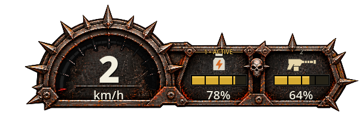
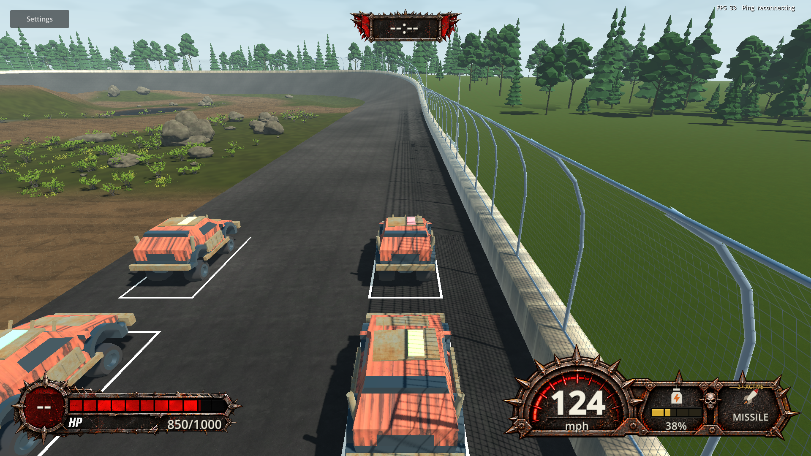

# TS-222 — Dynamic Two-Slot Item HUD Foundation

> Current result: user-authorized Round 3 below reduces the HUD size; Round 2 supersedes the original visual implementation and Round 1 findings. Earlier sections are retained as historical evidence.

## Round 1 — Implemented and scope

Implemented on `ts-222-jg`, 2026-09-27. Jira TS-222 was read with its complete description, comments (none), required children (none) and downstream links. TS-176, TS-177 and TS-178 were not implemented. The user-approved `ChatGPT Image Sep 27, 2026, 01_24_38 PM.png` was treated as composition/style direction, not a texture or instructions. No reference pixels or new external assets are distributed.

- One bottom-right, uniformly scaled assembly owns the existing speedometer and two independent physical slot controls. The original speed gauge joins an original native metal/spike frame.
- Shared `ItemHudSlotView` projects registry identity/icon and optional `ItemHudResource`; `ItemHudSlot` reuses layout, selection feedback, resource clearing and native lifetime for either physical slot. The resource renderer has no item-specific branches. Future adapters supply formatted text and an optional normalized fraction through the same path.
- Nitro and Machine Gun preserve existing upward-rounded percentage semantics, using a neutral shared meter. Salvo preserves count-only semantics: the authoritative slot does not publish its original capacity. No new resource rules, item variants, inventory authority, network schema or Core dependency were introduced.
- Empty/non-resource slots show no resource text or meter. Duplicates retain independent values. Confirmed physical selection never reorders contents. Wrong vehicle/life, death and unavailable inventory clear presentation.
- Existing speed conversion, 200 km/h gauge normalization, separate bottom-left HP artwork/binding/layout, timer and other HUD integrations remain.
- Current feature documentation and HUD provenance were updated. Canonical/preset versions synchronized to `0.2.1`/`0.2.1.0` from fetched main `c44c78d`. The pre-existing export-preset edit contained stale `0.1.69.0` values; the required synchronization superseded only those version fields.

## Verification performed

All listed checks actually executed. Native checks used Godot 4.7.2 .NET at `.godot/verification-tools/Godot_v4.7.2-stable_mono_win64/Godot_v4.7.2-stable_mono_win64_console.exe`.

| Check | Actual result |
| --- | --- |
| Fetch current main, ancestry check, `tools/sync-story-version.ps1` and its `check-version.ps1` | PASS; current main is an ancestor, canonical and export versions agree |
| `tools/check-fast.ps1 -Area Client` | PASS; Debug build, zero warnings/errors. Explicit area used because automatic routing reads committed changes and implementation was still uncommitted |
| `dotnet test code/TransportTests/Trackstorm.Transport.Tests.csproj -c Release --filter FullyQualifiedName~CombatHudTests` | PASS, 9 tests |
| `check.ps1` on completed production/test changes | PASS; 108 version-rule checks, workflow helper and frontend-media regressions/materialization, restore, Debug production build, Release full-solution build, 912 Core tests and 407 non-native Client/transport tests. Zero build warnings/errors. Log: `.godot/ts-222-final-check.log` |
| `check-hud.ps1 -GodotPath <above> -NoBuild` | PASS. Final artifacts: `.godot/hud-checks/319486e3dfc141838eb8664226689930/` |
| `check-items.ps1 -GodotPath <above> -NoBuild` | PASS; eight actual UDP peers, E/D-pad physical-slot switching and immediate second-slot Wrench use, full/damaged HP use, repeated-request rejection, missile use/impacts. Artifacts: `.godot/item-checks/671afad4143e4501aadae61ac5f215ff/` |
| `check-item-spawns.ps1 -GodotPath <above> -NoBuild` | PASS; eight peers, competing pickup, cooldown/reactivation, 32 repeated pickup rounds per player, pool change and confirmed ownership. Artifacts: `.godot/spawn-checks/0adb88bcffdc4a59bc7ff27c42e41817/` |
| `check-nitro.ps1 -GodotPath <above> -NoBuild` | PASS; two peers, sustained use/release/reuse/exhaustion, preserved second-slot Wrench, speed and recovery. `.godot/nitro-checks/runtime.log` |
| `check-machine-gun.ps1 -GodotPath <above> -NoBuild` | PASS; two peers, independent second item, held-input use, partial release/reuse and magazine exhaustion. `.godot/machine-gun-checks/runtime.log` |
| `check-oil.ps1 -GodotPath <above> -NoBuild` | PASS; dropped Oil deployment via ordinary held slot, banked terrain, replicated persistent patch, repeated passes, late admission and four-peer complete state. `.godot/oil-checks/runtime.log` |
| `check-salvo.ps1 -GodotPath <above> -NoBuild` | PASS; three peers, three five-press salvos, preserved second slot, held-input non-repeat and 15 replicated impacts. `.godot/salvo-checks/runtime.log` |
| Godot `--headless --path . --quit-after 120` | PASS; exit 0 and no logged errors/warnings. `.godot/ts-222-startup.log` |
| Complete working diff review and `git diff --check` | PASS; changes remain Client presentation/tests, affected documentation/provenance and required versions. No Core/gameplay or dependency changes |

The first native HUD capture was inspected during iteration, then slot height was reduced to restore the taller left speedometer silhouette. All final checks above follow production changes. Final verification is distinct from the subsequent critique below.

## Direct runtime and rendered evidence

- **VERIFIED — native render harness:** live health labels/materials and rendered HP/speed fill pixels; km/h to mph; both physical slots; duplicate Nitro, Salvo and Machine Gun values; full/partial/exhausted resources; repeated resource-to-nonresource-to-empty replacements in both slots; stale resource fields cannot leak into replacement content; correct selected/empty labels; missing and wrong-life/vehicle inventory; null vehicle hides the HUD; teardown.
- **VERIFIED — resolution harness:** 640×360, 960×540, 1280×720, 1600×900, 1920×1080, 2560×1440, 3840×2160, 1024×768 and 2560×1080. Native bounds checks establish separate HP/item regions and horizontal viewport fit. All nine captures were generated; direct visual inspection covered 640×360, 1280×720 and 1920×1080 captures, plus live 2560×1440 practice.
- **VERIFIED — active UI inspection after final checks:** opened production practice, observed empty slots, stable selected first slot, 0 km/h and 1000/1000 HP; opened ESC Game Menu, then clicked Leave to Main Menu and observed the entire combat HUD disappear. The computer-use skill was used. A W tap was sent but did not establish sustained motion, so it is not driving evidence. Native driving/resource harnesses supply the driving evidence above.
- The first detached game process closed before inspection; the attached-session retry stayed available and allowed the stated UI interactions. No cause is claimed for the initial closure.
- Captures/logs listed above are local ignored verification artifacts, not committed runtime assets. They do not establish remote-device behavior or a performance benchmark. FPS values visible during subviewport capture are not interpreted as gameplay performance.

## Astra Runtime Critique — Story Round 1

Performed after comprehensive final verification, using the rendered states, native runtime outcomes and active practice/menu inspection above.

**Overall Score: 7.4 / 10**
**Quality Assessment: FAIL (<8.0)**

| Material category | Score | Runtime basis |
| --- | --- | --- |
| Runtime Functionality | 8.8 | Confirmed independent content/resources and clearing across exercised transitions |
| Runtime Integration | 8.5 | Speed/HP checks, native inventory paths and observed menu/leave lifecycle |
| Runtime Stability | 8.3 | Final native harnesses completed without reported warnings/errors; active retry remained usable |
| UI / UX | 6.8 | Good physical-slot separation; small labels/icons are difficult to scan at minimum resolution |
| Visual Quality | 6.5 | Unified layout and steel/spike direction are present, but the thin rectangular rails and stretched steel sample are visibly flatter than the approved concept |

The overall judgment prioritizes this Story's visual/UX purpose; it is not a reward for test count or code quality. The technical foundation works, but the rendered result does not meet Trackstorm's 8.0 presentation gate.

### Recommendations

1. **Problem:** The item chassis has a flatter, more rectangular border and visibly stretched steel detail compared with the reference's substantial beveled, angular common frame. **Evidence:** 1280/1920 captures and live 2560 practice inspection. **Severity:** Medium. **Impact:** The gauge and slots share position and color but do not yet have the reference's cohesive finish. **Suggested improvement:** Refine the shared border/junction with angled corners, stronger metal bevels and correctly proportioned steel sampling while preserving the common baseline and compact footprint. **Scope:** In Scope. **Corrective Work Type:** Existing Task (TS-222).
2. **Problem:** Item names/selection and small resource-bearing silhouettes become difficult to scan at 640×360. **Evidence:** directly inspected `hud-640x360.png`; at uniform half scale, the 13-pixel design name becomes 6.5 pixels. **Severity:** Medium. **Impact:** Players must inspect the corner longer to identify an item, especially with two resource-bearing copies. **Suggested improvement:** Adjust shared slot typography/icon hierarchy and minimum-resolution layout while keeping speed/HP clear and resource content within its slot. **Scope:** In Scope. **Corrective Work Type:** Existing Task (TS-222).

**Recommended Next Round:** If authorized, address the shared frame finish and minimum-resolution readability; repeat affected HUD checks and runtime critique. Do not implement final Boost, Machine Gun or Shield designs in that round. No critique recommendation was implemented after this formal evaluation.

## Assumptions, limitations, risks and unverified areas

- The current game has no independent player inventory-discard command. Droppable Oil deployment was run; direct cleared/replaced slot binding was run. A hypothetical manual discard action is **UNVERIFIED / not implemented**, rather than added to this Story.
- Native inventory use tests are automated playthroughs on one Windows machine, not human combat playtesting. Active interaction was limited to practice HUD/menu/leave, with empty inventory. Sustained human-controlled item use in combat is **UNVERIFIED**.
- Duplicate resources were rendered from explicitly supplied confirmed-boundary fixtures. The existing authority/replication tests ran as listed; no claim is made that every duplicate combination was acquired in a live network match.
- Separate-PC/EOS, Internet latency, controller hardware, exported builds, long-session soak and new item-specific designs are **UNVERIFIED**. No authority/network behavior changed.
- Shared runtime resource meters deliberately remain neutral. Future items need their authoritative resource adapter; this is not a generic inventory serialization refactor.
- The visual/readability findings above remain unresolved; the result is not asserted to have passed acceptance.
- The requested push uses `[skip ci]` because `.github/workflows/auto-create-pr.yml` otherwise creates a PR on a new Story push. GitHub push-triggered CI is therefore not run on that push. No PR was requested or created by the agent, no merge was performed, and independent post-push PR engineering review is not claimed.

## Round 2 — reference fidelity rework, 2026-09-27

The user rejected Round 1 and explicitly authorized rework to match the approved visual by at least 90%. Jira TS-222 was updated with that clarification while preserving the shared-foundation scope and exclusion of final TS-176/177/178 designs.

### Actual implementation

- Replaced the procedural right frame and separate speedometer substrate with one reference-derived transparent chassis: `assets/hud/ItemAssembly.png`, 2172×724 RGBA. Thick distressed bevels, rust edges, spikes, bolted junctions and skull divider now reproduce the reference's shared silhouette and material direction. This supersedes Round 1's statement that no reference-derived asset is distributed.
- The built-in imagegen tool removed baked example icons, bars and text from the approved concept. Output SHA-256: `5ca367d058fe724e0bc744b0692c5a0d0e2fa97a7d7fee1def27f829181c1c7e`. Exact generation prompt, source provenance and runtime geometry are recorded in [the asset README](../../assets/hud/README.md) and `sources.json`.
- Native speed/unit labels, independent physical slot controls, selection, registry icons and resource readouts remain dynamic. A shader dims only authored red gauge ticks/cells according to existing speed normalization. The shared design is 600×200 with uniform scaling; each applicable slot contains an icon, four-segment meter and numeric resource readout.
- Increased shared icon and numeric prominence. Resource-bearing item names yield to the icon/bar/value hierarchy. No authority, inventory, Core, network schema, HP artwork/layout or item-resource semantics changed in this round. Final flame/bullet designs remain downstream scope.
- Extended native checks to count actual rendered resource depletion in the first slot while asserting unchanged second-slot pixels, and to check bottom viewport bounds. Added a transparent capture rendered by production CombatHud with 2 km/h, Nitro 78%, and Machine Gun 320/500 represented by its existing 64% adapter.

### Final verification actually performed

All production/test changes preceded this final verification. Only evidence documentation and the copied native capture were added afterward.

| Check | Result / evidence |
| --- | --- |
| Fetch main, ancestry, version synchronization | PASS; main `c44c78d` already included, version 0.2.1 / 0.2.1.0 consistent |
| `tools/check-fast.ps1 -Area Client` during iteration | PASS, zero build warnings/errors |
| Godot headless editor import | Completed successfully; new shader/texture imported |
| `check.ps1` | PASS; Debug/Release builds and analyzers, 912 Core and 407 Client/transport tests, zero failures/skips and build warnings/errors. `.godot/ts-222-round2-final-check.log` |
| `check-hud.ps1 -NoBuild` | PASS; independent slot states/duplicates/replacements/empty slots, resource pixel depletion/isolation, speed/units, HP pixels, nine resolutions and teardown. `.godot/hud-checks/41088a361d2a455fac2182789c5f78ee/` |
| `check-items.ps1 -NoBuild` | PASS; eight native peers and physical-slot switching/use. `.godot/item-checks/171b0583a0004106af920292bb41d796/` |
| `check-item-spawns.ps1 -NoBuild` | PASS; eight peers, competing/repeated pickups and ownership. `.godot/spawn-checks/8356d1c76af943a6b4ff50a6898e4ebf/` |
| `check-nitro.ps1`, `check-machine-gun.ps1`, `check-oil.ps1`, `check-salvo.ps1`, each `-NoBuild` | All PASS; sustained consume/reuse/exhaust, preserved other slot, Oil drop/deployment and replicated impacts. Combined log `.godot/ts-222-round2-native.log` |
| Godot `--headless --path . --quit-after 120` | PASS, exit 0, no logged errors/warnings. `.godot/ts-222-round2-startup.log` |

Native checks used the same Godot 4.7.2 .NET executable as Round 1. Final native captures directly inspected after the checks: isolated composition, 640×360, 1920×1080; live production practice observed at 2560×1440. The separate HP remains distinct and correctly rendered. The current live practice displayed empty wells, selected first slot, 0 km/h and 1000/1000 HP. The computer-use tool rejected ESC input twice because concurrent user input was detected, including after a fresh observation. No manual menu/leave success is claimed for Round 2; further input was stopped and the practice window left available. Native teardown checks passed. No human-driven combat or sustained manual driving is claimed.

### Astra Runtime Critique — Story Round 2

Performed after the comprehensive checks above and direct final render/live observation.

**Overall Score: 8.5 / 10**

**Quality Assessment: PASS (>=8.0)**

| Material category | Score | Observed basis |
| --- | --- | --- |
| Runtime Functionality | 8.8 | Native independent slots, duplicates, resource depletion/clearing and lifecycle outcomes |
| Visual Quality | 9.0 | Reference-derived continuous heavy metal frame, correct left-gauge/right-wells silhouette, spikes/skull/junctions; live overlay composition |
| UI / UX | 8.1 | Larger resource icons/numbers and aligned segmented meters improve hierarchy; 640×360 secondary selection text remains small |
| Runtime Integration | 8.6 | Observed HP separation, native speed/resource pixels and inventory transitions/teardown |
| Runtime Stability | 8.5 | Completed native scenarios and stable observed practice; no long-session claim |

**Reference-fidelity judgment:** approximately 90–93% for the in-scope shared frame and composition, a subjective visual assessment, not a measured image-similarity result or user acceptance. The silhouette, material, divider and layout closely match. This is not a claim that all pixels or the final item examples match by 90%: current registry icons, neutral gold resource meters, selection labels, smooth native typography and existing percentage semantics visibly differ from the example. At 2 km/h the red arc is correctly mostly dim rather than copying the concept's static lit arc. Final Boost/Machine Gun artwork remains excluded by the user's Story scope. The actual native image above makes these limits reviewable.

**VERIFIED:** native state/pixel checks and the rendered/live observations listed above. **INFERRED:** the same shared view supports future item-specific adapters without a parallel HUD. **UNVERIFIED:** sustained manual combat, every duplicate combination acquired in a real match, physical controller hardware, separate-PC/EOS/Internet conditions, exported builds and long-session soak. No independent PR engineering review is claimed. A manual inventory discard command still does not exist; Oil deployment and cleared-slot binding are the exercised drop-related paths.

The 8.5 score concerns the scoped runtime foundation and does not replace the user's visual acceptance. No subsequent improvement round is authorized. Delivery retains the requested no-PR policy and `[skip ci]` commit marker; remote push CI is skipped, local comprehensive verification above is the evidence.

## Round 3 — smaller combat HUD, 2026-09-27

The user requested that all HUD be scaled down a bit. Reduced the common CombatHud scale to 85% of its previous viewport-fit size: HP/standing, speedometer/two physical item slots, timer, Circus score/feedback and out-of-bounds warning. Proportions and existing edge/center anchoring remain intact. At 1280×720 the item assembly is now 510×170 instead of 600×200. This does not resize separate menus, FPS/ping diagnostics, world-space tags or other independently owned overlays. Jira records the approved size follow-up and the HP resize exception.

The native pixel sampling/capture now uses each control's actual global transform rather than fixed screen coordinates. An initial build exposed an invalid Control.GlobalScale API in that helper; corrected to GetGlobalTransform().Scale before rerunning checks. No gameplay or item-state changes.

**Verification:** current main ancestry and version synchronization passed; `tools/check-fast.ps1 -Area Client` passed after the helper correction; `check.ps1` passed (912 Core + 407 Client/transport tests, zero failures/skips, zero build warnings/errors); `check-hud.ps1 -NoBuild` passed all nine resolutions, labels, health/speed pixels, independent resource-meter pixels, duplicates/replacement/empty-slot behavior and teardown. Logs: `.godot/ts-222-scale-fast.log`, `.godot/ts-222-scale-final.log`, `.godot/ts-222-scale-hud.log`. Native captures: `.godot/hud-checks/4e9b1589cd914fb9a041147788e27529/`. Inventory/gameplay native suites were not repeated for this presentation-scale-only change; their Round 2 results remain historical evidence. Working diff check passed.

### Astra Runtime Critique — Story Round 3

Evaluated after final verification by inspecting actual native renders at 1920×1080 and 640×360. The main HUD occupies less arena space and retains the approved frame proportions, separated HP and item regions and centered timer. Secondary labels are small at 640×360; this remains the compactness/readability tradeoff. Automated native runtime transitions were exercised; no new manual driving/combat session was performed. Prior manual input contention and other Round 2 unverified areas remain limitations.

**Overall Score: 8.4 / 10**

**Quality Assessment: PASS (>=8.0)**

| Material category | Score | Evidence |
| --- | --- | --- |
| Visual Quality | 8.8 | Observed intact frame proportions with reduced arena obstruction |
| UI / UX | 8.0 | Clear primary numbers at normal resolution; small secondary text at minimum size |
| Runtime Functionality / Integration | 8.7 | Native HP/speed/independent resources and teardown passed at the reduced scale |
| Runtime Stability | 8.5 | Native harness completed without reported errors; no new soak claim |

**VERIFIED:** rendered layouts and native transitions above. **UNVERIFIED:** sustained human combat, remote-device/EOS, exported builds and long-session behavior. No new fidelity percentage measurement or independent PR review is claimed. No further implementation followed this evaluation. Commit/push remain authorized; `[skip ci]` prevents automatic PR creation and skips remote CI.

