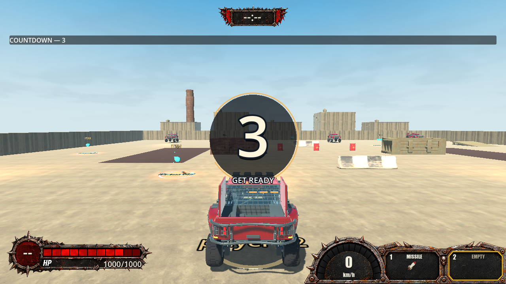
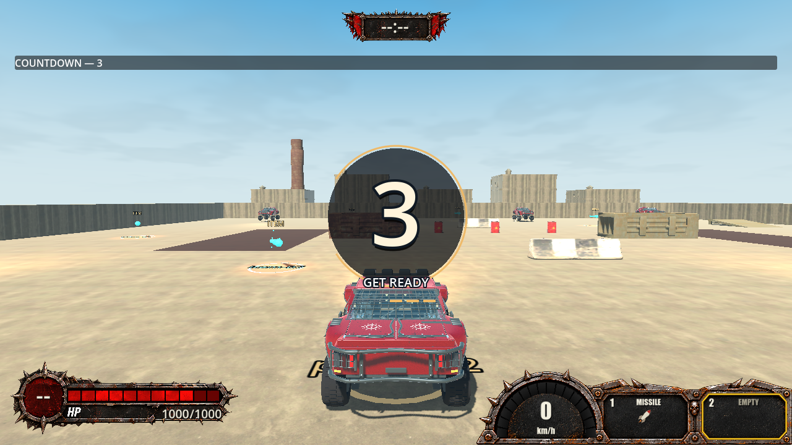

# TS-277 verification

Story: [TS-277 — Discard selected held item](https://jonathangenier.atlassian.net/browse/TS-277). Branch: `ts-277-jg`. Evidence date: 2026-10-03.

## Scope and implementation

The complete Jira description, comments, issue links and child query were inspected. No required children or additional comments were present. The description agrees with the assignment's explicitly approved behavior. No world-drop/pickup behavior was added.

- Added remappable `DiscardItem`, default physical keyboard **X** and controller **D-pad Left**, preserving existing action IDs and input layout. Short taps survive capture; focus, gameplay/UI and diagnostic suppression require release. Saved overrides/unbinding persist; older saves inherit defaults.
- Existing `ItemAuthority` immediately deletes only the selected physical slot on accepted sender/session/life/token/selection validation. It retires the capability, clears selected resources, cancels its pending/sustained use and removes only its attached Shield. Other-slot ownership/resources and existing deployed entities remain intact. Empty/repeated discard has no item effect; no pickup, projectile, hazard, released wall or use outcome is created.
- Reliable intent ordering is switch → discard → aim/use. Remote input requests a known capability without predicted inventory. Existing ownership publication drives HUD/racks.
- Added monotonic `DiscardRevision` to the existing authority/publication and complete checkpoints, using item protocol **21**. Live publication, resume and restoration reject regressed deletion boundaries. Migration excludes checkpoints before confirmed or newer retained discard and fails closed without a safe common checkpoint.
- Synchronized relevant feature docs and recovery fixture publication copies. The item harness's stale controller switch/use defaults now match current bindings; its movable projectile target intersects the actual vehicle-centre ray. No unrelated production physics/tuning change was made.

The branch was fetched/merged with current main before implementation and final verification, already up to date at `cee2ba27e7a378a112cf312d3ebd752848891b94`. Main's `0.2.24` yields canonical Story version **0.2.25**, tracked preset versions **0.2.25.0**; version checks passed.

## Targeted iteration verification

- `dotnet test code/Tests/Trackstorm.Core.Tests.csproj --filter FullyQualifiedName~ItemDiscardTests`: **15 passed**. All eight item identities across both slot selections; immediate clearing; other-slot preservation; pending/sustained use; existing world entities; empty/repeated discard; sender/session/life/token/selection failures; suspension/rebind; serialized restore; both death retention policies; replacement capability retirement; malformed/old protocol.
- Targeted transport discard and `TwoPlayerArenaRestoresLatestSafeCheckpoint` tests: **passed**. Actual driver ordering over a fake wire, reliable-only authority, delayed/foreign/repeated commands, replacement grants, old/equal/foreign publications, a newer publication with regressed deletion floor, and migration refusal before observed deletion.
- `./tools/check-fast.ps1 -Area Core`: **1,122 passed** in Release. Iterative Debug production compilation passed with zero warnings/errors.
- Iterative native input/items/death/reconnect/three-player migration checks passed after fixture corrections. Early failures exposed stale controller fixture defaults, a prop below the launch ray, and a sustained-fire unit fixture not entering Active. Corrections retained production behavior.

## Comprehensive final verification

Native scripts used Godot **4.7.2 .NET console** via `-GodotPath`. `-NoBuild` reused the warnings-as-errors Debug production build. Headless unless `-Visual` is listed.

| Command actually run | Result |
| --- | --- |
| `./tools/sync-story-version.ps1`; `./tools/check-version.ps1` | PASS; 0.2.25 / 0.2.25.0 |
| `./check.ps1` | PASS; Debug production and Release solution, zero warnings/errors; **1,122 Core + 430 non-native transport tests**; version/workflow/frontend checks |
| `./check-input.ps1` | PASS; **2,075 native assertions**, import and composed main startup |
| `./check-items.ps1 -NoBuild -Impaired -Visual` | PASS; eight native UDP peers, discard and Wrench/Missile regressions; rendered HUD captures |
| `./check-death-respawn.ps1 -NoBuild -Impaired` | PASS; four missile/collision death and respawn cycles, eight peers |
| `./check-reconnect.ps1 -NoBuild` | PASS; three resyncs, including **125 seconds offline** |
| `./check-migration.ps1 -NoBuild -Players 3` | PASS; sequential authority replacement, discarded-slot restoration |
| `dotnet test code/TransportTests/Trackstorm.Transport.Tests.csproj -c Release --no-build --filter TestCategory=Native` | PASS; **15 native tests**; explicit ten-minute soak not selected |
| Godot `--headless --path <repo> res://scenes/verification/transport_checks.tscn --quit-after 20000` | PASS; three creation/poll/message/cleanup cycles |
| `./check-eos.ps1` | PASS; three SDK lifecycle runs; authentication not tested |
| `./check-oil.ps1 -NoBuild -Impaired` | PASS |
| `./check-machine-gun.ps1 -NoBuild -Impaired` | PASS |
| `./check-rear-shield.ps1 -NoBuild -Impaired` | PASS |
| `./check-world-wall.ps1 -NoBuild -Impaired` | PASS; native contacts, deployment, damage, expiry, late join and UDP convergence |
| `./check-lobby.ps1 -NoBuild` | PASS; native local lobby/arena lifecycle |
| `./check-pickup-drive.ps1 -NoBuild` | FAIL; both peers acquired every registered item, then reliability sample rejected a geometrically invalid crossing (nearest 3.0506 m) |
| `./check-nitro.ps1 -NoBuild -Impaired` | FAIL; launch-from-rest assertion |
| `./check-migration.ps1 -NoBuild -Players 2` | FAIL; Shield fixture transition during countdown |
| `./check-mine.ps1 -NoBuild -Impaired` | FAIL; native knockback motion assertion |
| `./check-salvo.ps1 -NoBuild -Impaired` | FAIL; marker follows current forward aim during volley assertion |

The comprehensive native sweep is **not wholly green**. Passing `check.ps1` does not erase these runtime failures. **All five failing assertions reproduced identically on unchanged main C# sources** at `cee2ba27`, including Proxy Mine, Salvo and pickup's exact 3.0506 m crossing. These failures were not corrected under TS-277.

Nitro and two-player migration both failed with the same assertions when changed C# paths were temporarily built from unchanged `origin/main` at `cee2ba27`. Story sources were backed up and restored in `finally`. A diagnostic Nitro run measured start **0.000**, forward **5.321 m/s**, against `> 8`; the diagnostic edit was reverted. The two-player fixture tries to deploy Shield during Countdown, rejected by the existing active-phase gate. A subsequent full `check.ps1` rebuilt TS-277 and passed all builds and **1,122 + 430 tests** again. Neither unrelated failure was corrected.

## Runtime and multiplayer scenarios actually exercised

Committed evidence: [final full gate](ts-277/check-final.log), [native input](ts-277/check-input.log), [eight-peer item trace](ts-277/item-evidence.txt), [reconnect](ts-277/check-reconnect.log), [death/respawn](ts-277/check-death-respawn.log), [three-player migration](ts-277/check-migration-3.log), [native transport](ts-277/native-transport.log). Failure and baseline logs are retained alongside these files.

Committed log copies normalize line endings and trailing whitespace only; original runtime output remains under `.godot/ts-277-final` locally.

- **VERIFIED:** synthetic physical X/D-pad Left reached native input and driver; eight independent local UDP peers deleted both selected slots; empty/repeated discard was harmless; switch/discard targeted the correct physical slot. Rendered HUD showed selected slot two empty while slot one retained Missile, then both empty. No use feedback/new world entity accompanied discard.
- **VERIFIED:** deterministic authority/driver tests rejected delayed requests for deleted/replaced capabilities, old selection/life, foreign sender/session, unreliable delivery and stale/regressed publication. Discard stopped pending use and sustained Machine Gun fire while another slot's pending Wrench use and an already launched Missile continued.
- **VERIFIED:** native reconnect retained first-slot Nitro **37.5%**, selected second slot empty, selection and deletion watermark through three resyncs. Native death/respawn kept the deleted second slot absent over four cycles and rejected its old-life request. Deterministic restore/respawn covered both held-item death policies.
- **VERIFIED:** three-player native migration retained deleted first slot, second-slot Oil and selection across replacement authority. Deterministic migration rejected an older checkpoint after observed deletion; complete item/checkpoint codecs retained the watermark.
- **INFERRED:** the same confirmed-state semantics apply to authenticated EOS through the existing sender-resolved authority path; this is not Internet acceptance evidence.

## Assumptions, risks and unverified areas

- Remote deletion is immediate **on host acceptance**; local confirmation follows reliable network transit. No parallel/predicted inventory exists.
- A request interrupted before any surviving peer receives confirmation has an unknown client outcome; there is no external durable transaction store. Confirmed deletion prevents rollback, so migration can fail closed when survivors only share an older checkpoint.
- **UNVERIFIED:** physical controller ergonomics (zero connected gamepads; events synthetic), authenticated EOS identities/lobbies/P2P, WAN/multiple physical machines, exported builds, crash before surviving confirmation and the explicit ten-minute soak. UDP harnesses use trusted identity seams and isolated native worlds in one process.
- Broad native failures remain open. Full runtime completion, independent engineering/PR review and human acceptance are not claimed.
- No third-party dependency or redistributed asset was added; screenshots were generated from the existing game.

## Astra runtime critique

**Astra Runtime Critique — Story Round 1: 8.3 / 10 — PASS.** The exact 8.0 threshold applies. [Full independent critique](ts-277/astra-critique.md) records category scores, executed versus inspected evidence and limitations.

Astra independently executed two rendered eight-peer impaired item runs, the native input scene (**2,075 assertions**) and three-player native migration; all passed. It viewed the selected second slot empty with Missile retained in slot one, then both slots empty. Its first intermediate screenshot instead captured the previous rendered frame; an unchanged repeat and the earlier final capture showed the correct state. This is a capture-boundary limitation, not proof of persistent HUD failure or frame-exact presentation timing.

The critique's original `../item-checks/...` paths are relative to `.godot/ts-277-final`. Committed copies: [correct intermediate HUD](ts-277/astra-second-selected-empty.png), [both empty](ts-277/astra-both-empty.png), [prior-frame capture](ts-277/astra-prior-render-frame.png), [first run](ts-277/astra-items.log), [confirmation run](ts-277/astra-items-confirmation.log), [input](ts-277/astra-input.log), [migration](ts-277/astra-migration-3.log).

This is a scoped experiential PASS, not full-sweep or human acceptance. No critique recommendation or additional round was implemented. The explicitly requested commit/push delivers the result for independent engineering review and human decision; no merge or Jira completion is claimed.
